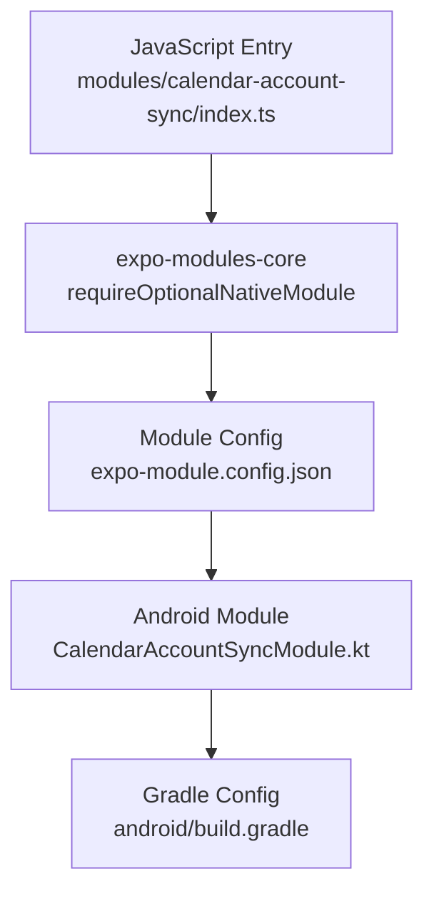
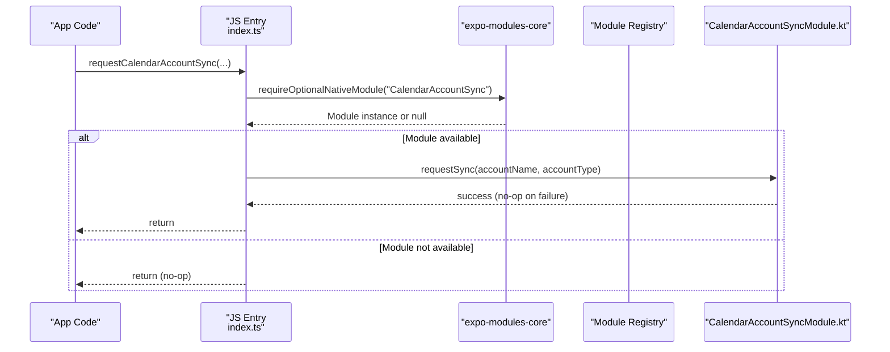
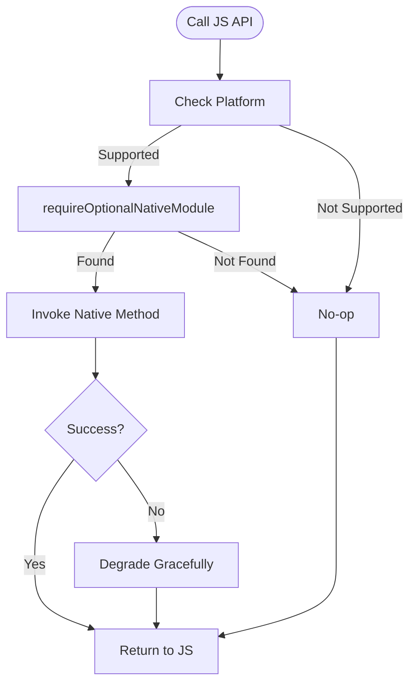
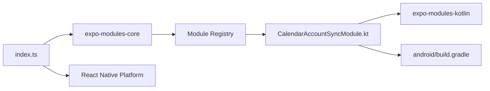

# Module Architecture

<cite>
**Referenced Files in This Document**
- [index.ts](file://modules/calendar-account-sync/index.ts)
- [expo-module.config.json](file://modules/calendar-account-sync/expo-module.config.json)
- [CalendarAccountSyncModule.kt](file://modules/calendar-account-sync/android/src/main/java/expo/modules/calendaraccountsync/CalendarAccountSyncModule.kt)
- [build.gradle](file://modules/calendar-account-sync/android/build.gradle)
- [DomWebViewModule.kt](file://node_modules/@expo/dom-webview/android/src/main/java/expo/modules/webview/DomWebViewModule.kt)
- [expo-module.config.json (constants)](file://node_modules/expo-constants/expo-module.config.json)
- [expo-module.config.json (application)](file://node_modules/expo-application/expo-module.config.json)
</cite>

## Table of Contents
1. Introduction
2. Project Structure
3. Core Components
4. Architecture Overview
5. Detailed Component Analysis
6. Dependency Analysis
7. Performance Considerations
8. Troubleshooting Guide
9. Conclusion

## Introduction
This document explains the Expo native module architecture and module structure as implemented in this project, focusing on how the JavaScript interface bridges to native code via expo-modules-core. It covers platform-specific bridging using requireOptionalNativeModule, module configuration through expo-module.config.json, module registration and discovery at runtime, and best practices for exposing native functionality safely across platforms. It also includes guidance for creating new modules, defining method signatures, handling platform differences between iOS and Android, managing module lifecycle, and implementing robust error handling strategies.

## Project Structure
The project contains a custom native module under modules/calendar-account-sync that exposes an Android-only capability to trigger immediate calendar account synchronization. The module is composed of:
- A JavaScript entry point that conditionally loads the native module only on Android and provides a safe wrapper around the native call.
- An Android implementation written in Kotlin that defines a native module with a single function exposed to JavaScript.
- A Gradle build file that configures the Android library namespace and versioning.
- An expo-module.config.json that registers the native module class for the Android platform.

**Diagram sources**
- [index.ts:1-16](file://modules/calendar-account-sync/index.ts#L1-L16)
- [expo-module.config.json:1-7](file://modules/calendar-account-sync/expo-module.config.json#L1-L7)
- [CalendarAccountSyncModule.kt:1-31](file://modules/calendar-account-sync/android/src/main/java/expo/modules/calendaraccountsync/CalendarAccountSyncModule.kt#L1-L31)
- [build.gradle:1-16](file://modules/calendar-account-sync/android/build.gradle#L1-L16)

**Section sources**
- [index.ts:1-16](file://modules/calendar-account-sync/index.ts#L1-L16)
- [expo-module.config.json:1-7](file://modules/calendar-account-sync/expo-module.config.json#L1-L7)
- [CalendarAccountSyncModule.kt:1-31](file://modules/calendar-account-sync/android/src/main/java/expo/modules/calendaraccountsync/CalendarAccountSyncModule.kt#L1-L31)
- [build.gradle:1-16](file://modules/calendar-account-sync/android/build.gradle#L1-L16)

## Core Components
- JavaScript bridge layer: Uses Platform checks and requireOptionalNativeModule to load the native module only when available and appropriate. Provides a safe wrapper that guards against missing modules and invalid inputs.
- Native module definition: Declares a named module and exposes functions to JavaScript using expo-modules-kotlin ModuleDefinition.
- Module configuration: Declares which platforms are supported and maps them to concrete native classes or services.
- Build configuration: Sets the Android library namespace and version metadata used by the build system.

Key responsibilities:
- Safe loading: Avoid crashes when the native module is absent (e.g., web or unsupported platform).
- Clear API surface: Expose minimal, well-named methods from native to JavaScript.
- Platform scoping: Restrict features to platforms where they make sense.
- Robustness: Handle errors gracefully on both sides of the bridge.

**Section sources**
- [index.ts:1-16](file://modules/calendar-account-sync/index.ts#L1-L16)
- [CalendarAccountSyncModule.kt:10-29](file://modules/calendar-account-sync/android/src/main/java/expo/modules/calendaraccountsync/CalendarAccountSyncModule.kt#L10-L29)
- [expo-module.config.json:1-7](file://modules/calendar-account-sync/expo-module.config.json#L1-L7)
- [build.gradle:1-16](file://modules/calendar-account-sync/android/build.gradle#L1-L16)

## Architecture Overview
At runtime, the JavaScript layer attempts to load the native module only on Android. If present, it calls into the native method; otherwise, it no-ops. The native module is discovered and registered based on expo-module.config.json during app startup, making it available to the bridge.

**Diagram sources**
- [index.ts:1-16](file://modules/calendar-account-sync/index.ts#L1-L16)
- [CalendarAccountSyncModule.kt:14-29](file://modules/calendar-account-sync/android/src/main/java/expo/modules/calendaraccountsync/CalendarAccountSyncModule.kt#L14-L29)
- [expo-module.config.json:1-7](file://modules/calendar-account-sync/expo-module.config.json#L1-L7)

## Detailed Component Analysis

### JavaScript Bridge Layer
- Platform gating: Loads the native module only on Android to avoid unnecessary overhead and ensure compatibility.
- Optional loading: Uses requireOptionalNativeModule to prevent exceptions when the module is unavailable (e.g., web or Expo Go).
- Defensive API: Validates inputs before calling native code and wraps the call in a try/catch to swallow failures, ensuring the app remains stable even if the native operation fails.

Best practices demonstrated:
- Guard against missing modules and invalid parameters.
- Keep the JavaScript API simple and synchronous from the caller’s perspective while delegating to native.
- Fail silently for non-critical operations to preserve UX.

**Section sources**
- [index.ts:1-16](file://modules/calendar-account-sync/index.ts#L1-L16)

### Android Native Module
- Module declaration: Extends Module and overrides definition() to register the module name and expose functions.
- Function exposure: Defines a Function named requestSync that accepts two string parameters and triggers the Android sync adapter for a specific account.
- Error strategy: Catches and ignores exceptions to implement a best-effort behavior, aligning with the design goal of not disrupting the user experience if the sync request cannot be honored.

Lifecycle hooks:
- While this module does not use lifecycle hooks, other modules can leverage OnDestroy or similar hooks to release resources when the module is torn down.

**Section sources**
- [CalendarAccountSyncModule.kt:14-29](file://modules/calendar-account-sync/android/src/main/java/expo/modules/calendaraccountsync/CalendarAccountSyncModule.kt#L14-L29)

### Module Configuration and Registration
- expo-module.config.json declares supported platforms and maps them to native classes/services. For this module, only Android is enabled, and the Android module class is fully qualified.
- During build/runtime, the Expo toolchain reads this configuration to register the module so that requireOptionalNativeModule can resolve it by name.

Multi-platform examples:
- Other modules in node_modules show how to support multiple platforms (apple, android, web) and include services alongside modules.

**Section sources**
- [expo-module.config.json:1-7](file://modules/calendar-account-sync/expo-module.config.json#L1-L7)
- [expo-module.config.json (constants):1-11](file://node_modules/expo-constants/expo-module.config.json#L1-L11)
- [expo-module.config.json (application):1-16](file://node_modules/expo-application/expo-module.config.json#L1-L16)

### Build Configuration
- The Android build script applies the expo-module-gradle-plugin and sets the group, version, and namespace for the module. This ensures proper packaging and integration with the Expo native module system.

**Section sources**
- [build.gradle:1-16](file://modules/calendar-account-sync/android/build.gradle#L1-L16)

### Example: Creating a New Native Module
To create a new native module:
- Define a JavaScript entry that uses Platform checks and requireOptionalNativeModule to load the module only on supported platforms.
- Create a native module class extending Module and override definition() to set Name() and expose Functions or AsyncFunctions.
- Add an expo-module.config.json declaring platforms and mapping to your native classes.
- Configure the Android/iOS build files as needed (namespace, dependencies).

Method signature patterns:
- Synchronous functions: Use Function(name) { ... } to expose a synchronous method to JavaScript.
- Asynchronous functions: Use AsyncFunction(name) { ... } for operations that may take time or need to run off the main thread.

Platform differences:
- Gate platform-specific logic in JavaScript using Platform.OS checks.
- Provide separate implementations per platform in their respective folders and declare them in expo-module.config.json.

Lifecycle considerations:
- Use OnDestroy to clean up resources when the module is destroyed.
- Avoid long-running work in synchronous functions; prefer asynchronous APIs.

Error handling strategies:
- On the JavaScript side, wrap native calls in try/catch and handle missing modules gracefully.
- On the native side, catch exceptions and decide whether to fail fast or degrade gracefully.

**Section sources**
- [index.ts:1-16](file://modules/calendar-account-sync/index.ts#L1-L16)
- [CalendarAccountSyncModule.kt:14-29](file://modules/calendar-account-sync/android/src/main/java/expo/modules/calendaraccountsync/CalendarAccountSyncModule.kt#L14-L29)
- [expo-module.config.json:1-7](file://modules/calendar-account-sync/expo-module.config.json#L1-L7)
- [DomWebViewModule.kt:10-63](file://node_modules/@expo/dom-webview/android/src/main/java/expo/modules/webview/DomWebViewModule.kt#L10-L63)

### Conceptual Overview
The bridge pattern separates concerns:
- JavaScript focuses on user-facing APIs and platform detection.
- Native code encapsulates platform-specific capabilities and OS interactions.
- Configuration drives discovery and registration without hardcoding paths in code.

[No sources needed since this diagram shows conceptual workflow, not actual code structure]

## Dependency Analysis
- JavaScript depends on expo-modules-core for requireOptionalNativeModule and on React Native’s Platform for conditional loading.
- The native module depends on expo-modules-kotlin to define modules and expose functions.
- The build system depends on the expo-module-gradle-plugin to integrate the module into the app.

**Diagram sources**
- [index.ts:1-16](file://modules/calendar-account-sync/index.ts#L1-L16)
- [CalendarAccountSyncModule.kt:1-31](file://modules/calendar-account-sync/android/src/main/java/expo/modules/calendaraccountsync/CalendarAccountSyncModule.kt#L1-L31)
- [build.gradle:1-16](file://modules/calendar-account-sync/android/build.gradle#L1-L16)

**Section sources**
- [index.ts:1-16](file://modules/calendar-account-sync/index.ts#L1-L16)
- [CalendarAccountSyncModule.kt:1-31](file://modules/calendar-account-sync/android/src/main/java/expo/modules/calendaraccountsync/CalendarAccountSyncModule.kt#L1-L31)
- [build.gradle:1-16](file://modules/calendar-account-sync/android/build.gradle#L1-L16)

## Performance Considerations
- Prefer asynchronous functions for heavy or blocking operations to keep the UI responsive.
- Minimize data marshalling between JavaScript and native layers; pass only necessary parameters.
- Gate expensive initialization behind lazy loading or explicit calls.
- Use best-effort semantics for non-critical operations to avoid impacting app performance or stability.

[No sources needed since this section provides general guidance]

## Troubleshooting Guide
Common issues and resolutions:
- Module not found: Ensure expo-module.config.json lists the correct platforms and fully qualified module names. Verify that the module is built and included in the app bundle.
- Platform mismatch: Confirm that Platform checks match the platforms declared in the configuration.
- Silent failures: If native calls throw exceptions, wrap them appropriately and decide whether to fail fast or degrade gracefully.
- Web builds: On web, requireOptionalNativeModule returns null; ensure your JavaScript wrapper handles null gracefully.

Operational tips:
- Log once at module load time to confirm availability in development builds.
- Validate inputs early in the JavaScript layer to reduce unnecessary native calls.
- In native code, log only when necessary to avoid noise in production.

**Section sources**
- [index.ts:1-16](file://modules/calendar-account-sync/index.ts#L1-L16)
- [CalendarAccountSyncModule.kt:14-29](file://modules/calendar-account-sync/android/src/main/java/expo/modules/calendaraccountsync/CalendarAccountSyncModule.kt#L14-L29)
- [expo-module.config.json:1-7](file://modules/calendar-account-sync/expo-module.config.json#L1-L7)

## Conclusion
This project demonstrates a clean, robust approach to exposing native functionality through Expo’s native module system. By combining platform-aware JavaScript loading with expo-modules-core, declarative module configuration, and defensive error handling, the module provides a reliable API that degrades gracefully when native capabilities are unavailable. Following these patterns—clear separation of concerns, explicit configuration, and careful error management—will help you build maintainable native integrations that scale across platforms and environments.