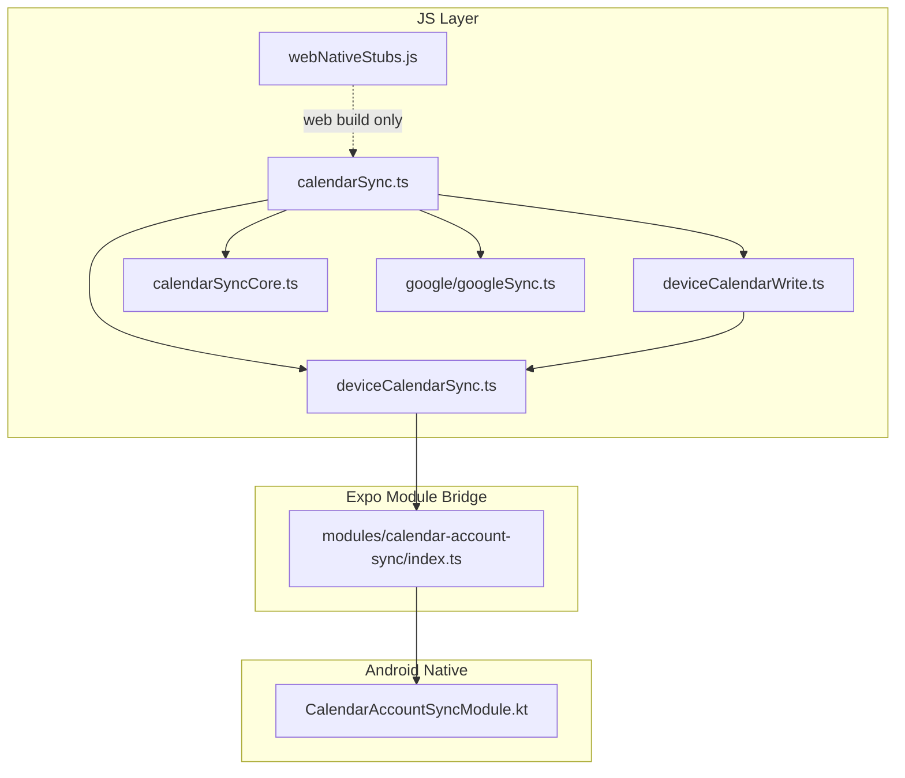
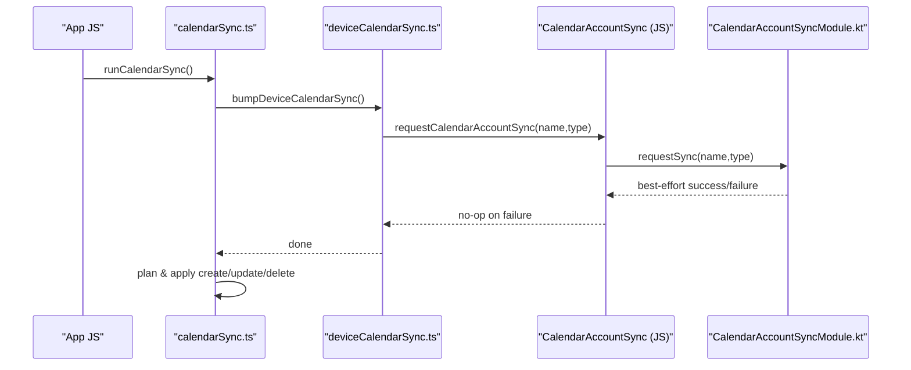
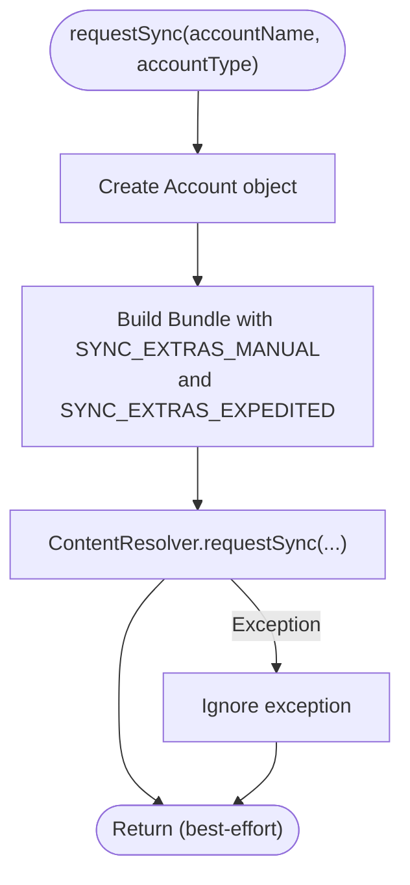
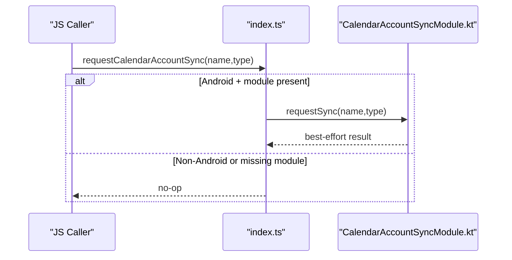
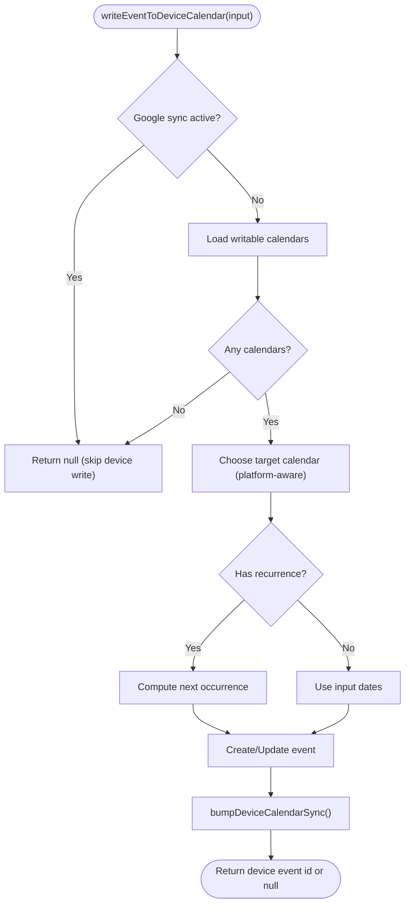
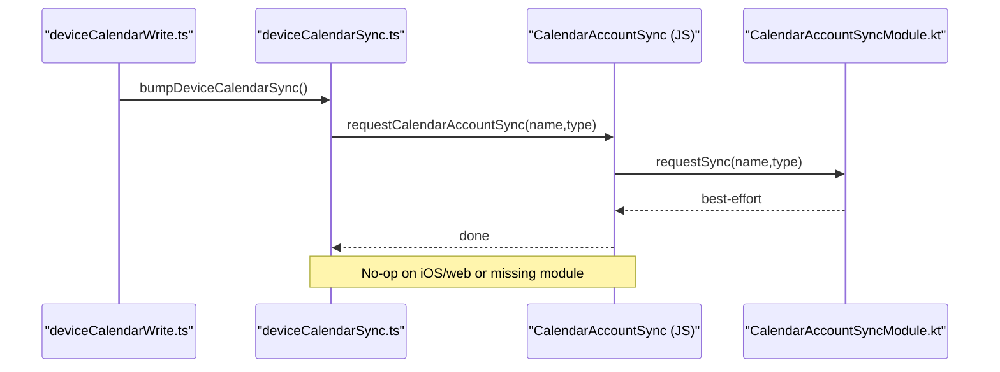
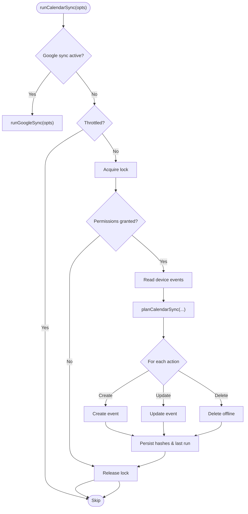
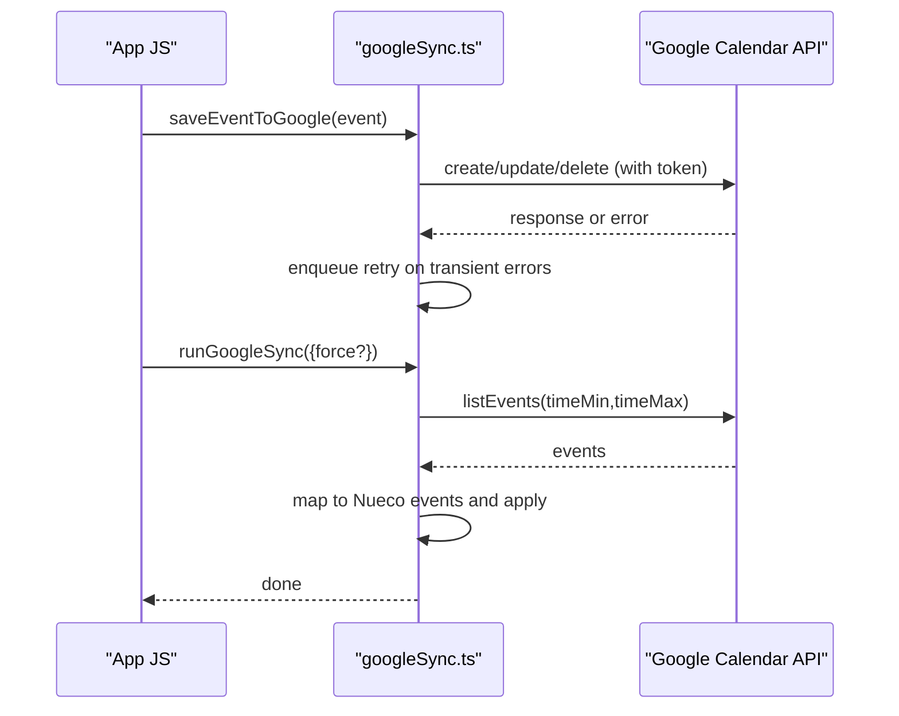
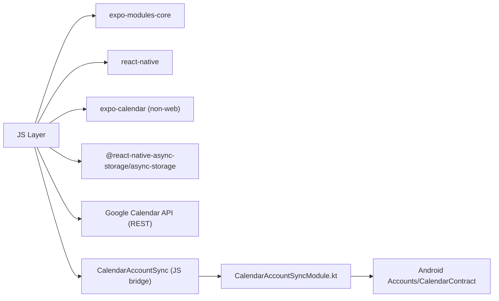

# Native Integration

<cite>
**Referenced Files in This Document**
- [index.ts](file://modules/calendar-account-sync/index.ts)
- [CalendarAccountSyncModule.kt](file://modules/calendar-account-sync/android/src/main/java/expo/modules/calendaraccountsync/CalendarAccountSyncModule.kt)
- [expo-module.config.json](file://modules/calendar-account-sync/expo-module.config.json)
- [build.gradle](file://modules/calendar-account-sync/android/build.gradle)
- [webNativeStubs.js](file://src/webNativeStubs.js)
- [calendarSync.ts](file://src/calendarSync.ts)
- [deviceCalendarSync.ts](file://src/deviceCalendarSync.ts)
- [deviceCalendarWrite.ts](file://src/deviceCalendarWrite.ts)
- [calendarSyncCore.ts](file://src/calendarSyncCore.ts)
- [googleSync.ts](file://src/google/googleSync.ts)
</cite>

## Table of Contents
1. [Introduction](#introduction)
2. [Project Structure](#project-structure)
3. [Core Components](#core-components)
4. [Architecture Overview](#architecture-overview)
5. [Detailed Component Analysis](#detailed-component-analysis)
6. [Dependency Analysis](#dependency-analysis)
7. [Performance Considerations](#performance-considerations)
8. [Troubleshooting Guide](#troubleshooting-guide)
9. [Conclusion](#conclusion)
10. [Appendices](#appendices)

## Introduction
This document explains how the app integrates native functionality through an Expo native module to improve calendar synchronization on Android, and how platform-specific implementations are handled across Android, iOS, and web. It focuses on the Calendar Account Sync module that nudges Android’s account sync adapter to push device calendar changes immediately, while providing safe fallbacks on other platforms. It also covers the broader calendar sync architecture, including device calendar read/write flows, Google Calendar two-way sync, and web stubs for non-native environments.

## Project Structure
The native integration is organized as a self-contained Expo module with a JavaScript entry point and an Android implementation:
- modules/calendar-account-sync: The native module package
  - index.ts: JS bridge exposing requestCalendarAccountSync
  - android/src/main/java/.../CalendarAccountSyncModule.kt: Kotlin implementation using Android’s ContentResolver
  - expo-module.config.json: Module registration for Android
  - android/build.gradle: Android library configuration
- src: Application logic that uses the module and coordinates calendar sync
  - calendarSync.ts: Orchestrates device-calendar and Google Calendar sync runs
  - deviceCalendarSync.ts: Nudges Android sync after writes and refreshes recurring entries
  - deviceCalendarWrite.ts: Writes events to the device calendar with platform-aware defaults
  - calendarSyncCore.ts: Pure decision logic for create/update/delete planning
  - google/googleSync.ts: Two-way sync with Google Calendar via REST API
  - webNativeStubs.js: Minimal stubs for native-only modules on web builds

**Diagram sources**
- [calendarSync.ts:102-199](file://src/calendarSync.ts#L102-L199)
- [deviceCalendarSync.ts:17-30](file://src/deviceCalendarSync.ts#L17-L30)
- [deviceCalendarWrite.ts:68-144](file://src/deviceCalendarWrite.ts#L68-L144)
- [calendarSyncCore.ts:87-148](file://src/calendarSyncCore.ts#L87-L148)
- [googleSync.ts:254-372](file://src/google/googleSync.ts#L254-L372)
- [index.ts:1-16](file://modules/calendar-account-sync/index.ts#L1-L16)
- [CalendarAccountSyncModule.kt:14-29](file://modules/calendar-account-sync/android/src/main/java/expo/modules/calendaraccountsync/CalendarAccountSyncModule.kt#L14-L29)
- [webNativeStubs.js:1-12](file://src/webNativeStubs.js#L1-L12)

**Section sources**
- [index.ts:1-16](file://modules/calendar-account-sync/index.ts#L1-L16)
- [CalendarAccountSyncModule.kt:14-29](file://modules/calendar-account-sync/android/src/main/java/expo/modules/calendaraccountsync/CalendarAccountSyncModule.kt#L14-L29)
- [expo-module.config.json:1-7](file://modules/calendar-account-sync/expo-module.config.json#L1-L7)
- [build.gradle:1-16](file://modules/calendar-account-sync/android/build.gradle#L1-L16)
- [webNativeStubs.js:1-12](file://src/webNativeStubs.js#L1-L12)
- [calendarSync.ts:102-199](file://src/calendarSync.ts#L102-L199)
- [deviceCalendarSync.ts:17-30](file://src/deviceCalendarSync.ts#L17-L30)
- [deviceCalendarWrite.ts:68-144](file://src/deviceCalendarWrite.ts#L68-L144)
- [calendarSyncCore.ts:87-148](file://src/calendarSyncCore.ts#L87-L148)
- [googleSync.ts:254-372](file://src/google/googleSync.ts#L254-L372)

## Core Components
- Calendar Account Sync (Android): A minimal native module that triggers an expedited sync for a specific calendar account so changes reach Google/Exchange quickly.
- Device Calendar Write: Creates or updates device calendar events with platform-aware default selection and recurrence handling.
- Device Calendar Sync: Nudges Android account sync after writes and refreshes recurring event occurrences.
- Calendar Sync Orchestration: Coordinates throttling, locking, permissions, and actions (create/update/delete) based on device calendar state and server data.
- Google Calendar Sync: Two-way sync with Google Calendar via REST API, including retry queue and conservative deletion.
- Web Stubs: Provide no-op behavior for native-only features when building for web.

**Section sources**
- [index.ts:10-15](file://modules/calendar-account-sync/index.ts#L10-L15)
- [CalendarAccountSyncModule.kt:18-28](file://modules/calendar-account-sync/android/src/main/java/expo/modules/calendaraccountsync/CalendarAccountSyncModule.kt#L18-L28)
- [deviceCalendarWrite.ts:24-48](file://src/deviceCalendarWrite.ts#L24-L48)
- [deviceCalendarWrite.ts:68-144](file://src/deviceCalendarWrite.ts#L68-L144)
- [deviceCalendarSync.ts:17-30](file://src/deviceCalendarSync.ts#L17-L30)
- [deviceCalendarSync.ts:44-95](file://src/deviceCalendarSync.ts#L44-L95)
- [calendarSync.ts:102-199](file://src/calendarSync.ts#L102-L199)
- [googleSync.ts:205-238](file://src/google/googleSync.ts#L205-L238)
- [googleSync.ts:254-372](file://src/google/googleSync.ts#L254-L372)
- [webNativeStubs.js:1-12](file://src/webNativeStubs.js#L1-L12)

## Architecture Overview
The system bridges JavaScript to native code only where necessary. On Android, the app calls into a custom Expo module to expedite calendar account sync. On iOS and web, it relies on platform behaviors or provides stubs. The orchestration layer ensures safe, idempotent sync operations with throttling and locking.

**Diagram sources**
- [calendarSync.ts:102-199](file://src/calendarSync.ts#L102-L199)
- [deviceCalendarSync.ts:17-30](file://src/deviceCalendarSync.ts#L17-L30)
- [index.ts:10-15](file://modules/calendar-account-sync/index.ts#L10-L15)
- [CalendarAccountSyncModule.kt:18-28](file://modules/calendar-account-sync/android/src/main/java/expo/modules/calendaraccountsync/CalendarAccountSyncModule.kt#L18-L28)

## Detailed Component Analysis

### Calendar Account Sync Module (Android)
- Purpose: Trigger an expedited sync for a specific calendar account to reduce latency between device changes and cloud servers.
- Implementation highlights:
  - Uses Android’s ContentResolver.requestSync with manual and expedited flags.
  - Best-effort design: exceptions are swallowed; failures fall back to normal periodic sync.
  - Registered via expo-module.config.json and built as an Android library.

**Diagram sources**
- [CalendarAccountSyncModule.kt:18-28](file://modules/calendar-account-sync/android/src/main/java/expo/modules/calendaraccountsync/CalendarAccountSyncModule.kt#L18-L28)

**Section sources**
- [CalendarAccountSyncModule.kt:14-29](file://modules/calendar-account-sync/android/src/main/java/expo/modules/calendaraccountsync/CalendarAccountSyncModule.kt#L14-L29)
- [expo-module.config.json:1-7](file://modules/calendar-account-sync/expo-module.config.json#L1-L7)
- [build.gradle:1-16](file://modules/calendar-account-sync/android/build.gradle#L1-L16)

### JS Bridge to Native Module
- Exposes requestCalendarAccountSync to JS, guarded by Platform checks and optional module loading.
- Safe fallback: if the module is unavailable (e.g., Expo Go or non-Android), the function becomes a no-op.

**Diagram sources**
- [index.ts:1-16](file://modules/calendar-account-sync/index.ts#L1-L16)
- [CalendarAccountSyncModule.kt:18-28](file://modules/calendar-account-sync/android/src/main/java/expo/modules/calendaraccountsync/CalendarAccountSyncModule.kt#L18-L28)

**Section sources**
- [index.ts:1-16](file://modules/calendar-account-sync/index.ts#L1-L16)

### Device Calendar Write
- Selects appropriate target calendar per platform (iOS default vs Android synced preference).
- For recurring events, writes a one-off instance pointing at the next occurrence to avoid platform-specific recurrence rule quirks.
- After write, triggers Android sync nudge.

**Diagram sources**
- [deviceCalendarWrite.ts:68-144](file://src/deviceCalendarWrite.ts#L68-L144)

**Section sources**
- [deviceCalendarWrite.ts:24-48](file://src/deviceCalendarWrite.ts#L24-L48)
- [deviceCalendarWrite.ts:68-144](file://src/deviceCalendarWrite.ts#L68-L144)

### Device Calendar Sync (Nudge and Refresh)
- Nudges Android account sync for all non-local accounts after writes to accelerate propagation.
- Refreshes recurring device calendar entries by updating them to their next occurrence, then nudging sync again.

**Diagram sources**
- [deviceCalendarSync.ts:17-30](file://src/deviceCalendarSync.ts#L17-L30)
- [index.ts:10-15](file://modules/calendar-account-sync/index.ts#L10-L15)
- [CalendarAccountSyncModule.kt:18-28](file://modules/calendar-account-sync/android/src/main/java/expo/modules/calendaraccountsync/CalendarAccountSyncModule.kt#L18-L28)

**Section sources**
- [deviceCalendarSync.ts:17-30](file://src/deviceCalendarSync.ts#L17-L30)
- [deviceCalendarSync.ts:44-95](file://src/deviceCalendarSync.ts#L44-L95)

### Calendar Sync Orchestration and Planning
- Orchestrates sync runs with throttling and storage-based locks to prevent concurrent runs.
- Reads device calendar events, plans create/update/delete actions using pure logic, and applies them safely.
- Conservative deletion: only deletes when calendar selection is unchanged and the fetch returned events.

**Diagram sources**
- [calendarSync.ts:102-199](file://src/calendarSync.ts#L102-L199)
- [calendarSyncCore.ts:87-148](file://src/calendarSyncCore.ts#L87-L148)

**Section sources**
- [calendarSync.ts:102-199](file://src/calendarSync.ts#L102-L199)
- [calendarSyncCore.ts:87-148](file://src/calendarSyncCore.ts#L87-L148)

### Google Calendar Sync
- Two-way sync with Google Calendar via REST API without involving the backend for sync logic.
- Outbound: pushes creates/updates/deletes with a persistent retry queue.
- Inbound: pulls events within a time window, maps to Nueco events, and applies conservative deletions.

**Diagram sources**
- [googleSync.ts:205-238](file://src/google/googleSync.ts#L205-L238)
- [googleSync.ts:254-372](file://src/google/googleSync.ts#L254-L372)

**Section sources**
- [googleSync.ts:205-238](file://src/google/googleSync.ts#L205-L238)
- [googleSync.ts:254-372](file://src/google/googleSync.ts#L254-L372)

### Web Platform Stub
- Provides minimal stubs for native-only modules to prevent Metro web crashes.
- Ensures non-native features degrade gracefully on web builds.

**Section sources**
- [webNativeStubs.js:1-12](file://src/webNativeStubs.js#L1-L12)

## Dependency Analysis
- JS layer depends on:
  - Platform detection and optional native module loading
  - AsyncStorage for throttling, locking, and state persistence
  - expo-calendar for device calendar access (non-web)
  - Google Calendar REST API client functions for Google sync
- Native module depends on:
  - Android Accounts and CalendarContract APIs
  - Expo Modules Kotlin runtime for module definition

**Diagram sources**
- [index.ts:1-16](file://modules/calendar-account-sync/index.ts#L1-L16)
- [CalendarAccountSyncModule.kt:1-13](file://modules/calendar-account-sync/android/src/main/java/expo/modules/calendaraccountsync/CalendarAccountSyncModule.kt#L1-L13)
- [calendarSync.ts:17-29](file://src/calendarSync.ts#L17-L29)
- [deviceCalendarWrite.ts:9-18](file://src/deviceCalendarWrite.ts#L9-L18)
- [googleSync.ts:24-42](file://src/google/googleSync.ts#L24-L42)

**Section sources**
- [index.ts:1-16](file://modules/calendar-account-sync/index.ts#L1-L16)
- [CalendarAccountSyncModule.kt:1-13](file://modules/calendar-account-sync/android/src/main/java/expo/modules/calendaraccountsync/CalendarAccountSyncModule.kt#L1-L13)
- [calendarSync.ts:17-29](file://src/calendarSync.ts#L17-L29)
- [deviceCalendarWrite.ts:9-18](file://src/deviceCalendarWrite.ts#L9-L18)
- [googleSync.ts:24-42](file://src/google/googleSync.ts#L24-L42)

## Performance Considerations
- Best-effort native calls: Exceptions are swallowed to avoid blocking UI or failing user workflows; rely on OS periodic sync as a safety net.
- Throttling and locking: Prevent excessive sync runs and concurrent execution using AsyncStorage-backed keys and TTLs.
- Efficient reads: Pull full collections before planning actions to avoid partial reads causing duplicates.
- Targeted sync nudges: Only trigger expedited sync for non-local accounts on Android to minimize overhead.
- Conservative deletions: Ensure destructive actions only occur when safe conditions hold (unchanged selection and successful fetch).

[No sources needed since this section provides general guidance]

## Troubleshooting Guide
- Native module not available:
  - On iOS or web, the bridge returns no-op; verify Platform checks and module presence.
  - In Expo Go, native modules may be absent; expect graceful degradation.
- Permissions issues:
  - Calendar permission must be granted before reading/writing; handle denied states and prompt users.
- Sync not reflecting changes:
  - Confirm Android account sync was nudged and that the account is not local-only.
  - Check throttling and lock keys to ensure sync runs are not being skipped.
- Google sync conflicts:
  - Review retry queue and last-write-wins policy; ensure tokens are valid and selected calendar is set.
- Recurring events stale:
  - Ensure refreshRecurringDeviceCalendarEntries runs on foreground and updates next occurrences.

**Section sources**
- [index.ts:10-15](file://modules/calendar-account-sync/index.ts#L10-L15)
- [deviceCalendarSync.ts:17-30](file://src/deviceCalendarSync.ts#L17-L30)
- [calendarSync.ts:102-199](file://src/calendarSync.ts#L102-L199)
- [googleSync.ts:254-372](file://src/google/googleSync.ts#L254-L372)

## Conclusion
The app uses a focused native module to accelerate Android calendar account sync while maintaining robust, platform-aware behavior elsewhere. The JS orchestration layer ensures safe, efficient sync operations with clear fallbacks for non-native platforms. By combining best-effort native calls, throttling, locking, and conservative deletion policies, the system balances performance and reliability across Android, iOS, and web.

[No sources needed since this section summarizes without analyzing specific files]

## Appendices

### Guidelines for Creating New Native Modules
- Define a clear JS interface with optional module loading and platform guards.
- Implement platform-specific logic in native code (e.g., Kotlin for Android) using Expo Modules.
- Register the module via expo-module.config.json and configure build scripts as needed.
- Provide web stubs to prevent build/runtime errors on non-native platforms.
- Design APIs to be best-effort where appropriate; swallow non-critical exceptions and rely on OS defaults.

**Section sources**
- [index.ts:1-16](file://modules/calendar-account-sync/index.ts#L1-L16)
- [expo-module.config.json:1-7](file://modules/calendar-account-sync/expo-module.config.json#L1-L7)
- [build.gradle:1-16](file://modules/calendar-account-sync/android/build.gradle#L1-L16)
- [webNativeStubs.js:1-12](file://src/webNativeStubs.js#L1-L12)

### Handling Platform Differences
- Use Platform checks to conditionally load native modules and feature branches.
- Prefer no-op fallbacks on unsupported platforms to maintain consistent UX.
- Respect platform conventions (e.g., all-day date handling, local vs synced calendars).

**Section sources**
- [index.ts:1-16](file://modules/calendar-account-sync/index.ts#L1-L16)
- [deviceCalendarWrite.ts:24-48](file://src/deviceCalendarWrite.ts#L24-L48)
- [calendarSyncCore.ts:27-39](file://src/calendarSyncCore.ts#L27-L39)

### Testing Native Code
- Unit-test pure logic (e.g., planning functions) without SDK dependencies.
- Mock native modules in tests to simulate availability and responses.
- Validate behavior under permission-denied and network-failure scenarios.

**Section sources**
- [calendarSyncCore.ts:87-148](file://src/calendarSyncCore.ts#L87-L148)

### Debugging Techniques
- Log key steps around throttling, locking, and permission checks.
- Inspect AsyncStorage keys used for state and locks during sync runs.
- Verify Android account sync nudges are invoked for non-local accounts.

**Section sources**
- [calendarSync.ts:102-199](file://src/calendarSync.ts#L102-L199)
- [deviceCalendarSync.ts:17-30](file://src/deviceCalendarSync.ts#L17-L30)

### Examples of Exposing Native Functionality
- JS bridge exposes a simple function that forwards parameters to native code when available.
- Native module defines a function via ModuleDefinition and handles platform APIs internally.

**Section sources**
- [index.ts:10-15](file://modules/calendar-account-sync/index.ts#L10-L15)
- [CalendarAccountSyncModule.kt:15-28](file://modules/calendar-account-sync/android/src/main/java/expo/modules/calendaraccountsync/CalendarAccountSyncModule.kt#L15-L28)

### Managing Asynchronous Operations and Resources
- Use async/await patterns consistently and wrap calls in try/catch to handle failures gracefully.
- Persist state (locks, last run times) to survive background/foreground transitions.
- Avoid long-running tasks in UI threads; rely on OS mechanisms (e.g., ContentResolver) for heavy work.

**Section sources**
- [calendarSync.ts:102-199](file://src/calendarSync.ts#L102-L199)
- [googleSync.ts:254-372](file://src/google/googleSync.ts#L254-L372)