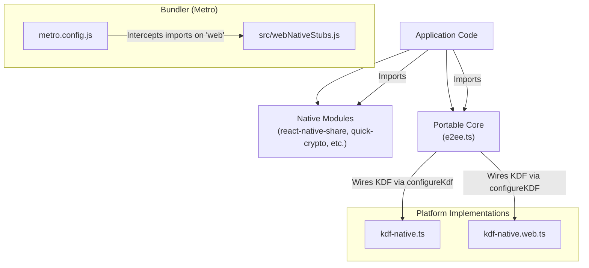
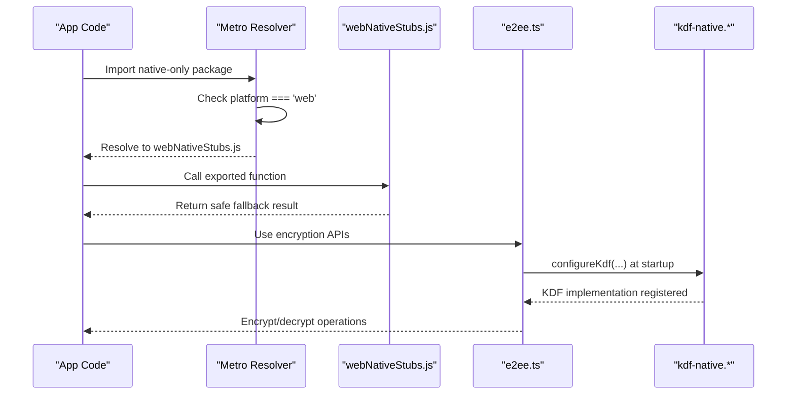
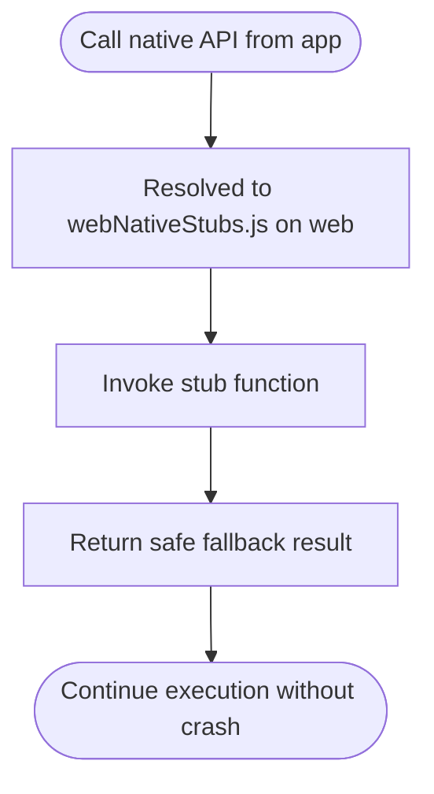
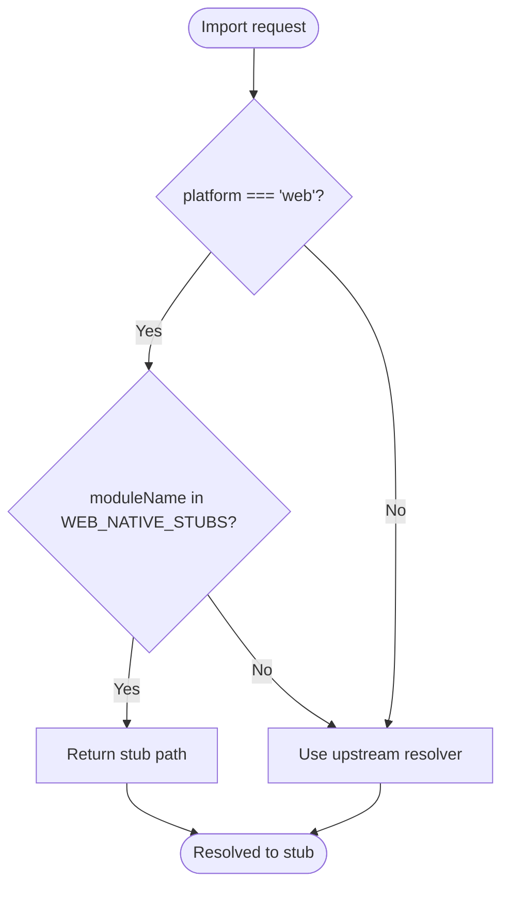
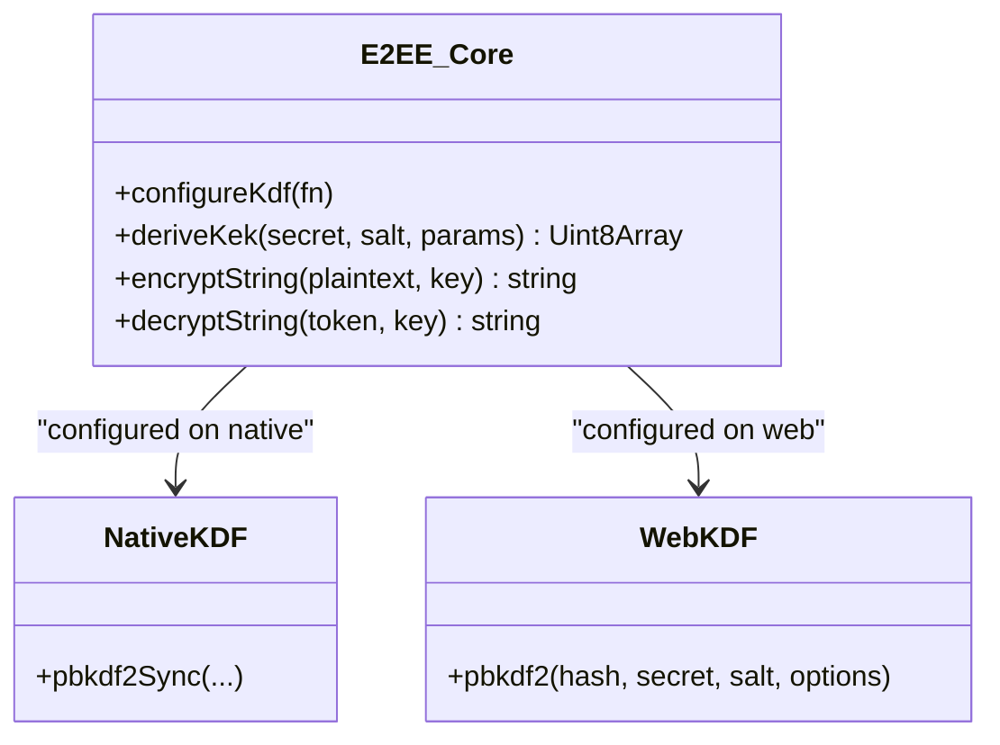
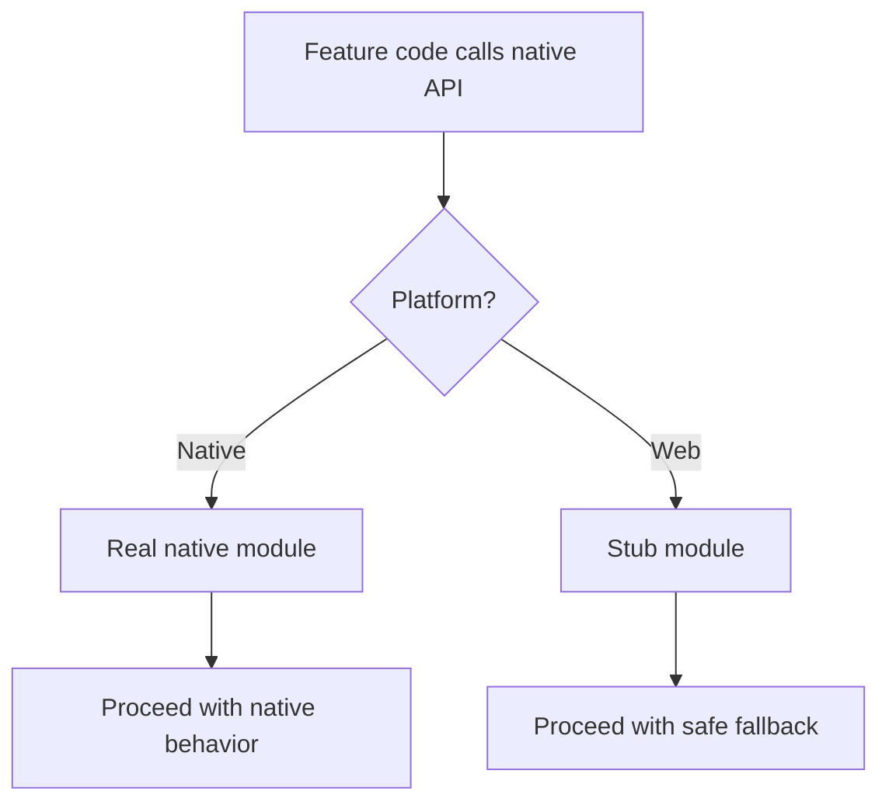
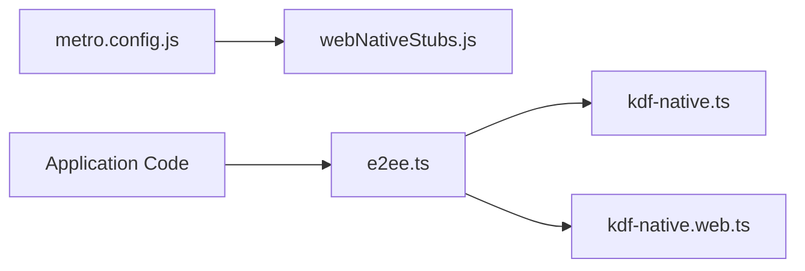

# Web Stub Implementation

<cite>
**Referenced Files in This Document**
- [webNativeStubs.js](file://src/webNativeStubs.js)
- [metro.config.js](file://metro.config.js)
- [kdf-native.ts](file://src/crypto/kdf-native.ts)
- [kdf-native.web.ts](file://src/crypto/kdf-native.web.ts)
- [e2ee.ts](file://src/crypto/e2ee.ts)
</cite>

## Table of Contents
1. Introduction
2. Project Structure
3. Core Components
4. Architecture Overview
5. Detailed Component Analysis
6. Dependency Analysis
7. Performance Considerations
8. Troubleshooting Guide
9. Conclusion
10. Appendices

## Introduction
This document explains how the project provides web platform stubs to ensure graceful degradation when native modules are unavailable, such as in browser environments or Expo Go. It focuses on the pattern used to intercept native-only dependencies during bundling and replace them with safe no-op implementations, enabling consistent behavior across platforms without runtime crashes.

The key idea is to:
- Detect the target platform at bundle time via Metro configuration.
- Redirect imports of native-only packages to a small stub module that exports safe fallback functions.
- Provide platform-specific implementations for features that require native performance (e.g., cryptographic KDF), while keeping the core logic portable.

This approach allows the application to run on both native and web targets with minimal conditional logic in feature code.

## Project Structure
At a high level, the web stub strategy spans three layers:
- Bundler-level interception: Metro resolves specific native packages to a single stub file when building for web.
- Feature-level stubs: A minimal JavaScript module exporting no-op functions for native APIs.
- Platform-specific wiring: Separate files for native and web paths where performance-sensitive functionality differs.

**Diagram sources**
- [metro.config.js:14-31](file://metro.config.js#L14-L31)
- [webNativeStubs.js:1-12](file://src/webNativeStubs.js#L1-L12)
- [kdf-native.ts:1-22](file://src/crypto/kdf-native.ts#L1-L22)
- [kdf-native.web.ts:1-16](file://src/crypto/kdf-native.web.ts#L1-L16)
- [e2ee.ts:136-149](file://src/crypto/e2ee.ts#L136-L149)

**Section sources**
- [metro.config.js:14-31](file://metro.config.js#L14-L31)
- [webNativeStubs.js:1-12](file://src/webNativeStubs.js#L1-L12)
- [kdf-native.ts:1-22](file://src/crypto/kdf-native.ts#L1-L22)
- [kdf-native.web.ts:1-16](file://src/crypto/kdf-native.web.ts#L1-L16)
- [e2ee.ts:136-149](file://src/crypto/e2ee.ts#L136-L149)

## Core Components
- Web stub resolver: Metro configuration redirects selected native-only packages to a shared stub file when building for web. This prevents import-time crashes caused by native module initialization.
- No-op stub module: Exports minimal, safe fallback functions for native APIs so calling code can proceed without errors.
- Platform-specific KDF wiring: The portable encryption core expects a KDF implementation to be configured at startup. Native builds use a fast native implementation; web builds use a pure-JS alternative.

Key responsibilities:
- Intercepting imports at bundle time for web only.
- Providing stable interfaces for native features with safe defaults.
- Keeping the core logic platform-agnostic by injecting platform-specific implementations.

**Section sources**
- [metro.config.js:14-31](file://metro.config.js#L14-L31)
- [webNativeStubs.js:1-12](file://src/webNativeStubs.js#L1-L12)
- [kdf-native.ts:1-22](file://src/crypto/kdf-native.ts#L1-L22)
- [kdf-native.web.ts:1-16](file://src/crypto/kdf-native.web.ts#L1-L16)
- [e2ee.ts:136-149](file://src/crypto/e2ee.ts#L136-L149)

## Architecture Overview
The architecture separates concerns between bundler-time resolution, runtime stubs, and platform-specific implementations:

- Metro config defines a set of native-only packages to stub on web and routes their imports to a single stub file.
- The stub file exports safe no-op functions that return predictable results, allowing UI and business logic to continue running.
- For performance-sensitive features like cryptography, the app wires a KDF implementation at startup. On native, it uses a fast JSI-backed library; on web, it uses a pure-JS implementation.

**Diagram sources**
- [metro.config.js:14-31](file://metro.config.js#L14-L31)
- [webNativeStubs.js:1-12](file://src/webNativeStubs.js#L1-L12)
- [e2ee.ts:136-149](file://src/crypto/e2ee.ts#L136-L149)
- [kdf-native.ts:1-22](file://src/crypto/kdf-native.ts#L1-L22)
- [kdf-native.web.ts:1-16](file://src/crypto/kdf-native.web.ts#L1-L16)

## Detailed Component Analysis

### Web Native Stubs Module
Responsibilities:
- Export no-op functions for native APIs that would otherwise crash on web.
- Provide consistent return shapes so calling code can handle success/failure uniformly.

Behavior highlights:
- Functions return structured results indicating failure and a message suitable for logging or user feedback.
- Empty namespaces are exported for modules that may be imported but not used on web.

**Diagram sources**
- [webNativeStubs.js:1-12](file://src/webNativeStubs.js#L1-L12)

**Section sources**
- [webNativeStubs.js:1-12](file://src/webNativeStubs.js#L1-L12)

### Metro Configuration Interception
Responsibilities:
- Maintain a list of native-only packages that must be stubbed on web.
- Override the resolver to redirect those imports to the stub file when building for web.

Behavior highlights:
- Only affects the web build; native builds resolve the real modules.
- Keeps the rest of the resolution pipeline intact by delegating to the upstream resolver.

**Diagram sources**
- [metro.config.js:14-31](file://metro.config.js#L14-L31)

**Section sources**
- [metro.config.js:14-31](file://metro.config.js#L14-L31)

### Platform-Specific KDF Wiring
Responsibilities:
- Provide a fast native PBKDF2 implementation for device builds.
- Provide a pure-JS PBKDF2 implementation for web builds.
- Keep the encryption core portable by injecting the KDF at startup.

Behavior highlights:
- The core requires a KDF to be configured before use; otherwise, it throws an error to prevent silent failures.
- The native path uses a JSI-backed library for performance; the web path uses a pure-JS library.

**Diagram sources**
- [e2ee.ts:136-149](file://src/crypto/e2ee.ts#L136-L149)
- [kdf-native.ts:1-22](file://src/crypto/kdf-native.ts#L1-L22)
- [kdf-native.web.ts:1-16](file://src/crypto/kdf-native.web.ts#L1-L16)

**Section sources**
- [kdf-native.ts:1-22](file://src/crypto/kdf-native.ts#L1-L22)
- [kdf-native.web.ts:1-16](file://src/crypto/kdf-native.web.ts#L1-L16)
- [e2ee.ts:136-149](file://src/crypto/e2ee.ts#L136-L149)

### Conceptual Overview
The overall pattern for cross-platform compatibility:
- Identify native-only dependencies that cannot run in the browser.
- At bundle time, redirect those imports to stubs on web.
- Provide safe fallbacks that maintain expected interfaces.
- For performance-sensitive features, use platform-specific implementations injected into portable cores.
- Ensure feature code remains free of platform conditionals by relying on resolved modules.

[No sources needed since this diagram shows conceptual workflow, not actual code structure]

## Dependency Analysis
The dependency relationships center around Metro’s resolver and the portable encryption core:

- Metro config depends on a set of native-only packages and maps them to a stub file on web.
- Application code depends on the portable core, which depends on a configured KDF implementation.
- Platform-specific KDF modules implement the same interface, enabling seamless substitution.

**Diagram sources**
- [metro.config.js:14-31](file://metro.config.js#L14-L31)
- [webNativeStubs.js:1-12](file://src/webNativeStubs.js#L1-L12)
- [e2ee.ts:136-149](file://src/crypto/e2ee.ts#L136-L149)
- [kdf-native.ts:1-22](file://src/crypto/kdf-native.ts#L1-L22)
- [kdf-native.web.ts:1-16](file://src/crypto/kdf-native.web.ts#L1-L16)

**Section sources**
- [metro.config.js:14-31](file://metro.config.js#L14-L31)
- [webNativeStubs.js:1-12](file://src/webNativeStubs.js#L1-L12)
- [e2ee.ts:136-149](file://src/crypto/e2ee.ts#L136-L149)
- [kdf-native.ts:1-22](file://src/crypto/kdf-native.ts#L1-L22)
- [kdf-native.web.ts:1-16](file://src/crypto/kdf-native.web.ts#L1-L16)

## Performance Considerations
- Native KDF path: Uses a JSI-backed library for fast cryptographic operations on devices. This is essential for acceptable login times under heavy iteration counts.
- Web KDF path: Uses a pure-JS implementation. While slower than native, it is sufficient for local web runs and screenshots.
- Avoid importing native-only modules directly in feature code; rely on Metro redirection to keep bundles clean and avoid runtime overhead.

Recommendations:
- Keep stubs minimal to reduce bundle size.
- Measure performance differences between native and web paths for critical operations.
- Consider feature flags or environment checks if certain features should be disabled on web.

[No sources needed since this section provides general guidance]

## Troubleshooting Guide
Common issues and resolutions:
- Import-time crashes on web due to native modules: Ensure the native-only package is included in the Metro stub set and that the resolver correctly redirects to the stub file.
- Missing KDF configuration: If the encryption core throws about an unconfigured KDF, verify that the appropriate KDF wiring file is imported at app entry before any encryption operations.
- Unexpected behavior in Expo Go: Some native modules may not be available; rely on stubs and test thoroughly in the target environment.

Verification steps:
- Confirm Metro resolves native-only imports to the stub file on web builds.
- Validate that the KDF is configured before any encryption/decryption calls.
- Test feature flows on both native and web targets to ensure consistent behavior.

**Section sources**
- [metro.config.js:14-31](file://metro.config.js#L14-L31)
- [webNativeStubs.js:1-12](file://src/webNativeStubs.js#L1-L12)
- [e2ee.ts:136-149](file://src/crypto/e2ee.ts#L136-L149)
- [kdf-native.ts:1-22](file://src/crypto/kdf-native.ts#L1-L22)
- [kdf-native.web.ts:1-16](file://src/crypto/kdf-native.web.ts#L1-L16)

## Conclusion
By intercepting native-only imports at bundle time and providing safe stubs, the application achieves graceful degradation on web without compromising native performance. The portable encryption core demonstrates a robust pattern for platform-specific wiring through dependency injection. This approach minimizes conditional logic in feature code and ensures consistent behavior across platforms.

[No sources needed since this section summarizes without analyzing specific files]

## Appendices

### Pattern Checklist for Creating Web-Compatible Alternatives
- Identify native-only dependencies that cause import-time failures on web.
- Add them to the Metro stub set and ensure they resolve to a stub file on web.
- Implement no-op functions with stable return shapes in the stub module.
- For performance-sensitive features, create platform-specific implementations and wire them into the portable core at startup.
- Test on both native and web targets to validate behavior and performance.

[No sources needed since this section provides general guidance]