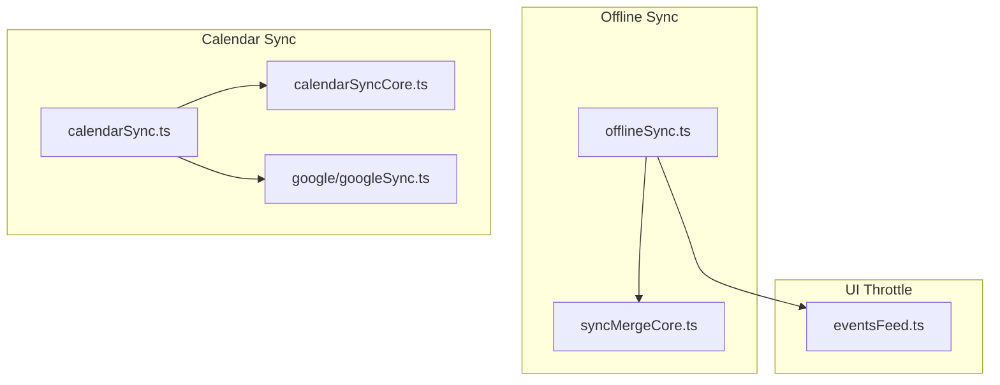
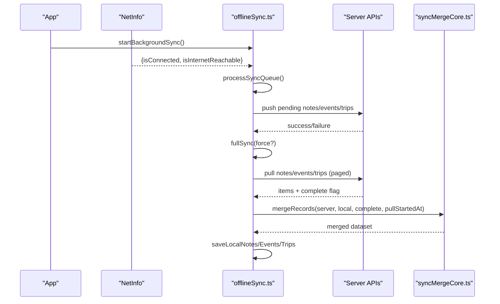
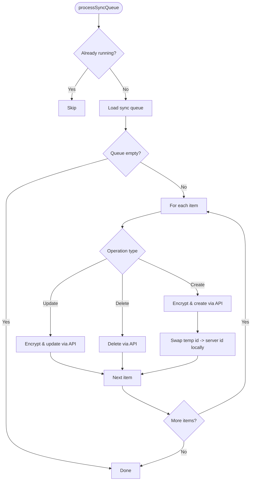
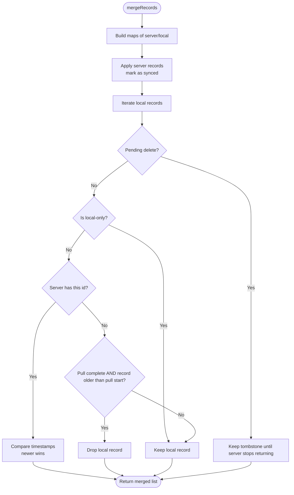
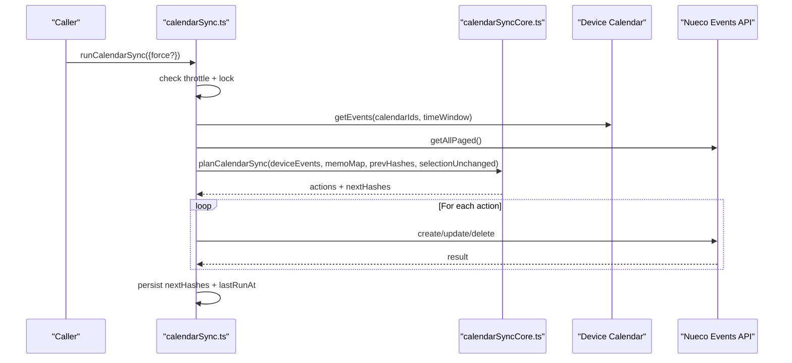
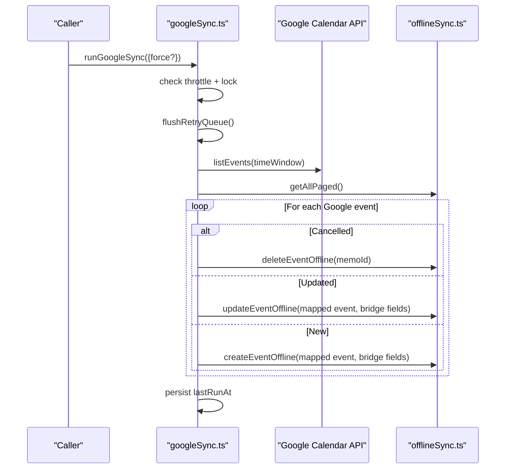
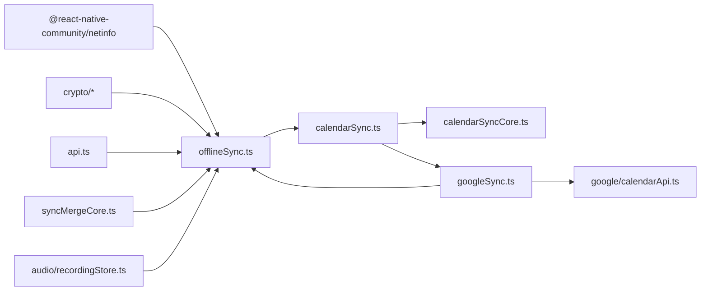

# Background Synchronization

<cite>
**Referenced Files in This Document**
- [offlineSync.ts](file://src/offlineSync.ts)
- [syncMergeCore.ts](file://src/syncMergeCore.ts)
- [calendarSync.ts](file://src/calendarSync.ts)
- [calendarSyncCore.ts](file://src/calendarSyncCore.ts)
- [googleSync.ts](file://src/google/googleSync.ts)
- [eventsFeed.ts](file://src/events/eventsFeed.ts)
</cite>

## Table of Contents
1. [Introduction](#introduction)
2. [Project Structure](#project-structure)
3. [Core Components](#core-components)
4. [Architecture Overview](#architecture-overview)
5. [Detailed Component Analysis](#detailed-component-analysis)
6. [Dependency Analysis](#dependency-analysis)
7. [Performance Considerations](#performance-considerations)
8. [Troubleshooting Guide](#troubleshooting-guide)
9. [Conclusion](#conclusion)
10. [Appendices](#appendices)

## Introduction
This document explains the background synchronization system that keeps local data consistent with the server and external calendars when network connectivity is available. It covers:
- NetInfo-based network state monitoring to trigger deferred operations
- Throttled full syncs to prevent excessive API calls
- Deferred operation processing via a durable queue
- Sync lifecycle including startup repair for stale recording links, conflict resolution, and cleanup procedures
- Configuration options for sync intervals, retry policies, and monitoring approaches for health and performance

## Project Structure
The background sync spans several modules:
- Core offline sync engine and NetInfo listener
- Merge logic for reconciling server vs local records
- Device calendar sync (opt-in)
- Google Calendar two-way sync
- Focus-triggered throttling for UI-driven syncs

**Diagram sources**
- [offlineSync.ts:785-1070](file://src/offlineSync.ts#L785-L1070)
- [syncMergeCore.ts:1-140](file://src/syncMergeCore.ts#L1-L140)
- [calendarSync.ts:1-199](file://src/calendarSync.ts#L1-L199)
- [calendarSyncCore.ts:1-149](file://src/calendarSyncCore.ts#L1-L149)
- [googleSync.ts:1-388](file://src/google/googleSync.ts#L1-L388)
- [eventsFeed.ts:23-60](file://src/events/eventsFeed.ts#L23-L60)

**Section sources**
- [offlineSync.ts:1-120](file://src/offlineSync.ts#L1-L120)
- [calendarSync.ts:1-46](file://src/calendarSync.ts#L1-L46)
- [googleSync.ts:1-55](file://src/google/googleSync.ts#L1-L55)
- [eventsFeed.ts:23-60](file://src/events/eventsFeed.ts#L23-L60)

## Core Components
- Offline sync engine: manages local storage, sync queue, full sync, and background sync via NetInfo
- Merge core: defines reconciliation rules between server and local records
- Calendar sync: device calendar import/export with throttling and safe deletion policy
- Google sync: two-way sync with persistent retry queue and conservative deletions
- Focus throttle: prevents rapid focus-triggered syncs from overloading the app

Key responsibilities:
- Defer operations when offline; process them on reconnect
- Throttle expensive full syncs to avoid redundant work
- Reconcile conflicts using timestamps and completeness flags
- Provide startup repair for orphaned or stale references

**Section sources**
- [offlineSync.ts:785-1070](file://src/offlineSync.ts#L785-L1070)
- [syncMergeCore.ts:16-140](file://src/syncMergeCore.ts#L16-L140)
- [calendarSync.ts:97-199](file://src/calendarSync.ts#L97-L199)
- [googleSync.ts:86-125](file://src/google/googleSync.ts#L86-L125)
- [eventsFeed.ts:23-60](file://src/events/eventsFeed.ts#L23-L60)

## Architecture Overview
The system combines immediate local writes with deferred network operations. When online, it pushes pending changes and periodically pulls server updates, merging them safely into local storage. Network events trigger background syncs, while UI focus triggers are throttled to reduce load.

**Diagram sources**
- [offlineSync.ts:1043-1054](file://src/offlineSync.ts#L1043-L1054)
- [offlineSync.ts:798-837](file://src/offlineSync.ts#L798-L837)
- [offlineSync.ts:930-1037](file://src/offlineSync.ts#L930-L1037)
- [syncMergeCore.ts:76-121](file://src/syncMergeCore.ts#L76-L121)

## Detailed Component Analysis

### Offline Sync Engine (offlineSync.ts)
Responsibilities:
- Local persistence for notes, events, trips, and sync queue
- Defers operations to a durable queue when offline
- Processes queued operations when online
- Runs full sync with throttling and E2EE safeguards
- Monitors network state via NetInfo to resume background sync

Key behaviors:
- Full sync throttle: prevents repeated full syncs within a short window unless forced
- E2EE guard: skips full sync until DEK is loaded to avoid corrupting plaintext store
- Queue deduplication: merges create/update/delete for same entity id
- Conflict resolution: uses updated_at timestamps and completeness flags during merge
- Startup repair: re-links recordings stranded on temporary note ids by replaying persisted aliases and content matching

**Diagram sources**
- [offlineSync.ts:798-837](file://src/offlineSync.ts#L798-L837)
- [offlineSync.ts:884-928](file://src/offlineSync.ts#L884-L928)

**Section sources**
- [offlineSync.ts:112-193](file://src/offlineSync.ts#L112-L193)
- [offlineSync.ts:298-327](file://src/offlineSync.ts#L298-L327)
- [offlineSync.ts:365-415](file://src/offlineSync.ts#L365-L415)
- [offlineSync.ts:798-837](file://src/offlineSync.ts#L798-L837)
- [offlineSync.ts:930-1037](file://src/offlineSync.ts#L930-L1037)
- [offlineSync.ts:1043-1070](file://src/offlineSync.ts#L1043-L1070)

### Merge Logic (syncMergeCore.ts)
Purpose:
- Define deterministic reconciliation rules for server vs local records
- Ensure absence means deletion only when the server pull is known complete and older than the record’s timestamp

Rules:
- Pending deletes win over server live records
- Local-only records survive
- Newer timestamps win when both sides have the record
- Absence means deletion only if pull is complete and record not newer than pull start

**Diagram sources**
- [syncMergeCore.ts:76-121](file://src/syncMergeCore.ts#L76-L121)
- [syncMergeCore.ts:123-139](file://src/syncMergeCore.ts#L123-L139)

**Section sources**
- [syncMergeCore.ts:16-140](file://src/syncMergeCore.ts#L16-L140)

### Device Calendar Sync (calendarSync.ts + calendarSyncCore.ts)
Responsibilities:
- Import device calendar events into Nueco (opt-in)
- Throttle runs and use a storage-based lock to avoid concurrent runs
- Plan actions (create/update/delete) based on hashes and selection stability
- Safely mirror deletions only when calendar selection hasn’t changed and fetch was non-empty

Configuration:
- Throttle interval: 15 minutes
- Lock TTL: 2 minutes
- Time window: past 7 days, future 180 days

**Diagram sources**
- [calendarSync.ts:97-199](file://src/calendarSync.ts#L97-L199)
- [calendarSyncCore.ts:80-149](file://src/calendarSyncCore.ts#L80-L149)

**Section sources**
- [calendarSync.ts:31-46](file://src/calendarSync.ts#L31-L46)
- [calendarSync.ts:97-199](file://src/calendarSync.ts#L97-L199)
- [calendarSyncCore.ts:52-78](file://src/calendarSyncCore.ts#L52-L78)
- [calendarSyncCore.ts:80-149](file://src/calendarSyncCore.ts#L80-L149)

### Google Calendar Sync (google/googleSync.ts)
Responsibilities:
- Two-way sync between Nueco events and a selected Google calendar
- Persistent retry queue for outbound operations
- Conservative deletion mirroring within fetched window
- Throttled runs with storage-based lock

Configuration:
- Throttle interval: 15 minutes
- Lock TTL: 5 minutes
- Time window: past 7 days, future 180 days

**Diagram sources**
- [googleSync.ts:86-125](file://src/google/googleSync.ts#L86-L125)
- [googleSync.ts:250-372](file://src/google/googleSync.ts#L250-L372)

**Section sources**
- [googleSync.ts:44-55](file://src/google/googleSync.ts#L44-L55)
- [googleSync.ts:86-125](file://src/google/googleSync.ts#L86-L125)
- [googleSync.ts:201-238](file://src/google/googleSync.ts#L201-L238)
- [googleSync.ts:250-372](file://src/google/googleSync.ts#L250-L372)

### Focus-Throttled Sync (eventsFeed.ts)
Purpose:
- Prevent rapid focus-triggered network syncs from overwhelming the JS thread
- Allow explicit user gestures (pull-to-refresh) to bypass throttling

Behavior:
- Minimum spacing between focus-triggered syncs
- Force flag always allows sync and resets the window

**Section sources**
- [eventsFeed.ts:23-60](file://src/events/eventsFeed.ts#L23-L60)

## Dependency Analysis
- offlineSync.ts depends on:
  - NetInfo for network state monitoring
  - Crypto modules for encryption/decryption
  - API modules for server communication
  - syncMergeCore for reconciliation
  - Audio recording store for startup repair
- calendarSync.ts depends on:
  - expo-calendar (when available)
  - googleSync for two-way sync when connected
  - offlineSync for safe deletion via queue
- googleSync.ts depends on:
  - offlineSync for creating/updating/deleting Nueco events
  - calendarApi for Google Calendar operations
  - AsyncStorage for retry queue and throttle markers

**Diagram sources**
- [offlineSync.ts:12-26](file://src/offlineSync.ts#L12-L26)
- [calendarSync.ts:17-24](file://src/calendarSync.ts#L17-L24)
- [googleSync.ts:24-42](file://src/google/googleSync.ts#L24-L42)

**Section sources**
- [offlineSync.ts:12-26](file://src/offlineSync.ts#L12-L26)
- [calendarSync.ts:17-24](file://src/calendarSync.ts#L17-L24)
- [googleSync.ts:24-42](file://src/google/googleSync.ts#L24-L42)

## Performance Considerations
- Full sync throttling: prevents redundant network requests and heavy decryption loops
- File-backed storage: avoids AsyncStorage CursorWindow limits for large collections
- In-memory caching: reduces repeated JSON.parse overhead for large datasets
- Queue deduplication: minimizes redundant operations for the same entity
- Safe deletion policies: prevent accidental mass deletions due to partial reads or transient failures
- Focus throttling: balances responsiveness with network efficiency

[No sources needed since this section provides general guidance]

## Troubleshooting Guide
Common issues and resolutions:
- Stale recording links: use startup repair to re-link recordings to correct notes
- Sync queue stuck: verify network state and ensure background sync listener is active
- Full sync not triggering: check throttle window and E2EE key availability
- Calendar sync not deleting: confirm selection unchanged and fetch non-empty conditions
- Google sync retries: inspect retry queue and ensure token validity

Monitoring approaches:
- Log network state transitions and sync starts
- Track last run timestamps for throttle diagnostics
- Monitor queue sizes and failure rates
- Validate merge outcomes and incomplete pulls

**Section sources**
- [offlineSync.ts:298-327](file://src/offlineSync.ts#L298-L327)
- [offlineSync.ts:1043-1070](file://src/offlineSync.ts#L1043-L1070)
- [calendarSync.ts:164-191](file://src/calendarSync.ts#L164-L191)
- [googleSync.ts:108-125](file://src/google/googleSync.ts#L108-L125)

## Conclusion
The background synchronization system provides robust offline-first behavior with intelligent throttling, conflict resolution, and recovery mechanisms. It ensures data consistency across devices and external calendars while maintaining performance and reliability through careful design choices around queuing, merging, and network monitoring.

[No sources needed since this section summarizes without analyzing specific files]

## Appendices

### Configuration Options Summary
- Full sync throttle: 20 seconds minimum between automatic full syncs
- Focus sync throttle: 20 seconds minimum between focus-triggered syncs
- Device calendar sync throttle: 15 minutes
- Google sync throttle: 15 minutes
- Lock TTLs: 2 minutes (device), 5 minutes (Google)
- Time windows: past 7 days, future 180 days for calendar syncs

**Section sources**
- [offlineSync.ts:790-796](file://src/offlineSync.ts#L790-L796)
- [eventsFeed.ts:23-24](file://src/events/eventsFeed.ts#L23-L24)
- [calendarSync.ts:40-45](file://src/calendarSync.ts#L40-L45)
- [googleSync.ts:51-54](file://src/google/googleSync.ts#L51-L54)