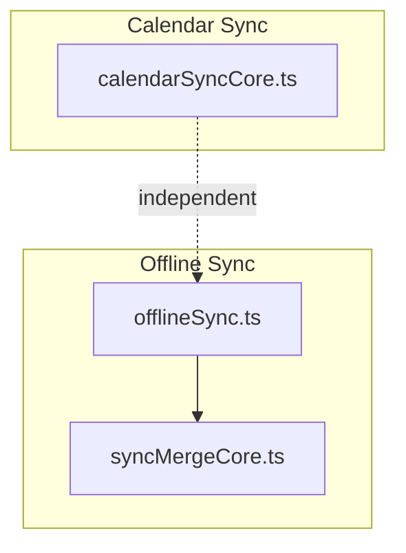
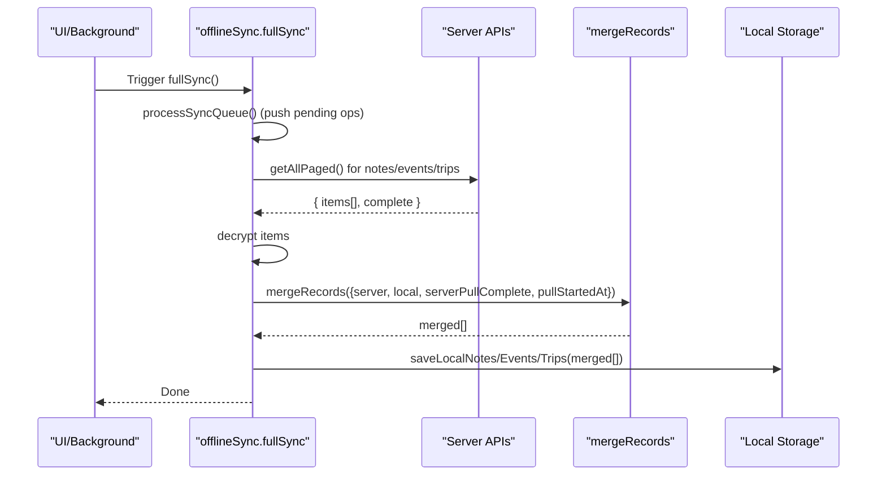
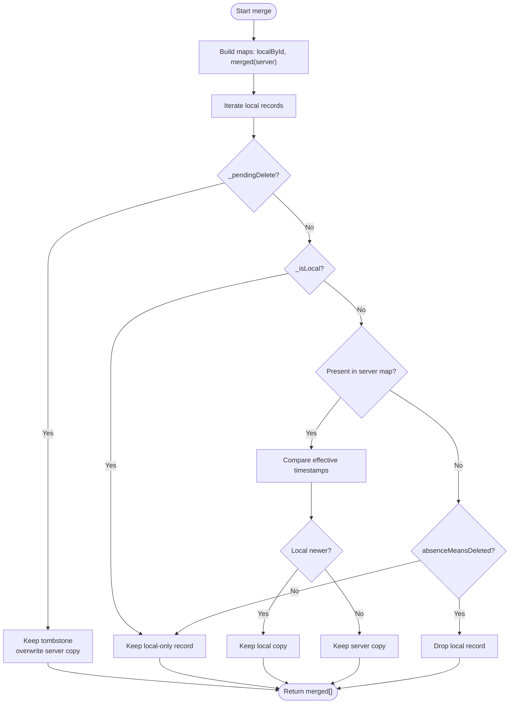
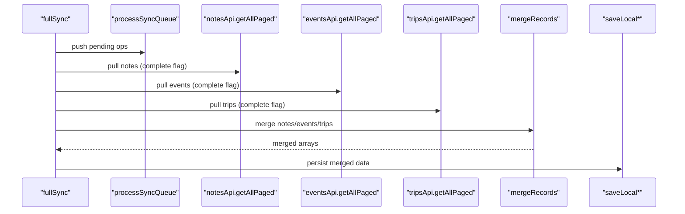
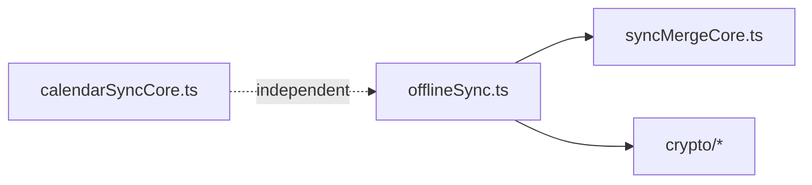

# Conflict Detection & Resolution

<cite>
**Referenced Files in This Document**
- [syncMergeCore.ts](file://src/syncMergeCore.ts)
- [offlineSync.ts](file://src/offlineSync.ts)
- [calendarSyncCore.ts](file://src/calendarSyncCore.ts)
- [syncMergeCore.test.ts](file://src/syncMergeCore.test.ts)
</cite>

## Table of Contents
1. [Introduction](#introduction)
2. [Project Structure](#project-structure)
3. [Core Components](#core-components)
4. [Architecture Overview](#architecture-overview)
5. [Detailed Component Analysis](#detailed-component-analysis)
6. [Dependency Analysis](#dependency-analysis)
7. [Performance Considerations](#performance-considerations)
8. [Troubleshooting Guide](#troubleshooting-guide)
9. [Conclusion](#conclusion)

## Introduction
This document explains the conflict detection and resolution algorithms used by the offline-first synchronization system. It focuses on timestamp-based conflict resolution using updated_at fields, merge strategies for concurrent modifications across devices, and reconciliation during full sync operations. It also documents the mergeRecords function’s logic for combining local and remote changes, handling deleted vs modified records, preserving user intent, and resolving edge cases such as simultaneous edits to the same field.

## Project Structure
The conflict resolution logic is implemented as a small, testable core module that is consumed by the offline sync engine during full synchronization. Calendar synchronization uses a separate decision layer for device calendar events; it does not participate in the general note/event/trip merge but demonstrates similar principles (hashing and conservative deletion).

**Diagram sources**
- [offlineSync.ts:931-1037](file://src/offlineSync.ts#L931-L1037)
- [syncMergeCore.ts:16-140](file://src/syncMergeCore.ts#L16-L140)
- [calendarSyncCore.ts:1-149](file://src/calendarSyncCore.ts#L1-L149)

**Section sources**
- [offlineSync.ts:931-1037](file://src/offlineSync.ts#L931-L1037)
- [syncMergeCore.ts:16-140](file://src/syncMergeCore.ts#L16-L140)
- [calendarSyncCore.ts:1-149](file://src/calendarSyncCore.ts#L1-L149)

## Core Components
- Timestamp utilities and merge rules are isolated in a pure module for notes/events/trips:
  - recordTimestamp: resolves the effective timestamp for comparison (prefers updated_at, falls back to created_at).
  - isNewerTimestamp: strict “a is newer than b” over ISO timestamps with safe handling of unparseable inputs.
  - absenceMeansDeleted: determines whether a missing server record should be treated as deleted locally.
  - mergeRecords: reconciles server and local collections with newest-write-wins semantics and special handling for pending deletes and local-only records.

- The offline sync engine orchestrates:
  - Pushing pending operations first.
  - Pulling all pages from the server and capturing pullStartedAt.
  - Decrypting server payloads.
  - Merging via mergeRecords with per-entity adoptLocalFields where needed.
  - Saving merged results back to local storage.

**Section sources**
- [syncMergeCore.ts:16-140](file://src/syncMergeCore.ts#L16-L140)
- [offlineSync.ts:931-1037](file://src/offlineSync.ts#L931-L1037)

## Architecture Overview
The full sync flow ensures data consistency while protecting against partial pulls and mid-pull edits. It applies a consistent set of rules regardless of entity type.

**Diagram sources**
- [offlineSync.ts:931-1037](file://src/offlineSync.ts#L931-L1037)
- [syncMergeCore.ts:76-121](file://src/syncMergeCore.ts#L76-L121)

## Detailed Component Analysis

### Timestamp-Based Conflict Resolution
- Effective timestamp selection:
  - Uses updated_at when present; otherwise falls back to created_at for legacy or backend rows without updated_at.
- Comparison semantics:
  - Strictly compares parsed ISO timestamps.
  - Unreadable timestamps do not win comparisons; they lose unless the other side is also unreadable.
  - Ties go to the server copy (local must be strictly newer to survive).

These behaviors ensure deterministic merges even with mixed legacy data and timezone-aware timestamps.

**Section sources**
- [syncMergeCore.ts:16-46](file://src/syncMergeCore.ts#L16-L46)
- [syncMergeCore.test.ts:47-70](file://src/syncMergeCore.test.ts#L47-L70)

### Merge Strategy: mergeRecords
The merge algorithm enforces these precedence rules:
1. Pending delete wins: if a local record has _pendingDelete, it stays deleted until the server confirms absence.
2. Local-only survives: records never seen by the server (_isLocal) are preserved even if absent from the server response.
3. Newest-write-wins: when both sides have the record, the one with the newer effective timestamp wins.
4. Absence handling:
   - If the server pull was complete and the local record was not written after the pull started, treat absence as deletion.
   - Otherwise, keep the local record to avoid deleting items that may have been re-sorted past a read page.

Device-only fields (e.g., local_notification_id) can be preserved by passing an adoptLocalFields function that copies relevant fields from the previous local copy onto the incoming server record.

**Diagram sources**
- [syncMergeCore.ts:76-121](file://src/syncMergeCore.ts#L76-L121)
- [syncMergeCore.ts:123-140](file://src/syncMergeCore.ts#L123-L140)

**Section sources**
- [syncMergeCore.ts:76-140](file://src/syncMergeCore.ts#L76-L140)
- [syncMergeCore.test.ts:72-262](file://src/syncMergeCore.test.ts#L72-L262)

### Full Sync Reconciliation Flow
fullSync performs:
- Push pending operations first to minimize conflicts.
- Capture pullStartedAt before pulling to protect mid-pull edits.
- Pull all pages for each entity independently and track completeness.
- Decrypt server responses.
- Merge using mergeRecords with optional adoptLocalFields (e.g., preserving device-specific fields like notification IDs for events).
- Save merged results back to local storage.

**Diagram sources**
- [offlineSync.ts:931-1037](file://src/offlineSync.ts#L931-L1037)
- [syncMergeCore.ts:76-121](file://src/syncMergeCore.ts#L76-L121)

**Section sources**
- [offlineSync.ts:931-1037](file://src/offlineSync.ts#L931-L1037)

### Handling Deleted vs Modified Records
- Pending delete:
  - When a local record is marked for deletion (_pendingDelete), it remains deleted even if the server still returns it. Once the server stops returning it, the tombstone clears.
- Server-side deletion:
  - If the server pull is complete and the local record was not edited after the pull started, absence means deletion.
- Local-only records:
  - Never deleted by absence because the server has never seen them; they remain until successfully pushed and acknowledged.

**Section sources**
- [syncMergeCore.ts:76-121](file://src/syncMergeCore.ts#L76-L121)
- [syncMergeCore.test.ts:127-191](file://src/syncMergeCore.test.ts#L127-L191)

### Preservation of User Intent
- Local-only writes:
  - Always preserved until the server acknowledges them.
- Mid-pull edits:
  - Protected by comparing against pullStartedAt; edits made during the pull are kept to avoid reverting user work.
- Device-only fields:
  - Preserved via adoptLocalFields so local-only metadata (e.g., OS notification handles) is not lost on merge.

**Section sources**
- [syncMergeCore.ts:56-64](file://src/syncMergeCore.ts#L56-L64)
- [syncMergeCore.ts:123-140](file://src/syncMergeCore.ts#L123-L140)
- [offlineSync.ts:996-1004](file://src/offlineSync.ts#L996-L1004)

### Common Conflict Scenarios and Outcomes
- Concurrent edits on the same record:
  - Outcome: newest effective timestamp wins. If timestamps tie, server copy prevails.
- Edit made after server update but before next pull:
  - Outcome: local edit survives if its effective timestamp is newer than the server’s.
- Record edited mid-pull:
  - Outcome: kept even if absent from the current page due to re-sorting; absenceMeansDeleted returns false for records newer than pullStartedAt.
- Deletion in progress:
  - Outcome: tombstone persists until server confirms absence; prevents accidental resurrection.
- Legacy records without updated_at:
  - Outcome: compare using created_at; newest-write-wins still applies.

These scenarios are validated by unit tests covering timestamp behavior, presence/absence, pending deletes, and device-only field adoption.

**Section sources**
- [syncMergeCore.test.ts:47-70](file://src/syncMergeCore.test.ts#L47-L70)
- [syncMergeCore.test.ts:72-262](file://src/syncMergeCore.test.ts#L72-L262)

### Edge Cases: Simultaneous Edits to the Same Field
- Timestamp ties:
  - Deterministic outcome: server copy wins.
- Unparseable timestamps:
  - Safe fallback: cannot win; avoids incorrect precedence.
- Timezone differences:
  - Comparisons use parsed instants, ensuring correct ordering across offsets.

**Section sources**
- [syncMergeCore.test.ts:61-70](file://src/syncMergeCore.test.ts#L61-L70)
- [syncMergeCore.test.ts:105-125](file://src/syncMergeCore.test.ts#L105-L125)

### Calendar Sync Decision Logic (Related)
While not part of the general note/event/trip merge, calendar sync demonstrates similar principles:
- Hash-based change detection for device calendar events.
- Conservative deletion only when calendar selection is unchanged and fetch is non-empty.
- Mapping between device event identifiers and memoized Nueco event identifiers.

**Section sources**
- [calendarSyncCore.ts:1-149](file://src/calendarSyncCore.ts#L1-L149)

## Dependency Analysis
- offlineSync depends on syncMergeCore for merging logic and on crypto modules for encryption/decryption.
- mergeRecords is pure and testable without network or storage dependencies.
- Calendar sync is decoupled from the main merge path but shares concepts (hashing, conservative deletion).

**Diagram sources**
- [offlineSync.ts:931-1037](file://src/offlineSync.ts#L931-L1037)
- [syncMergeCore.ts:16-140](file://src/syncMergeCore.ts#L16-L140)
- [calendarSyncCore.ts:1-149](file://src/calendarSyncCore.ts#L1-L149)

**Section sources**
- [offlineSync.ts:931-1037](file://src/offlineSync.ts#L931-L1037)
- [syncMergeCore.ts:16-140](file://src/syncMergeCore.ts#L16-L140)
- [calendarSyncCore.ts:1-149](file://src/calendarSyncCore.ts#L1-L149)

## Performance Considerations
- Full sync throttling:
  - Avoids redundant full syncs within a short window to reduce network and CPU usage.
- In-memory caching:
  - Local collections and sync queue are cached in memory to avoid repeated file reads/writes during a single sync cycle.
- File-backed storage:
  - Large collections are persisted to JSON files to bypass AsyncStorage row-size limits and prevent silent data loss on Android.
- Concurrency control:
  - Mutexes serialize critical sections around notes to prevent race conditions during concurrent upserts and sync operations.

[No sources needed since this section provides general guidance]

## Troubleshooting Guide
- Missing records after sync:
  - Verify serverPullComplete is true; incomplete pulls intentionally preserve local records to avoid accidental deletions.
- Unexpected resurrection of deleted records:
  - Ensure _pendingDelete is cleared only after server confirms absence; tombstones persist until then.
- Conflicts not resolved as expected:
  - Confirm effective timestamps: updated_at preferred; created_at fallback for legacy records.
  - Check for unparseable timestamps which cannot win comparisons.
- Device-specific fields lost:
  - Ensure adoptLocalFields is provided for entities with device-only fields (e.g., events’ local_notification_id).

**Section sources**
- [syncMergeCore.ts:123-140](file://src/syncMergeCore.ts#L123-L140)
- [offlineSync.ts:996-1004](file://src/offlineSync.ts#L996-L1004)
- [syncMergeCore.test.ts:161-191](file://src/syncMergeCore.test.ts#L161-L191)

## Conclusion
The offline-first synchronization system uses a robust, timestamp-based merge strategy that preserves user intent, safely handles partial pulls, and supports legacy data. The core merge logic is pure and well-tested, enabling predictable outcomes for common and edge-case conflicts. Full sync orchestrates pushes, pulls, decryption, and merging with safeguards like throttling, concurrency control, and device-field preservation. Calendar sync follows similar principles tailored to device calendar integration.