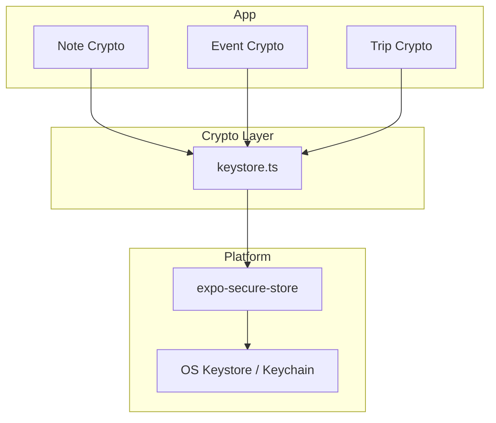
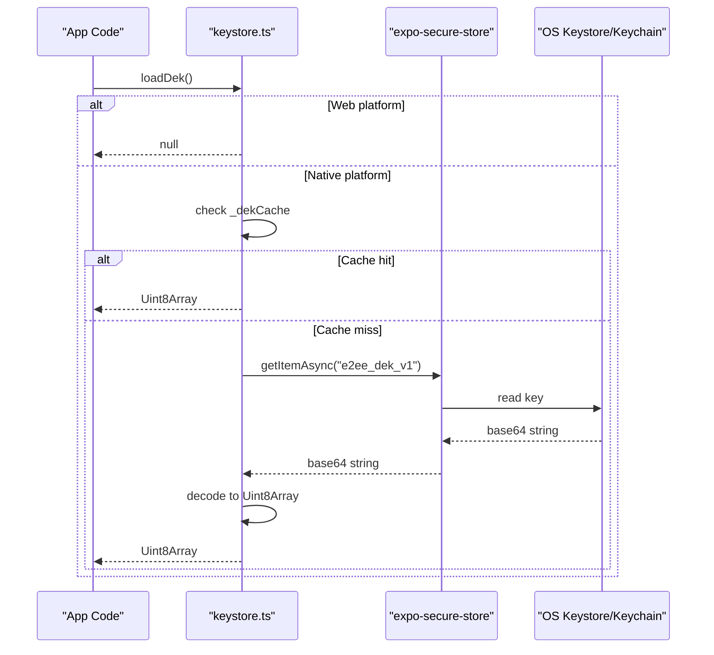
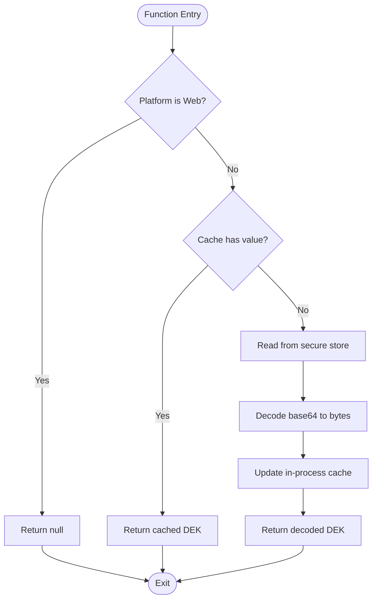
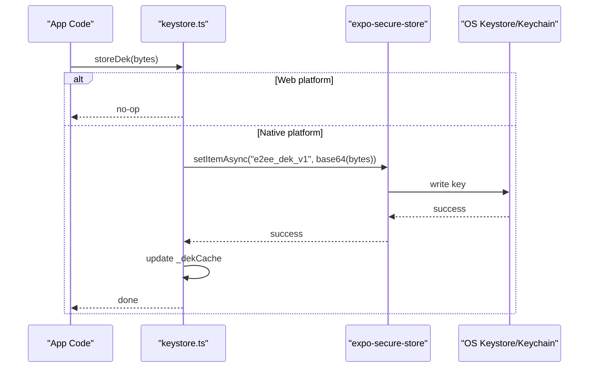
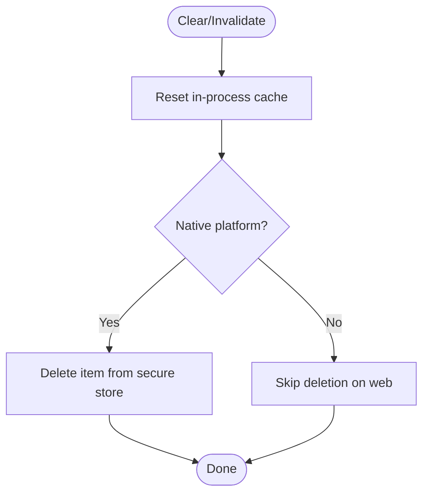
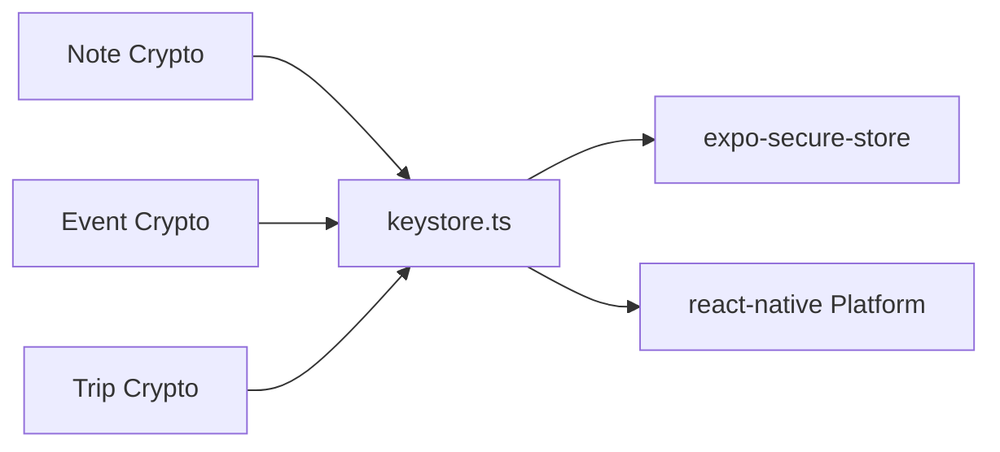

# Local Storage & Data Persistence

<cite>
**Referenced Files in This Document**
- [keystore.ts](file://src/crypto/keystore.ts)
</cite>

## Table of Contents
1. [Introduction](#introduction)
2. [Project Structure](#project-structure)
3. [Core Components](#core-components)
4. [Architecture Overview](#architecture-overview)
5. [Detailed Component Analysis](#detailed-component-analysis)
6. [Dependency Analysis](#dependency-analysis)
7. [Performance Considerations](#performance-considerations)
8. [Troubleshooting Guide](#troubleshooting-guide)
9. [Conclusion](#conclusion)

## Introduction
This document describes the local storage and data persistence layer with a focus on how cryptographic keys are persisted securely and how the application avoids heavy reliance on general-purpose key-value stores for sensitive material. It explains the file-backed approach for storing the Data Encryption Key (DEK) using the platform’s secure keystore, the in-process caching strategy to minimize native calls, and the migration-safe design that isolates crypto state from app data. While this repository does not include a generic JSON store implementation here, the patterns documented below apply to any persistent layer that must protect secrets and coordinate concurrent access safely.

## Project Structure
The persistence-related code relevant to this document is concentrated in the crypto module:
- Crypto keystore abstraction for secure DEK storage and retrieval
- Platform-aware behavior (native vs web)
- In-process memoization to reduce expensive native calls

**Diagram sources**
- [keystore.ts:1-53](file://src/crypto/keystore.ts#L1-L53)

**Section sources**
- [keystore.ts:1-53](file://src/crypto/keystore.ts#L1-L53)

## Core Components
- Secure DEK storage: The DEK is stored base64-encoded in the OS keystore via expo-secure-store and never sent to servers or analytics.
- In-process cache: A process-scoped memo holds the DEK after first load to avoid repeated native calls within a single operation.
- Platform gating: On web, all operations are no-ops and load returns null, ensuring E2EE remains native-only.
- Lifecycle helpers: Functions to store, load, clear, and check presence of the DEK, plus an invalidation helper for sign-out or key rotation.

Key responsibilities:
- StoreDek: Persist DEK to secure storage and update in-process cache.
- LoadDek: Return cached DEK if present; otherwise read from secure storage and cache result.
- ClearDek: Remove DEK from secure storage and reset cache.
- HasDek: Check whether a DEK exists without side effects beyond loading.
- InvalidateDekCache: Reset cache to force re-read next time.

**Section sources**
- [keystore.ts:1-53](file://src/crypto/keystore.ts#L1-L53)

## Architecture Overview
The architecture centers around a small, focused interface to secure storage with explicit lifecycle management and caching to balance security and performance.

**Diagram sources**
- [keystore.ts:16-42](file://src/crypto/keystore.ts#L16-L42)

## Detailed Component Analysis

### Secure DEK Storage and Retrieval
- Storage format: Base64-encoded bytes stored under a fixed key.
- Caching: In-memory map-like cache keyed by process lifetime; cleared on invalidation.
- Platform behavior: Web path short-circuits to safe defaults; native path performs secure reads/writes.
- Error handling: Errors from secure storage propagate up to callers; callers should handle failures (e.g., device locked, missing keystore).

**Diagram sources**
- [keystore.ts:16-42](file://src/crypto/keystore.ts#L16-L42)

**Section sources**
- [keystore.ts:16-42](file://src/crypto/keystore.ts#L16-L42)

### Write Path for DEK
- Stores the DEK only on native platforms.
- Updates both secure storage and in-process cache atomically from the caller’s perspective.
- Suitable for initial setup and key rotation flows.

**Diagram sources**
- [keystore.ts:30-34](file://src/crypto/keystore.ts#L30-L34)

**Section sources**
- [keystore.ts:30-34](file://src/crypto/keystore.ts#L30-L34)

### Cleanup and Rotation
- Clearing removes the DEK from secure storage and resets the cache.
- Invalidating the cache ensures subsequent loads re-read from secure storage, useful during sign-out or when rotating keys.

**Diagram sources**
- [keystore.ts:25-28](file://src/crypto/keystore.ts#L25-L28)
- [keystore.ts:44-48](file://src/crypto/keystore.ts#L44-L48)

**Section sources**
- [keystore.ts:25-28](file://src/crypto/keystore.ts#L25-L28)
- [keystore.ts:44-48](file://src/crypto/keystore.ts#L44-L48)

## Dependency Analysis
- External dependencies:
  - expo-secure-store: Used for secure storage on native platforms.
  - react-native Platform: Determines runtime environment to gate behavior.
- Internal relationships:
  - Crypto modules (note/event/trip) depend on keystore for DEK access.
  - All crypto boundaries call loadDek before encrypt/decrypt operations.

**Diagram sources**
- [keystore.ts:1-14](file://src/crypto/keystore.ts#L1-L14)
- [keystore.ts:16-23](file://src/crypto/keystore.ts#L16-L23)

**Section sources**
- [keystore.ts:1-14](file://src/crypto/keystore.ts#L1-L14)
- [keystore.ts:16-23](file://src/crypto/keystore.ts#L16-L23)

## Performance Considerations
- Minimize native calls: The in-process cache reduces repeated secure storage reads within a single operation or batch.
- Batch-friendly: For large datasets, perform one loadDek per batch rather than per item to amortize native overhead.
- Memory footprint: The cache holds a single DEK in memory; negligible compared to dataset sizes.
- I/O cost: Secure store operations are intentionally slow; avoid calling them in tight loops.

[No sources needed since this section provides general guidance]

## Troubleshooting Guide
Common issues and resolutions:
- Null DEK on web: Expected behavior; E2EE is native-only. Ensure running on native or adjust feature flags accordingly.
- Stale cache after rotation/sign-out: Call invalidateDekCache to ensure next load reads fresh values from secure storage.
- Secure store errors: Handle exceptions from secure storage (e.g., device locked, unavailable keystore) at call sites.
- Unexpected behavior after clearing: After clearDek, verify hasDek returns false and subsequent loadDek returns null.

Operational tips:
- Always wrap crypto operations with try/catch and surface user-friendly errors.
- Log minimal diagnostics; never log raw DEKs or decrypted content.

**Section sources**
- [keystore.ts:16-42](file://src/crypto/keystore.ts#L16-L42)
- [keystore.ts:44-52](file://src/crypto/keystore.ts#L44-L52)

## Conclusion
The persistence layer for cryptographic keys is intentionally minimal and secure: it uses the OS keystore via expo-secure-store, caches the DEK in-process to reduce native overhead, and provides clear lifecycle controls for rotation and cleanup. This design avoids exposing sensitive material to general-purpose storage and aligns with best practices for mobile applications. When extending to broader data persistence (notes, events, trips, sync queue), adopt similar principles: isolate secrets, cache judiciously, protect concurrency with locks, and implement robust migrations for schema changes.