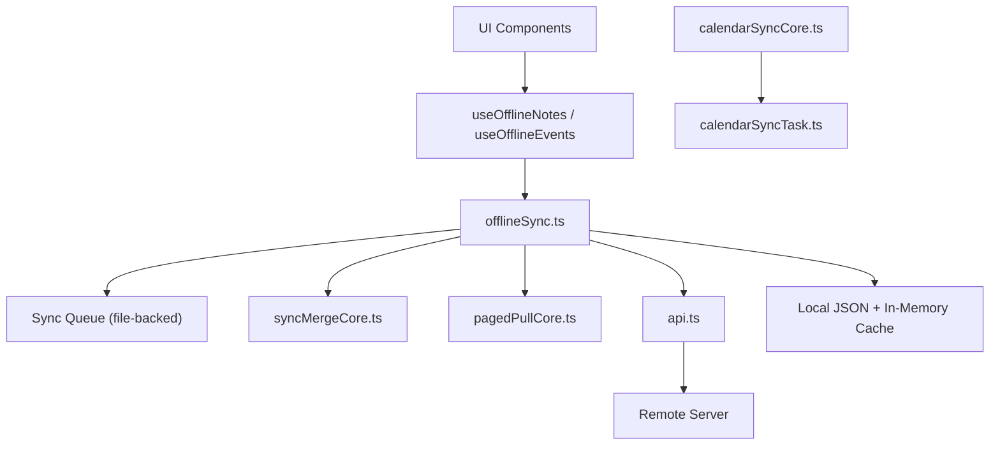
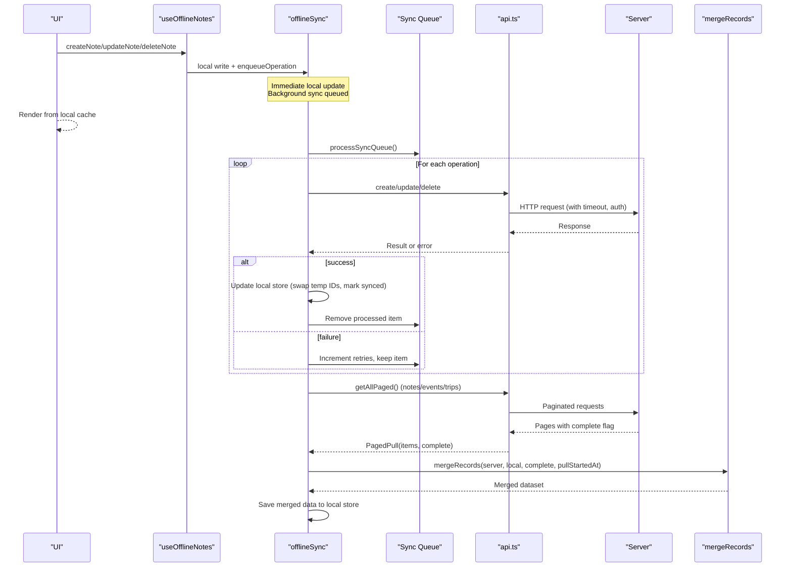
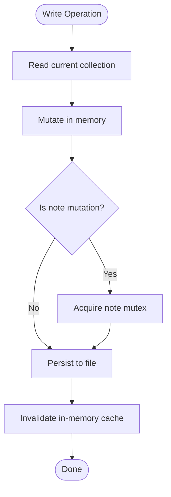
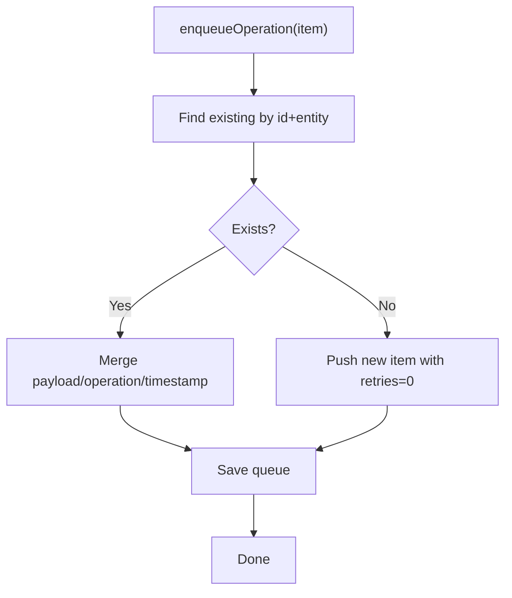
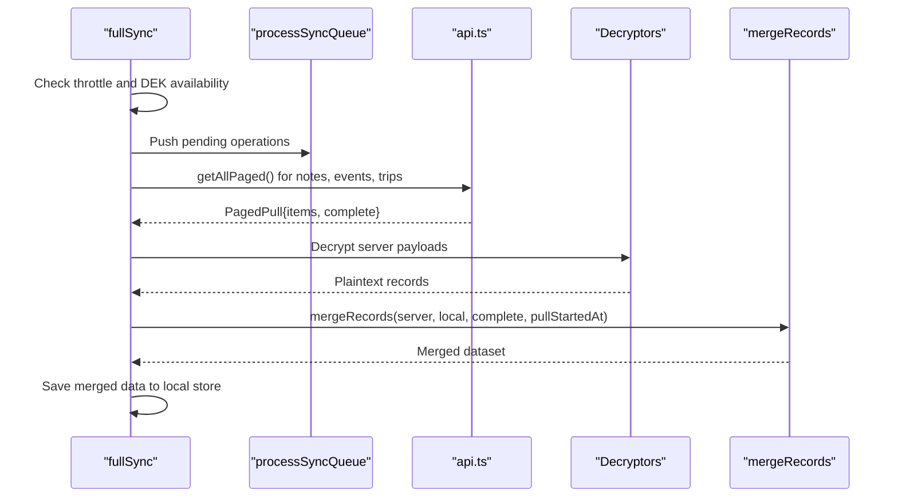
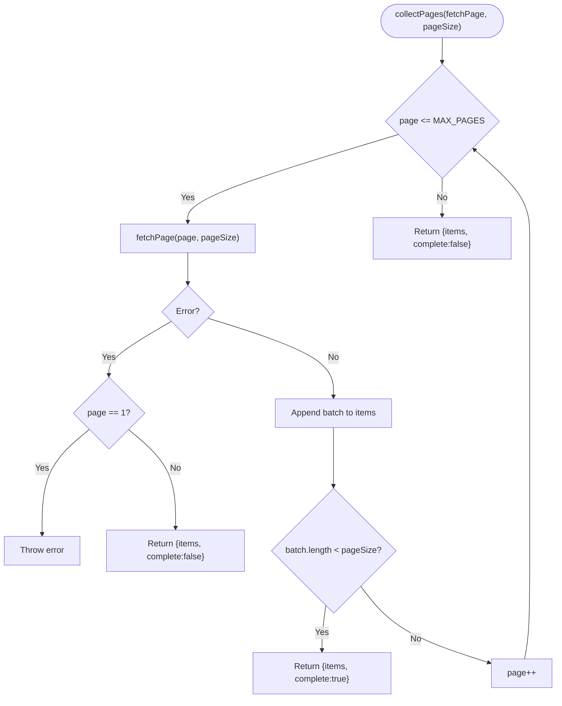
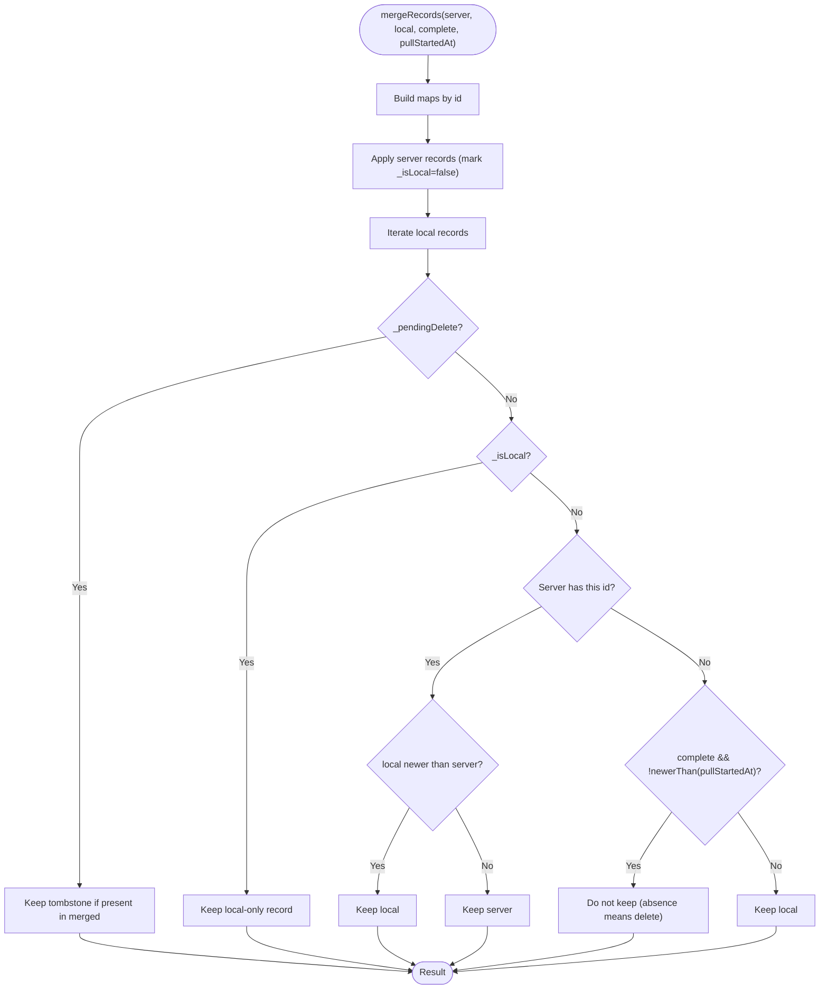
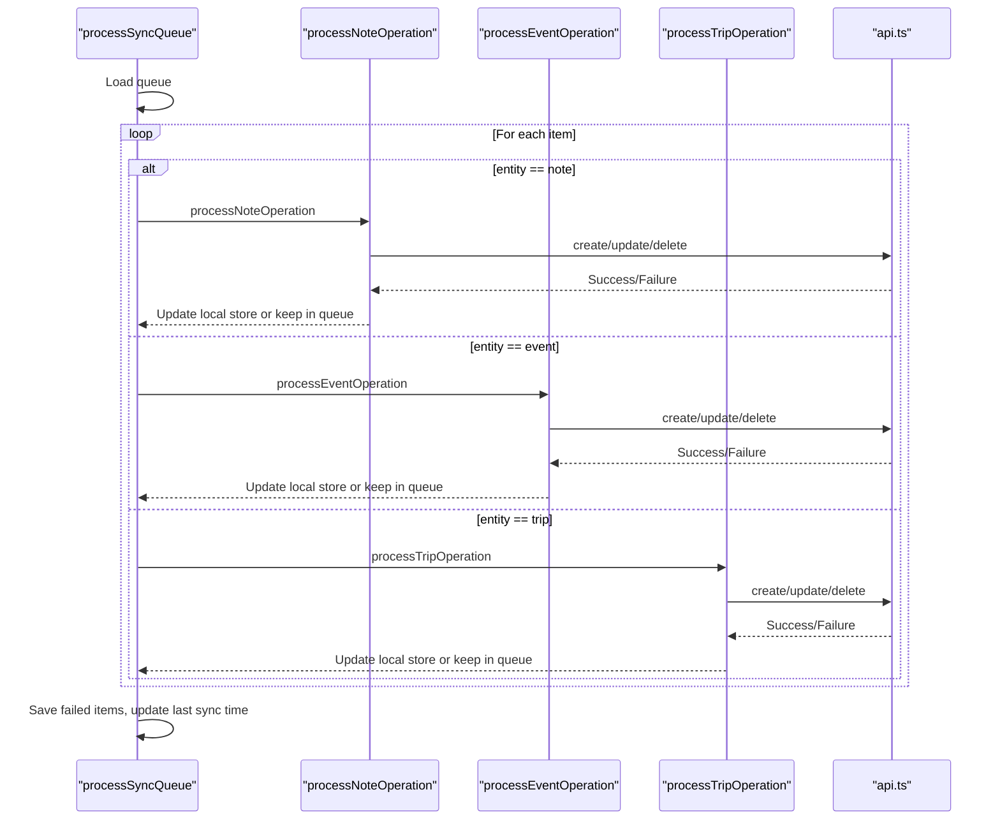
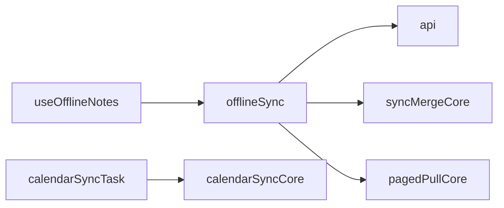

# Offline & Synchronization

<cite>
**Referenced Files in This Document**
- [offlineSync.ts](file://src/offlineSync.ts)
- [pagedPullCore.ts](file://src/pagedPullCore.ts)
- [syncMergeCore.ts](file://src/syncMergeCore.ts)
- [api.ts](file://src/api.ts)
- [useOfflineNotes.ts](file://src/useOfflineNotes.ts)
- [calendarSyncCore.ts](file://src/calendarSyncCore.ts)
- [calendarSyncTask.ts](file://src/calendarSyncTask.ts)
</cite>

## Table of Contents
1. Introduction
2. Project Structure
3. Core Components
4. Architecture Overview
5. Detailed Component Analysis
6. Dependency Analysis
7. Performance Considerations
8. Troubleshooting Guide
9. Conclusion

## Introduction
This document explains the offline-first architecture and synchronization system that keeps user data available without a network connection, while eventually reconciling with remote servers when connectivity is restored. It covers:
- Local-first data pattern: all writes go to local storage first; background sync pushes changes later.
- Conflict detection and resolution: newest-write-wins using timestamps, plus safe deletion semantics based on complete server pulls.
- Paged pull mechanism: efficient loading and incremental reconciliation for large datasets.
- Operation queue: durable background task management with retry logic and error handling.
- Data consistency guarantees: transaction-like boundaries via mutexes and merge rules, with rollback-safe behaviors.
- Sync workflows, conflict strategies, and performance techniques for large datasets.

## Project Structure
The offline sync system spans several modules:
- Local storage and persistence (JSON files with in-memory caches).
- Sync queue for pending operations with retries.
- Full sync orchestration: push pending changes, pull paged collections, decrypt, merge, and persist.
- Paged collection loader to avoid partial dataset loss.
- Merge core for conflict-free reconciliation.
- API layer with timeouts, token refresh, and per-entity paging.
- Hooks that expose offline-aware CRUD to UI components.
- Calendar sync decision logic and OS-level background task registration.

**Diagram sources**
- [offlineSync.ts:112-135](file://src/offlineSync.ts#L112-L135)
- [offlineSync.ts:376-415](file://src/offlineSync.ts#L376-L415)
- [offlineSync.ts:930-1037](file://src/offlineSync.ts#L930-L1037)
- [pagedPullCore.ts:21-69](file://src/pagedPullCore.ts#L21-L69)
- [syncMergeCore.ts:16-140](file://src/syncMergeCore.ts#L16-L140)
- [api.ts:84-138](file://src/api.ts#L84-L138)
- [calendarSyncCore.ts:87-148](file://src/calendarSyncCore.ts#L87-L148)
- [calendarSyncTask.ts:26-51](file://src/calendarSyncTask.ts#L26-L51)

**Section sources**
- [offlineSync.ts:112-135](file://src/offlineSync.ts#L112-L135)
- [api.ts:123-138](file://src/api.ts#L123-L138)
- [pagedPullCore.ts:21-69](file://src/pagedPullCore.ts#L21-L69)
- [syncMergeCore.ts:16-140](file://src/syncMergeCore.ts#L16-L140)
- [calendarSyncCore.ts:87-148](file://src/calendarSyncCore.ts#L87-L148)
- [calendarSyncTask.ts:26-51](file://src/calendarSyncTask.ts#L26-L51)

## Core Components
- Local-first storage: file-backed JSON stores for notes, events, trips, and sync queue, with in-memory caches to avoid repeated parsing overhead. A mutex serializes note mutations to prevent race conditions during concurrent writes.
- Sync queue: durable list of create/update/delete operations with retry counters and idempotent merging of adjacent operations.
- Full sync: orchestrates pushing pending operations, pulling paged collections from the server, decrypting payloads, and merging into local store using newest-write-wins and safe deletion semantics.
- Paged pull: iterates pages until a short page or max page limit is reached, reporting whether the full collection was retrieved.
- Merge core: reconciles server vs. local records, preserving locally-only items and honoring pending deletes; absence means deletion only when the pull is known complete and the record wasn’t modified after the pull started.
- API layer: fetch wrapper with timeout, 401 handling with single-flight token refresh, and per-entity paged endpoints.
- Hooks: provide offline-aware CRUD and automatic background sync triggers on app state changes.
- Calendar sync: pure decision logic for device calendar mirroring, plus OS background task registration.

**Section sources**
- [offlineSync.ts:197-244](file://src/offlineSync.ts#L197-L244)
- [offlineSync.ts:376-415](file://src/offlineSync.ts#L376-L415)
- [offlineSync.ts:930-1037](file://src/offlineSync.ts#L930-L1037)
- [pagedPullCore.ts:21-69](file://src/pagedPullCore.ts#L21-L69)
- [syncMergeCore.ts:16-140](file://src/syncMergeCore.ts#L16-L140)
- [api.ts:84-138](file://src/api.ts#L84-L138)
- [useOfflineNotes.ts:40-142](file://src/useOfflineNotes.ts#L40-L142)
- [calendarSyncCore.ts:87-148](file://src/calendarSyncCore.ts#L87-L148)
- [calendarSyncTask.ts:26-51](file://src/calendarSyncTask.ts#L26-L51)

## Architecture Overview
The system follows an offline-first design:
- All user actions write locally immediately and enqueue operations for later sync.
- Background listeners trigger sync when connectivity is restored.
- Full sync pushes pending operations first, then pulls paged collections, decrypts, merges, and persists results.
- Merge rules ensure no silent deletions unless the server response covered the entire collection and the record wasn’t edited mid-pull.

**Diagram sources**
- [useOfflineNotes.ts:146-201](file://src/useOfflineNotes.ts#L146-L201)
- [offlineSync.ts:388-415](file://src/offlineSync.ts#L388-L415)
- [offlineSync.ts:798-836](file://src/offlineSync.ts#L798-L836)
- [offlineSync.ts:838-928](file://src/offlineSync.ts#L838-L928)
- [offlineSync.ts:930-1037](file://src/offlineSync.ts#L930-L1037)
- [pagedPullCore.ts:45-69](file://src/pagedPullCore.ts#L45-L69)
- [api.ts:123-138](file://src/api.ts#L123-L138)

## Detailed Component Analysis

### Local-First Storage and Concurrency Control
- File-backed JSON stores replace AsyncStorage for large collections to avoid platform limits and read failures.
- In-memory caches reduce repeated parse costs; caches are invalidated on every write.
- A mutex serializes note mutations to prevent lost updates when multiple paths modify notes concurrently.
- Alias mapping persists temporary-to-server ID swaps so recordings linked by temp IDs remain valid after restart.

**Diagram sources**
- [offlineSync.ts:122-193](file://src/offlineSync.ts#L122-L193)
- [offlineSync.ts:207-244](file://src/offlineSync.ts#L207-L244)
- [offlineSync.ts:329-363](file://src/offlineSync.ts#L329-L363)
- [offlineSync.ts:419-433](file://src/offlineSync.ts#L419-L433)

**Section sources**
- [offlineSync.ts:122-193](file://src/offlineSync.ts#L122-L193)
- [offlineSync.ts:207-244](file://src/offlineSync.ts#L207-L244)
- [offlineSync.ts:329-363](file://src/offlineSync.ts#L329-L363)
- [offlineSync.ts:419-433](file://src/offlineSync.ts#L419-L433)

### Sync Queue and Retry Logic
- Operations are enqueued with entity type, operation kind, payload, timestamp, and retry counter.
- Adjacent operations on the same entity/id are merged to minimize redundant work (e.g., delete cancels a pending create).
- processSyncQueue runs sequentially, attempts each operation, and retains failed items up to a maximum retry count.
- Last sync timestamp is updated upon completion.

**Diagram sources**
- [offlineSync.ts:376-415](file://src/offlineSync.ts#L376-L415)

**Section sources**
- [offlineSync.ts:376-415](file://src/offlineSync.ts#L376-L415)
- [offlineSync.ts:798-836](file://src/offlineSync.ts#L798-L836)

### Full Sync Orchestration
- Throttled full sync avoids excessive network calls; force option bypasses throttle.
- Ensures E2EE keys are loaded before decryption; otherwise skips sync safely.
- Pushes pending operations first, then pulls notes, events, and trips concurrently.
- Captures pull start time to protect against mid-pull edits being incorrectly deleted.
- Decrypts server responses and merges using mergeRecords with appropriate adoptLocalFields where needed.

**Diagram sources**
- [offlineSync.ts:930-1037](file://src/offlineSync.ts#L930-L1037)
- [pagedPullCore.ts:45-69](file://src/pagedPullCore.ts#L45-L69)
- [syncMergeCore.ts:76-140](file://src/syncMergeCore.ts#L76-L140)

**Section sources**
- [offlineSync.ts:930-1037](file://src/offlineSync.ts#L930-L1037)

### Paged Pull Mechanism
- Iterates pages until a short page indicates the end or a hard ceiling is reached.
- Asymmetric failure handling: first-page failure aborts the pull; later-page failure returns collected items marked incomplete.
- Prevents silent deletion of records beyond the first page by ensuring completeness is known before treating absence as deletion.

**Diagram sources**
- [pagedPullCore.ts:45-69](file://src/pagedPullCore.ts#L45-L69)

**Section sources**
- [pagedPullCore.ts:21-69](file://src/pagedPullCore.ts#L21-L69)

### Conflict Detection and Resolution
- Newest-write-wins: compare recordTimestamp(updated_at or created_at) between local and server copies.
- Pending deletes take precedence to avoid reappearing records while a delete is in flight.
- Local-only records survive unless the server pull is complete and the record was not modified after the pull started.
- Adopt local-only fields (e.g., device notification handles) onto incoming server records to preserve client-specific metadata.

**Diagram sources**
- [syncMergeCore.ts:76-140](file://src/syncMergeCore.ts#L76-L140)

**Section sources**
- [syncMergeCore.ts:16-140](file://src/syncMergeCore.ts#L16-L140)

### Operation Queue Processing and Error Handling
- processNoteOperation handles create/update/delete with encryption and server version checks for updates.
- processEventOperation and processTripOperation follow similar patterns, updating local stores on successful creates.
- Errors increment retry counts up to a cap; items exceeding the cap are dropped with logs.
- Network listener triggers background sync when connectivity is restored.

**Diagram sources**
- [offlineSync.ts:798-836](file://src/offlineSync.ts#L798-L836)
- [offlineSync.ts:838-928](file://src/offlineSync.ts#L838-L928)

**Section sources**
- [offlineSync.ts:798-836](file://src/offlineSync.ts#L798-L836)
- [offlineSync.ts:838-928](file://src/offlineSync.ts#L838-L928)

### Data Consistency Guarantees and Transaction Boundaries
- Notes are protected by a mutex to serialize read-modify-write cycles, preventing lost updates across concurrent callers.
- Full sync captures pullStartedAt to avoid deleting records edited during the pull window.
- Merge rules treat absence as deletion only when the pull is complete and the record was not modified post-pull start.
- Pending deletes act as tombstones to hide records until server confirms deletion.

**Section sources**
- [offlineSync.ts:207-244](file://src/offlineSync.ts#L207-L244)
- [offlineSync.ts:930-1037](file://src/offlineSync.ts#L930-L1037)
- [syncMergeCore.ts:76-140](file://src/syncMergeCore.ts#L76-L140)

### Rollback Mechanisms and Safe Behaviors
- If a full sync fails mid-way, partial results are still persisted per entity; independent failures do not corrupt other collections.
- Failed operations remain in the queue with incremented retries; they are retried on subsequent sync attempts.
- Token refresh is single-flighted to avoid race conditions; session expiration errors are surfaced clearly.

**Section sources**
- [offlineSync.ts:930-1037](file://src/offlineSync.ts#L930-L1037)
- [offlineSync.ts:798-836](file://src/offlineSync.ts#L798-L836)
- [api.ts:23-72](file://src/api.ts#L23-L72)

### Sync Workflows and Strategies
- Create/Update/Delete: immediate local write, enqueue operation, optional immediate push if online; otherwise background sync handles it.
- Conflict resolution: newest-write-wins using updated_at or created_at; pending deletes override server presence until confirmed absent.
- Large datasets: paged pulls with a hard page limit prevent infinite loops; incomplete pulls preserve local records not seen by the server.

**Section sources**
- [useOfflineNotes.ts:146-201](file://src/useOfflineNotes.ts#L146-L201)
- [offlineSync.ts:449-537](file://src/offlineSync.ts#L449-L537)
- [offlineSync.ts:599-783](file://src/offlineSync.ts#L599-L783)
- [pagedPullCore.ts:45-69](file://src/pagedPullCore.ts#L45-L69)

### Performance Optimization Techniques
- File-backed storage avoids platform storage limits and read failures for large payloads.
- In-memory caches reduce repeated JSON parsing costs; caches are invalidated on writes.
- Paged pulls reduce memory pressure and allow incremental processing.
- Month events cache deduplicates repeated loads for calendar views.
- Concurrent pulls for different entities improve throughput while isolating failures.

**Section sources**
- [offlineSync.ts:122-193](file://src/offlineSync.ts#L122-L193)
- [offlineSync.ts:207-244](file://src/offlineSync.ts#L207-L244)
- [api.ts:156-188](file://src/api.ts#L156-L188)
- [api.ts:123-138](file://src/api.ts#L123-L138)

## Dependency Analysis
- offlineSync depends on api for network access, syncMergeCore for reconciliation, and pagedPullCore for pagination.
- useOfflineNotes composes offlineSync functions to expose a React hook with background sync integration.
- calendarSyncCore provides pure decision logic used by calendarSyncTask for OS background execution.

**Diagram sources**
- [useOfflineNotes.ts:18-36](file://src/useOfflineNotes.ts#L18-L36)
- [offlineSync.ts:17-26](file://src/offlineSync.ts#L17-L26)
- [calendarSyncTask.ts:14-16](file://src/calendarSyncTask.ts#L14-L16)

**Section sources**
- [useOfflineNotes.ts:18-36](file://src/useOfflineNotes.ts#L18-L36)
- [offlineSync.ts:17-26](file://src/offlineSync.ts#L17-L26)
- [calendarSyncTask.ts:14-16](file://src/calendarSyncTask.ts#L14-L16)

## Performance Considerations
- Use paged pulls to handle large collections efficiently and avoid memory spikes.
- Leverage in-memory caches to reduce I/O overhead; ensure caches are invalidated appropriately.
- Avoid unnecessary full syncs by throttling and forcing only when necessary (e.g., app foreground).
- Prefer month events cache for frequently accessed calendar data to reduce network and decryption costs.
- Monitor queue size and retry behavior to identify persistent issues early.

[No sources needed since this section provides general guidance]

## Troubleshooting Guide
- Stuck sync: check processSyncQueue guard and API timeout; ensure fetch timeout prevents indefinite hangs.
- Missing records after sync: verify paged pulls completed; incomplete pulls preserve local records not seen by server.
- Conflicting edits: confirm updated_at stamps are set and compared correctly; review merge rules for newest-write-wins.
- Deleted items reappear: ensure pending deletes are respected and tombstones are maintained until server confirms absence.
- Token refresh issues: inspect single-flight refresh logic and 401 handling; clear tokens if refresh fails.

**Section sources**
- [api.ts:74-121](file://src/api.ts#L74-L121)
- [offlineSync.ts:930-1037](file://src/offlineSync.ts#L930-L1037)
- [syncMergeCore.ts:76-140](file://src/syncMergeCore.ts#L76-L140)

## Conclusion
The offline-first architecture ensures reliable, responsive user experiences by prioritizing local operations and deferring network interactions. Robust conflict resolution, paged pulls, and a durable sync queue provide strong consistency guarantees even under intermittent connectivity. The modular design separates concerns across storage, networking, and reconciliation, enabling maintainable and testable code. By following the outlined workflows and optimization techniques, developers can build scalable features that perform well with large datasets and complex sync scenarios.

[No sources needed since this section summarizes without analyzing specific files]