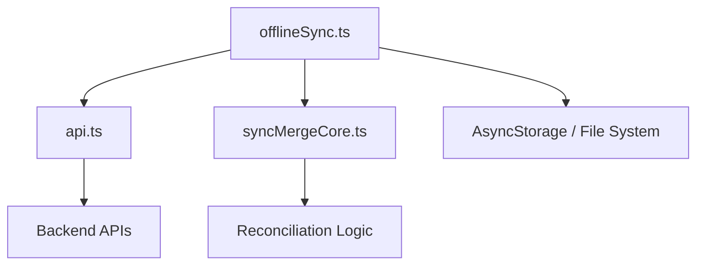
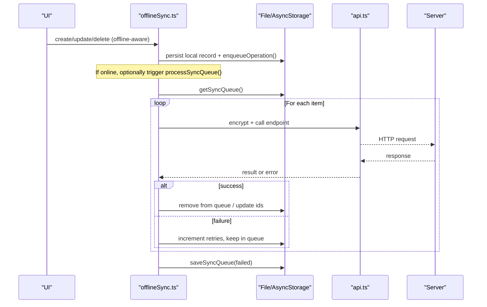
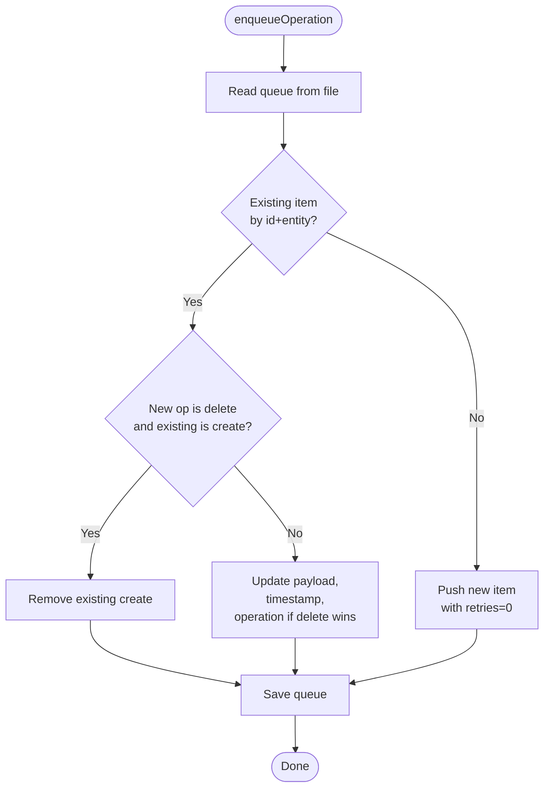
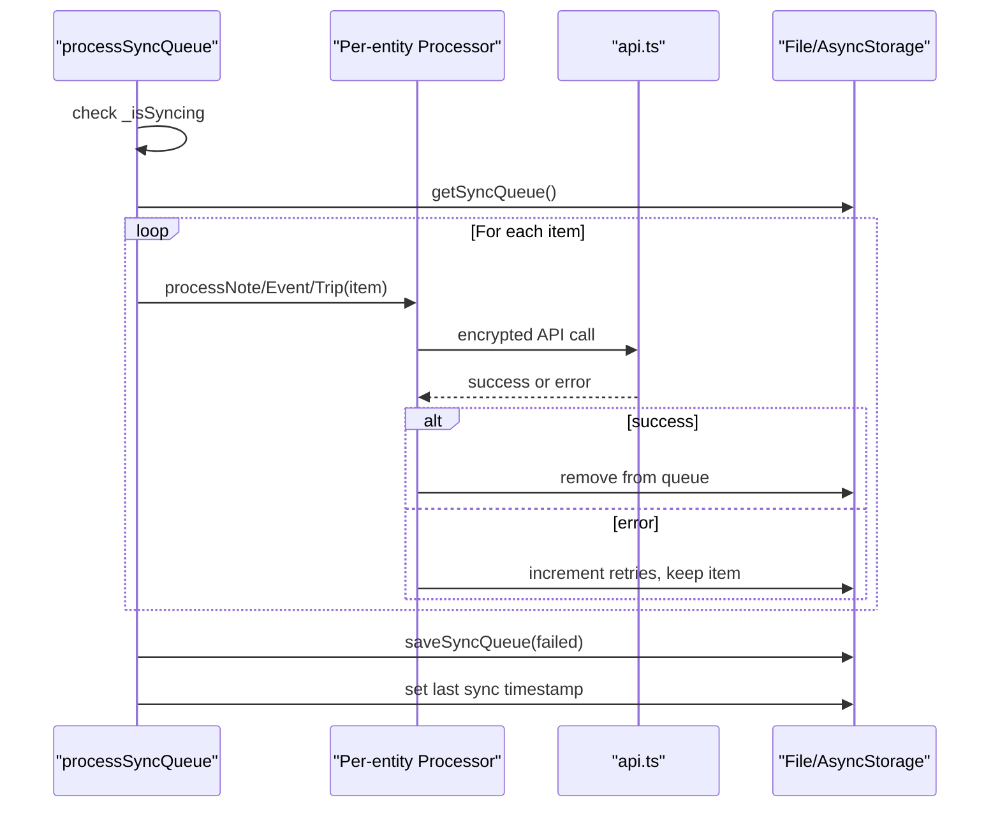
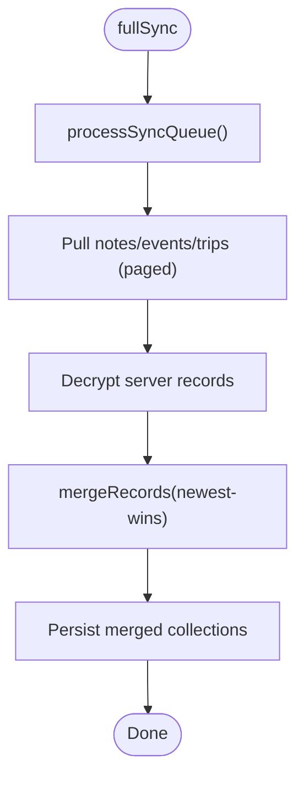
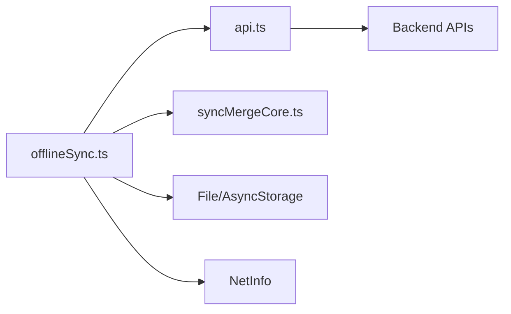

# Sync Queue & Operation Management

<cite>
**Referenced Files in This Document**
- [offlineSync.ts](file://src/offlineSync.ts)
- [api.ts](file://src/api.ts)
- [syncMergeCore.ts](file://src/syncMergeCore.ts)
</cite>

## Table of Contents
1. [Introduction](#introduction)
2. [Project Structure](#project-structure)
3. [Core Components](#core-components)
4. [Architecture Overview](#architecture-overview)
5. [Detailed Component Analysis](#detailed-component-analysis)
6. [Dependency Analysis](#dependency-analysis)
7. [Performance Considerations](#performance-considerations)
8. [Troubleshooting Guide](#troubleshooting-guide)
9. [Conclusion](#conclusion)

## Introduction
This document explains the synchronization queue system that persists and retries pending create, update, and delete operations for notes, events, and trips. It covers:
- The queue item structure (id mapping, entity types, operation types, timestamps, retries)
- enqueueOperation conflict resolution and payload merging
- Persistence strategy for the queue
- processSyncQueue engine behavior including network detection, background sync, and error recovery
- Workflows for queue management, prioritization, and debugging stuck operations

## Project Structure
The sync queue lives primarily in a single module that coordinates local persistence, network calls, and reconciliation with the server. Supporting modules provide API access and merge logic used during full syncs.

**Diagram sources**
- [offlineSync.ts:1-120](file://src/offlineSync.ts#L1-L120)
- [api.ts:140-220](file://src/api.ts#L140-L220)
- [syncMergeCore.ts:1-64](file://src/syncMergeCore.ts#L1-L64)

**Section sources**
- [offlineSync.ts:1-120](file://src/offlineSync.ts#L1-L120)
- [api.ts:140-220](file://src/api.ts#L140-L220)
- [syncMergeCore.ts:1-64](file://src/syncMergeCore.ts#L1-L64)

## Core Components
- SyncQueueItem: Represents a queued operation with id mapping, entity type, operation type, payload, timestamp, and retry count.
- LocalNote/LocalEvent/LocalTrip: Local data models with flags indicating whether they are local-only or pending deletion.
- Storage layer: JSON files on disk for large collections; AsyncStorage fallback/migration for legacy keys.
- Sync engine: processSyncQueue iterates the queue, executes per-entity processors, and persists failed items with incremented retries.
- Full sync: fullSync pushes pending changes first, then pulls and merges server data using mergeRecords.
- Network listener: startBackgroundSync triggers processSyncQueue when connectivity is restored.

Key responsibilities:
- Enqueue operations without blocking UI writes
- Merge duplicate operations to avoid redundant work
- Persist queue across app restarts
- Retry failed operations up to a limit
- Reconcile server vs local state safely

**Section sources**
- [offlineSync.ts:28-41](file://src/offlineSync.ts#L28-L41)
- [offlineSync.ts:112-135](file://src/offlineSync.ts#L112-L135)
- [offlineSync.ts:365-415](file://src/offlineSync.ts#L365-L415)
- [offlineSync.ts:785-836](file://src/offlineSync.ts#L785-L836)
- [offlineSync.ts:930-1037](file://src/offlineSync.ts#L930-L1037)
- [offlineSync.ts:1039-1071](file://src/offlineSync.ts#L1039-L1071)
- [syncMergeCore.ts:16-64](file://src/syncMergeCore.ts#L16-L64)

## Architecture Overview
The sync architecture ensures offline-first writes, durable queuing, and eventual consistency with the server.

**Diagram sources**
- [offlineSync.ts:388-415](file://src/offlineSync.ts#L388-L415)
- [offlineSync.ts:798-836](file://src/offlineSync.ts#L798-L836)
- [offlineSync.ts:838-928](file://src/offlineSync.ts#L838-L928)
- [api.ts:140-220](file://src/api.ts#L140-L220)

## Detailed Component Analysis

### Queue Item Structure and Id Mapping
- id: local temporary id for creates (prefixed), later swapped to server id after successful create
- serverId: reserved field in the interface but not actively used by the current implementation; id swapping is handled via local records and alias maps
- entity: note | event | trip
- operation: create | update | delete
- payload: data to send to the server (encrypted at push time)
- timestamp: ISO string when enqueued
- retries: number of attempts; max 5 before dropping

Id mapping details:
- Creates use local_ prefixed ids until the server responds with a real id
- After a successful create, the local record’s id is updated and an alias map persists old temp id -> new server id
- Aliases survive restarts to repair recording links and other references

**Section sources**
- [offlineSync.ts:28-41](file://src/offlineSync.ts#L28-L41)
- [offlineSync.ts:246-281](file://src/offlineSync.ts#L246-L281)
- [offlineSync.ts:838-857](file://src/offlineSync.ts#L838-L857)

### enqueueOperation: Conflict Resolution and Payload Merging
Conflict rules:
- If a pending create exists for the same id and entity, subsequent updates merge into it (operation stays create unless a delete arrives)
- A delete for a never-synced create removes the pending create entirely
- Otherwise, append a new queue item with retries initialized to 0

Payload merging:
- On merge, the newer payload replaces the existing one while preserving earlier operation semantics where appropriate
- Timestamps are updated to the latest enqueue time

Persistence:
- Queue is persisted to a JSON file under a dedicated directory
- In-memory cache avoids repeated reads/writes within a session

**Diagram sources**
- [offlineSync.ts:388-415](file://src/offlineSync.ts#L388-L415)

**Section sources**
- [offlineSync.ts:365-415](file://src/offlineSync.ts#L365-L415)

### processSyncQueue Engine: Processing, Network Detection, Background Sync, Error Recovery
Processing flow:
- Guards against concurrent runs with a boolean flag
- Reads the queue and processes each item by entity type
- Calls per-entity processors that encrypt payloads and call the appropriate API endpoints
- On success, removes the item from the queue; on failure, increments retries and keeps it for later
- Persists only failed items back to the queue and updates last sync timestamp

Network detection and background sync:
- startBackgroundSync registers a NetInfo listener that triggers processSyncQueue when the device is connected and internet reachable
- isOnline checks current connectivity and is used by callers to decide immediate sync

Error recovery:
- Each failed item increments retries up to a maximum (5); beyond that, the item is dropped
- Errors are logged for visibility
- Full sync also handles partial failures gracefully by pulling all collections independently

**Diagram sources**
- [offlineSync.ts:798-836](file://src/offlineSync.ts#L798-L836)
- [offlineSync.ts:838-928](file://src/offlineSync.ts#L838-L928)
- [api.ts:140-220](file://src/api.ts#L140-L220)

**Section sources**
- [offlineSync.ts:785-836](file://src/offlineSync.ts#L785-L836)
- [offlineSync.ts:1039-1071](file://src/offlineSync.ts#L1039-L1071)

### Full Sync and Merge Strategy
fullSync:
- Pushes pending changes first
- Pulls notes, events, and trips concurrently and independently
- Decrypts server responses
- Merges server and local records using mergeRecords with newest-write-wins semantics
- Preserves device-only fields (e.g., local_notification_id) via adoptLocalFields
- Handles incomplete pulls safely by not deleting records absent from partial pages

Merge rules:
- Pending deletes take precedence locally
- Local-only records always survive
- When both sides have a record, the newer timestamp wins
- Absence means deletion only when the pull reached the end of the collection and the record was not written after the pull started

**Diagram sources**
- [offlineSync.ts:930-1037](file://src/offlineSync.ts#L930-L1037)
- [syncMergeCore.ts:66-140](file://src/syncMergeCore.ts#L66-L140)

**Section sources**
- [offlineSync.ts:930-1037](file://src/offlineSync.ts#L930-L1037)
- [syncMergeCore.ts:16-64](file://src/syncMergeCore.ts#L16-L64)
- [syncMergeCore.ts:66-140](file://src/syncMergeCore.ts#L66-L140)

### Per-Entity Processors
- Notes: create swaps temp id to server id and persists aliases; update performs server version check and may fetch server copy to merge; delete calls server delete
- Events: create swaps temp id; update and delete call server endpoints
- Trips: create swaps temp id; update and delete call server endpoints

These processors ensure local state reflects server reality and that id mappings remain consistent.

**Section sources**
- [offlineSync.ts:838-928](file://src/offlineSync.ts#L838-L928)

## Dependency Analysis
- offlineSync.ts depends on:
  - api.ts for network requests and pagination
  - syncMergeCore.ts for reconciliation logic
  - File system and AsyncStorage for persistence
  - NetInfo for network state monitoring
- api.ts provides typed endpoints and shared fetch behavior with timeouts and token refresh
- syncMergeCore.ts is pure logic used by fullSync

**Diagram sources**
- [offlineSync.ts:12-26](file://src/offlineSync.ts#L12-L26)
- [api.ts:140-220](file://src/api.ts#L140-L220)
- [syncMergeCore.ts:1-64](file://src/syncMergeCore.ts#L1-L64)

**Section sources**
- [offlineSync.ts:12-26](file://src/offlineSync.ts#L12-L26)
- [api.ts:140-220](file://src/api.ts#L140-L220)
- [syncMergeCore.ts:1-64](file://src/syncMergeCore.ts#L1-L64)

## Performance Considerations
- File-backed storage avoids AsyncStorage CursorWindow limits for large collections
- In-memory caches reduce repeated JSON parse/stringify overhead
- Mutex serializes note writes to prevent race conditions between editor autosaves, queue id swaps, and fullSync merges
- Full sync throttling prevents excessive network and decryption work
- Network timeouts prevent hung requests from blocking future syncs

[No sources needed since this section provides general guidance]

## Troubleshooting Guide
Common issues and techniques:
- Stuck operations:
  - Inspect the persisted queue file to see items with high retry counts
  - Verify network connectivity and authentication headers
  - Check logs for specific errors per entity and id
- Temp id mismatches:
  - Use resolveNoteId to map stale temp ids to current server ids
  - Ensure aliases are persisted and repaired on startup
- Partial pulls:
  - Confirm server endpoints report complete pagination; incomplete pulls preserve local records
- Token refresh:
  - 401 responses trigger automatic refresh; failures surface as session expired errors

Practical steps:
- Clear local data to reset state when necessary
- Force a full sync to reconcile server and local state
- Monitor background sync activation on reconnect

**Section sources**
- [offlineSync.ts:246-281](file://src/offlineSync.ts#L246-L281)
- [offlineSync.ts:147-159](file://src/offlineSync.ts#L147-L159)
- [api.ts:74-82](file://src/api.ts#L74-L82)
- [api.ts:104-119](file://src/api.ts#L104-L119)

## Conclusion
The sync queue system provides robust offline-first support with durable persistence, conflict resolution, and reliable retry mechanisms. It integrates seamlessly with full sync to maintain consistency with the server while protecting user edits. Proper use of id mapping, payload merging, and background sync ensures resilience even under intermittent connectivity and heavy write loads.

[No sources needed since this section summarizes without analyzing specific files]