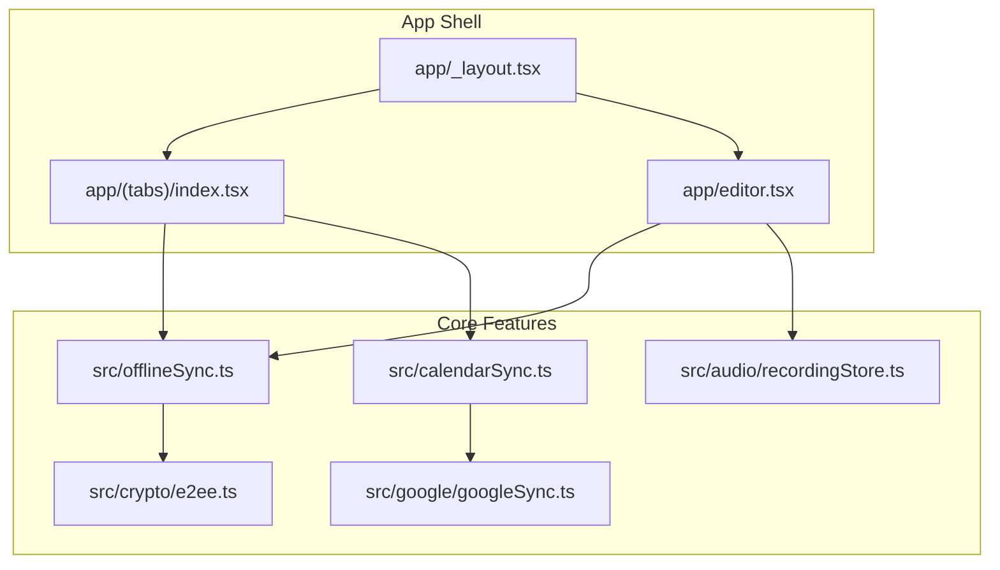
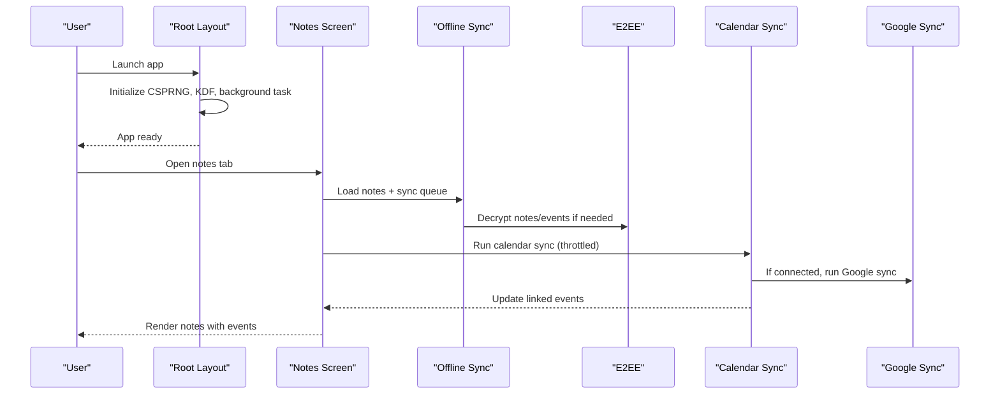
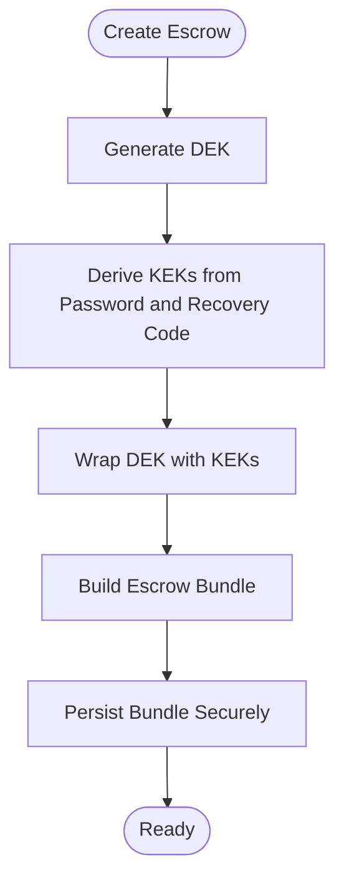
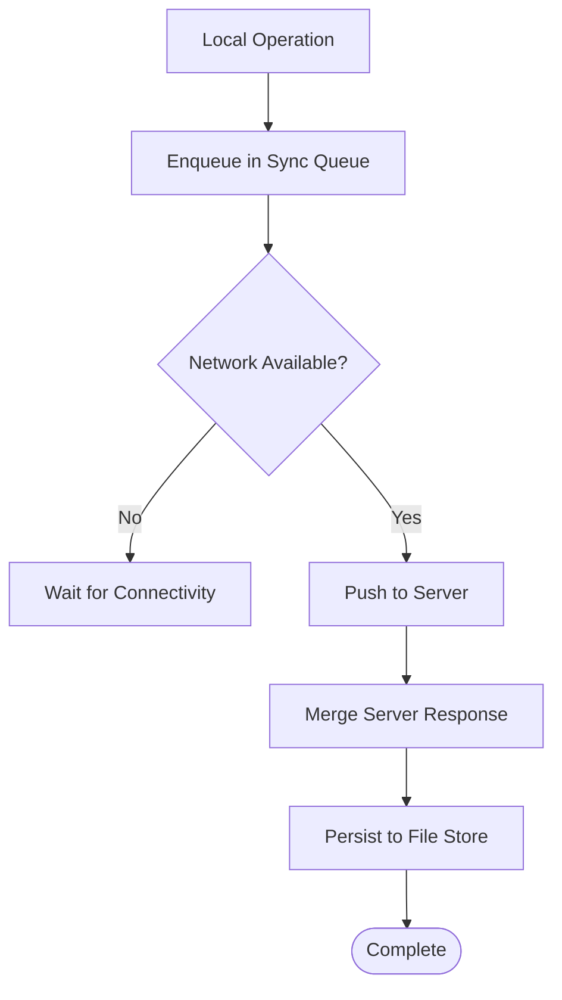
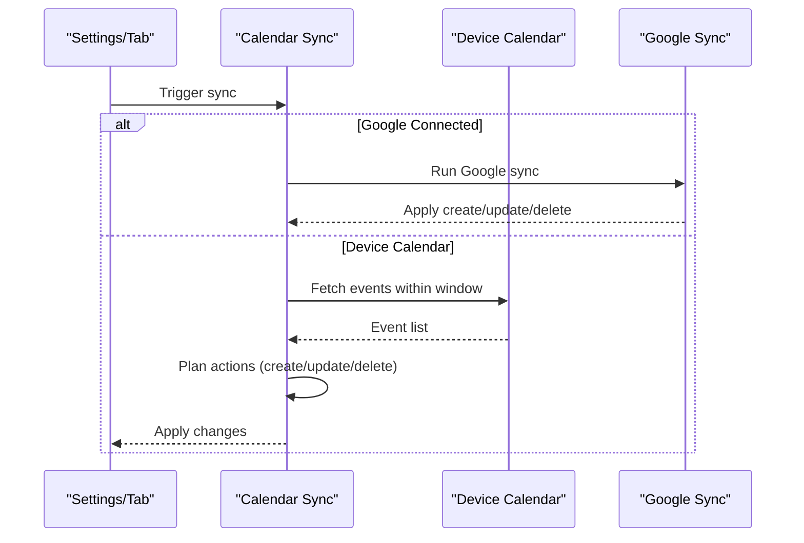
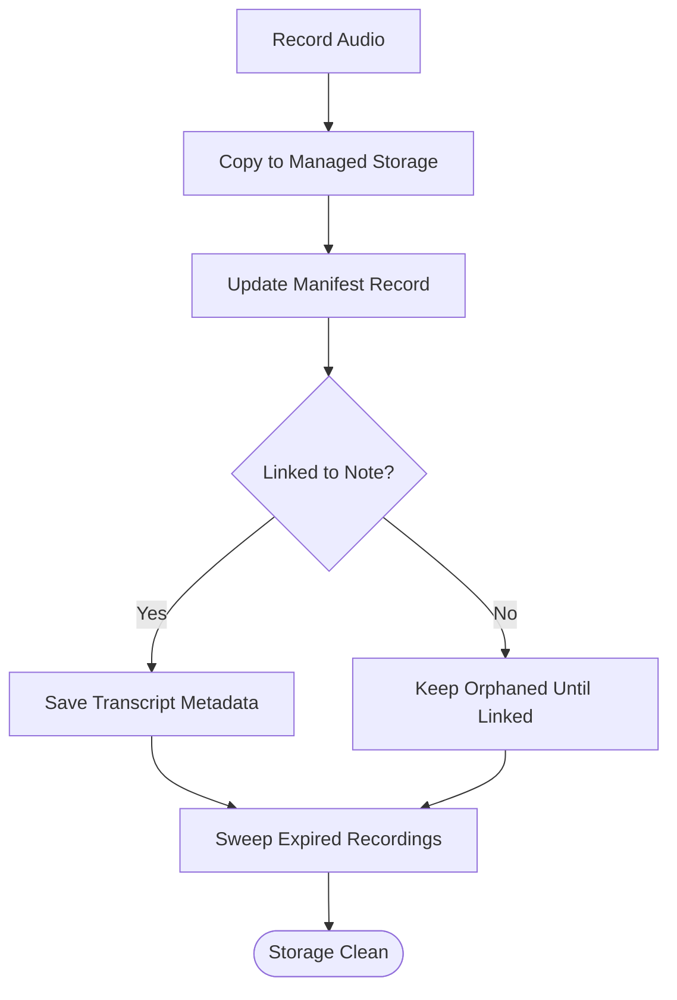
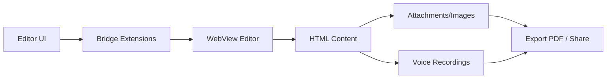
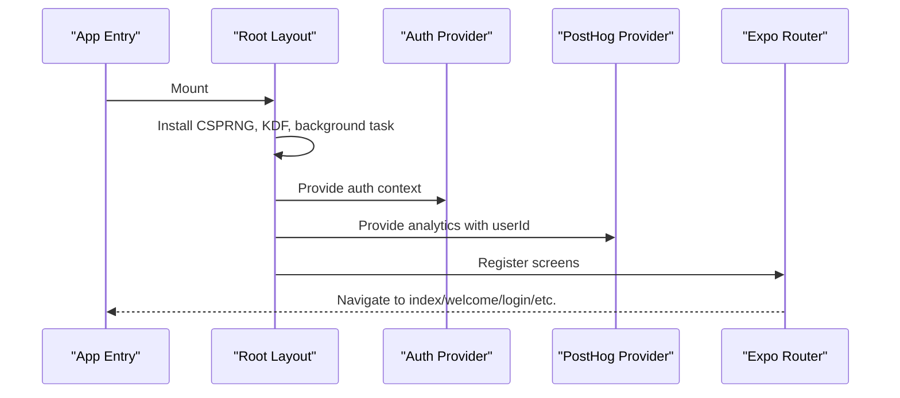
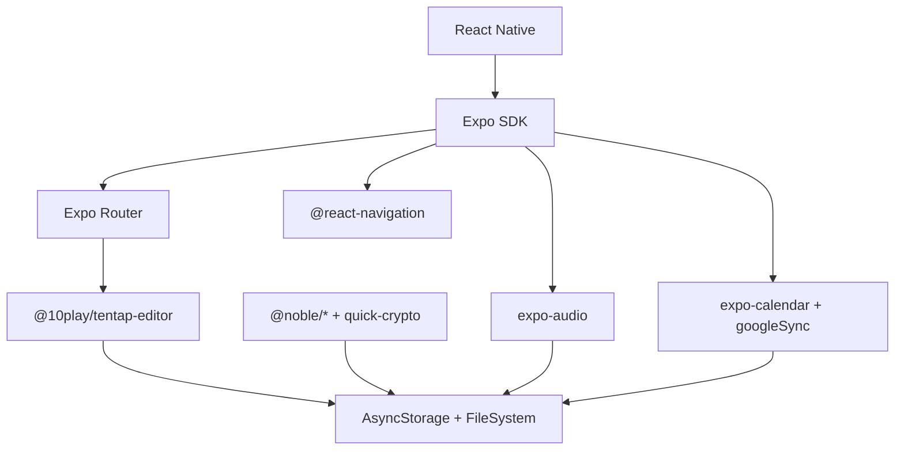

# Project Overview

<cite>
**Referenced Files in This Document**
- [README.md](file://README.md)
- [package.json](file://package.json)
- [app.config.js](file://app.config.js)
- [eas.json](file://eas.json)
- [app/_layout.tsx](file://app/_layout.tsx)
- [src/crypto/e2ee.ts](file://src/crypto/e2ee.ts)
- [src/calendarSync.ts](file://src/calendarSync.ts)
- [src/google/googleSync.ts](file://src/google/googleSync.ts)
- [src/audio/recordingStore.ts](file://src/audio/recordingStore.ts)
- [app/(tabs)/index.tsx](file://app/(tabs)/index.tsx)
- [app/editor.tsx](file://app/editor.tsx)
- [src/offlineSync.ts](file://src/offlineSync.ts)
</cite>

## Table of Contents
1. Introduction
2. Project Structure
3. Core Components
4. Architecture Overview
5. Detailed Component Analysis
6. Dependency Analysis
7. Performance Considerations
8. Troubleshooting Guide
9. Conclusion
10. Appendices

## Introduction
Nueco is a privacy-first note-taking application built with React Native and Expo that emphasizes end-to-end encryption (E2EE), offline-first reliability, and cross-platform compatibility across iOS, Android, and web. It integrates calendar synchronization (device calendars and Google Calendar), voice recording with transcription support, and rich content editing for notes. The app uses Expo Application Services (EAS) for building and distributing production artifacts.

Key highlights:
- E2EE notes: Notes are encrypted on-device using AES-GCM with per-user keys derived from password and recovery code; the server stores only ciphertext and wrapped keys.
- Calendar integration: Syncs events from device calendars and optionally Google Calendar with throttling, conflict handling, and conservative deletion logic.
- Voice recording: Captures audio locally, persists recordings with retention policies, supports transcription metadata, and integrates into notes.
- Rich editor: A WebView-based rich text editor with tables, images, and attachments, plus PDF import/export flows.
- Offline-first: Local file-backed storage with a sync queue and conflict resolution by timestamp.
- Cross-platform: Built with Expo/React Native targeting iOS, Android, and web; EAS profiles configure builds and environment variables.

**Section sources**
- [README.md:1-51](file://README.md#L1-L51)
- [package.json:1-125](file://package.json#L1-L125)
- [app.config.js:1-57](file://app.config.js#L1-L57)
- [eas.json:1-67](file://eas.json#L1-L67)

## Project Structure
The project follows an Expo Router file-based routing structure under app/, with feature modules organized under src/. Key directories:
- app/: Screens and layout, including tabs, editor, settings, auth flows, and calendar-related screens.
- src/: Feature modules such as crypto (E2EE), audio (recording store), google (Calendar API bridge), editor bridges, offline sync, and analytics.
- webEditor/pdfExtractor: Vite-built assets embedded via WebViews for rich editing and PDF extraction.
- scripts: Build helpers for web editor and PDF extractor HTML bundles.

**Diagram sources**
- [app/_layout.tsx:1-102](file://app/_layout.tsx#L1-L102)
- [app/(tabs)/index.tsx:1-800](file://app/(tabs)/index.tsx#L1-L800)
- [app/editor.tsx:1-800](file://app/editor.tsx#L1-L800)
- [src/offlineSync.ts:1-200](file://src/offlineSync.ts#L1-L200)
- [src/crypto/e2ee.ts:1-228](file://src/crypto/e2ee.ts#L1-L228)
- [src/google/googleSync.ts:1-200](file://src/google/googleSync.ts#L1-L200)
- [src/audio/recordingStore.ts:1-263](file://src/audio/recordingStore.ts#L1-L263)
- [src/calendarSync.ts:1-199](file://src/calendarSync.ts#L1-L199)

**Section sources**
- [app/_layout.tsx:1-102](file://app/_layout.tsx#L1-L102)
- [package.json:1-125](file://package.json#L1-L125)

## Core Components
- End-to-end encryption (E2EE): Implements AES-GCM encryption for strings and key wrapping/unwrapping with PBKDF2-derived KEKs from password and recovery code. Supports escrow bundle creation, rewrap on password change, and recovery flow.
- Offline sync manager: File-backed JSON stores for notes/events/trips, a persistent sync queue, network detection, and merge strategy based on timestamps. Migrates from AsyncStorage to files to avoid SQLite row-size limits.
- Calendar sync: Orchestrates device calendar imports and Google Calendar two-way sync with throttling, lock management, and conservative deletion rules.
- Audio recording store: Manages local recording files and manifest, retention policies, transcript metadata, and linking recordings to notes.
- Rich editor: WebView-based editor with custom bridges for tables, images, placeholders, and dynamic height measurement; supports PDF import/export and attachment sharing.

**Section sources**
- [src/crypto/e2ee.ts:1-228](file://src/crypto/e2ee.ts#L1-L228)
- [src/offlineSync.ts:1-200](file://src/offlineSync.ts#L1-L200)
- [src/calendarSync.ts:1-199](file://src/calendarSync.ts#L1-L199)
- [src/google/googleSync.ts:1-200](file://src/google/googleSync.ts#L1-L200)
- [src/audio/recordingStore.ts:1-263](file://src/audio/recordingStore.ts#L1-L263)
- [app/editor.tsx:1-800](file://app/editor.tsx#L1-L800)

## Architecture Overview
Nueco’s architecture centers on an offline-first data layer with E2EE at rest and in transit, layered over Expo Router screens and feature modules. The root layout initializes security primitives, background tasks, and providers. The notes list screen orchestrates sync and displays linked events. The editor integrates voice capture, rich editing, and media handling. Calendar sync coordinates device and Google sources.

**Diagram sources**
- [app/_layout.tsx:1-102](file://app/_layout.tsx#L1-L102)
- [app/(tabs)/index.tsx:1-800](file://app/(tabs)/index.tsx#L1-L800)
- [src/offlineSync.ts:1-200](file://src/offlineSync.ts#L1-L200)
- [src/crypto/e2ee.ts:1-228](file://src/crypto/e2ee.ts#L1-L228)
- [src/calendarSync.ts:1-199](file://src/calendarSync.ts#L1-L199)
- [src/google/googleSync.ts:1-200](file://src/google/googleSync.ts#L1-L200)

## Detailed Component Analysis

### End-to-End Encryption (E2EE)
Nueco encrypts note content on-device using AES-GCM with a per-user Data Encryption Key (DEK). The DEK is wrapped by Key Encryption Keys (KEKs) derived from the user’s password and a recovery code via PBKDF2. The core module provides functions to generate keys, derive KEKs, wrap/unwrap keys, and create or recover escrow bundles. It is platform-agnostic and injects a native KDF for performance on React Native.

**Diagram sources**
- [src/crypto/e2ee.ts:152-228](file://src/crypto/e2ee.ts#L152-L228)

**Section sources**
- [src/crypto/e2ee.ts:1-228](file://src/crypto/e2ee.ts#L1-L228)

### Offline Sync Manager
The offline sync layer persists large collections (notes, events, trips) to file-backed JSON to avoid AsyncStorage row-size limits. It maintains a sync queue for pending operations, detects network state, and merges server responses using timestamps. It also handles migration from legacy AsyncStorage keys and ensures safe reads/writes.

**Diagram sources**
- [src/offlineSync.ts:1-200](file://src/offlineSync.ts#L1-L200)

**Section sources**
- [src/offlineSync.ts:1-200](file://src/offlineSync.ts#L1-L200)

### Calendar Integration
Calendar sync supports both device calendars and Google Calendar. It throttles runs, manages locks, and applies conservative deletion logic to avoid accidental data loss. When Google is connected, it delegates to a two-way sync that maps Nueco events to Google resources and vice versa, maintaining bridge fields for reconciliation.

**Diagram sources**
- [src/calendarSync.ts:102-199](file://src/calendarSync.ts#L102-L199)
- [src/google/googleSync.ts:108-200](file://src/google/googleSync.ts#L108-L200)

**Section sources**
- [src/calendarSync.ts:1-199](file://src/calendarSync.ts#L1-L199)
- [src/google/googleSync.ts:1-200](file://src/google/googleSync.ts#L1-L200)

### Voice Recording and Transcription Support
The audio recording store manages local audio files and a manifest for metadata. It supports saving recordings, linking them to notes, marking transcripts, and sweeping expired files based on retention preferences. It serializes manifest mutations to prevent race conditions and tracks language preferences and conversation mode announcements.

**Diagram sources**
- [src/audio/recordingStore.ts:78-174](file://src/audio/recordingStore.ts#L78-L174)
- [src/audio/recordingStore.ts:226-242](file://src/audio/recordingStore.ts#L226-L242)

**Section sources**
- [src/audio/recordingStore.ts:1-263](file://src/audio/recordingStore.ts#L1-L263)

### Rich Content Editor
The editor uses a WebView-based rich text engine with custom bridges for tables, images, placeholders, and dynamic height measurement. It supports importing PDFs, attaching files, exporting to PDF, and integrating voice recordings and transcriptions into notes. It also handles image resizing and base64 embedding for reliable rendering.

**Diagram sources**
- [app/editor.tsx:239-590](file://app/editor.tsx#L239-L590)
- [app/editor.tsx:299-438](file://app/editor.tsx#L299-L438)

**Section sources**
- [app/editor.tsx:1-800](file://app/editor.tsx#L1-L800)

### Root Layout and App Initialization
The root layout installs secure random number generation, configures native KDF, registers background calendar sync tasks, sets up authentication and analytics providers, and defines routes. It also handles share intents and notification taps to navigate to relevant screens.

**Diagram sources**
- [app/_layout.tsx:1-102](file://app/_layout.tsx#L1-L102)

**Section sources**
- [app/_layout.tsx:1-102](file://app/_layout.tsx#L1-L102)

## Dependency Analysis
Nueco relies on a modern stack centered around Expo and React Native, with TypeScript for type safety. Notable dependencies include:
- Expo ecosystem: expo-router, expo-auth-session, expo-calendar, expo-audio, expo-file-system, expo-notifications, expo-web-browser, etc.
- UI and navigation: @react-navigation/*, @expo/vector-icons, react-native-gesture-handler, react-native-screens.
- Rich editing: @10play/tentap-editor with custom bridges.
- Crypto: @noble/ciphers, @noble/hashes, react-native-quick-crypto for native KDF.
- Storage and networking: @react-native-async-storage/async-storage, @react-native-community/netinfo.
- Media and tools: expo-image-picker, expo-document-picker, react-native-share, expo-print.

**Diagram sources**
- [package.json:21-101](file://package.json#L21-L101)

**Section sources**
- [package.json:1-125](file://package.json#L1-L125)

## Performance Considerations
- Large content handling: Notes with inline base64 images can be megabytes; the notes list caches derived text and thumbnails to avoid repeated expensive parsing.
- WebView editor sizing: Uses ResizeObserver-based content height reporting to prevent clipping and ensure accurate layout.
- File-backed storage: Avoids AsyncStorage row-size limits by persisting large collections to JSON files.
- Throttling and locking: Calendar sync throttles runs and uses storage-based locks to prevent concurrent background tasks.
- Image optimization: Images are resized and converted to base64 for consistent rendering and reduced payload size.

[No sources needed since this section provides general guidance]

## Troubleshooting Guide
Common issues and mitigations:
- Network errors during sync: The offline sync queue retries operations when connectivity returns; check pending count and retry later.
- Calendar sync failures: Ensure permissions are granted and selected calendars are valid; throttling prevents excessive calls; review logs for failed actions.
- Audio recording issues: Verify microphone permissions and foreground service availability on Android; retention sweeps clean expired files automatically.
- Editor not ready: The editor waits for a webview-ready message before accepting commands; ensure custom editor HTML includes required bridges.
- E2EE unlock failures: Wrong password or recovery code will throw; verify inputs and ensure KDF is configured at startup.

**Section sources**
- [src/calendarSync.ts:170-199](file://src/calendarSync.ts#L170-L199)
- [src/audio/recordingStore.ts:226-242](file://src/audio/recordingStore.ts#L226-L242)
- [app/editor.tsx:484-515](file://app/editor.tsx#L484-L515)
- [src/crypto/e2ee.ts:145-150](file://src/crypto/e2ee.ts#L145-L150)

## Conclusion
Nueco delivers a robust, privacy-focused note-taking experience with strong offline capabilities, end-to-end encryption, and integrated calendar and voice features. Its modular architecture, careful performance optimizations, and cross-platform deployment via EAS make it suitable for users who value security and reliability across devices.

[No sources needed since this section summarizes without analyzing specific files]

## Appendices

### Installation and Setup
- Install dependencies and start the development server using standard Expo commands.
- Use Expo Go, emulators, or development builds for testing.
- Configure environment variables for analytics and Google OAuth via EAS profiles.

**Section sources**
- [README.md:5-26](file://README.md#L5-L26)
- [eas.json:6-61](file://eas.json#L6-L61)

### Development Environment Configuration
- Feature flags and build-time configuration are managed in app.config.js, including E2EE enablement, diagnostics toggles, and cleartext traffic gating for non-production builds.
- EAS profiles define build variants (development, preview, production) with environment variables and distribution settings.

**Section sources**
- [app.config.js:1-57](file://app.config.js#L1-L57)
- [eas.json:1-67](file://eas.json#L1-L67)

### Major Features Overview
- E2EE notes: On-device encryption with password and recovery code; server stores only ciphertext and wrapped keys.
- Calendar sync: Device calendar import and optional Google Calendar two-way sync with throttling and conservative deletion.
- Voice recording: Local capture, retention management, transcript metadata, and integration into notes.
- Rich editing: WebView-based editor with tables, images, attachments, PDF import/export, and voice integration.

**Section sources**
- [src/crypto/e2ee.ts:1-228](file://src/crypto/e2ee.ts#L1-L228)
- [src/calendarSync.ts:1-199](file://src/calendarSync.ts#L1-L199)
- [src/google/googleSync.ts:1-200](file://src/google/googleSync.ts#L1-L200)
- [src/audio/recordingStore.ts:1-263](file://src/audio/recordingStore.ts#L1-L263)
- [app/editor.tsx:1-800](file://app/editor.tsx#L1-L800)

### Target Platforms and Deployment
- Platforms: iOS, Android, and web via React Native and Expo.
- Deployment: Expo Application Services (EAS) with profiles for development, preview, and production builds; environment variables injected at build time.

**Section sources**
- [package.json:6-19](file://package.json#L6-L19)
- [eas.json:6-67](file://eas.json#L6-L67)