# Testing Strategy

<cite>
**Referenced Files in This Document**
- [package.json](file://package.json)
- [tsconfig.json](file://tsconfig.json)
- [_ts-resolver.mjs](file://src/crypto/_ts-resolver.mjs)
- [e2ee.test.ts](file://src/crypto/e2ee.test.ts)
- [noteCryptoCore.test.ts](file://src/crypto/noteCryptoCore.test.ts)
- [calendarSyncCore.test.ts](file://src/calendarSyncCore.test.ts)
- [eventMapper.test.ts](file://src/google/eventMapper.test.ts)
- [recurrence.test.ts](file://src/recurrence.test.ts)
- [pagedPullCore.test.ts](file://src/pagedPullCore.test.ts)
- [syncMergeCore.test.ts](file://src/syncMergeCore.test.ts)
- [vad.test.ts](file://src/audio/vad.test.ts)
- [retention.test.ts](file://src/audio/retention.test.ts)
- [normalizeShareIntent.test.ts](file://src/share/normalizeShareIntent.test.ts)
- [eventEmoji.test.ts](file://src/events/eventEmoji.test.ts)
</cite>

## Table of Contents
1. [Introduction](#introduction)
2. [Project Structure](#project-structure)
3. [Core Components](#core-components)
4. [Architecture Overview](#architecture-overview)
5. [Detailed Component Analysis](#detailed-component-analysis)
6. [Dependency Analysis](#dependency-analysis)
7. [Performance Considerations](#performance-considerations)
8. [Troubleshooting Guide](#troubleshooting-guide)
9. [Conclusion](#conclusion)
10. [Appendices](#appendices)

## Introduction
This document describes the testing strategy for the frontend application, focusing on unit tests that are already implemented and providing guidance to extend coverage into integration and end-to-end scenarios. The project currently uses framework-free Node-based tests executed via npm scripts with a custom TypeScript module resolver. Tests cover encryption, audio processing (voice activity detection and retention), calendar synchronization logic, Google Calendar mapping, recurrence display helpers, paged data pulls, sync merge rules, share intent normalization, and event emoji selection.

The goal is to:
- Explain how existing tests are organized and run
- Provide patterns for mocking external dependencies and managing test data
- Detail testing approaches for encryption functions, audio algorithms, and calendar synchronization
- Offer guidelines for maintainable tests, performance testing, and CI setup
- Address mobile-specific challenges such as device simulation, permissions, and native modules

## Project Structure
Tests live alongside their source files using a .test.ts naming convention. Each test file is self-contained and runnable directly with Node, using a small assertion helper and process.exit codes to signal success or failure. A shared test-only module resolver enables running tests that import relative paths without extensions.

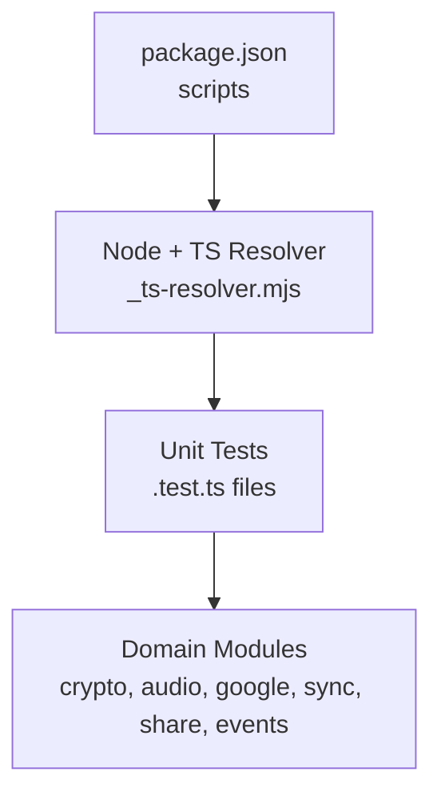

**Diagram sources**
- [package.json:5-19](file://package.json#L5-L19)
- [_ts-resolver.mjs:1-27](file://src/crypto/_ts-resolver.mjs#L1-L27)

**Section sources**
- [package.json:5-19](file://package.json#L5-L19)
- [tsconfig.json:1-23](file://tsconfig.json#L1-L23)
- [_ts-resolver.mjs:1-27](file://src/crypto/_ts-resolver.mjs#L1-L27)

## Core Components
The current test suite focuses on pure and deterministic logic across several domains:

- Encryption and key management: round-trip encrypt/decrypt, KDF determinism, key wrap/unwrap, escrow creation and recovery, rewrap flows, and tamper detection.
- Note field encryption: selective field encryption, idempotency, legacy passthrough, partial updates, and attachment filename encryption.
- Audio processing: silence-pause voice activity detection state machine and retention policies for audio recordings.
- Calendar synchronization: decision logic for creating/updating/deleting events based on hashes and selection changes; Google Calendar mapping between internal and external formats; recurrence display helpers.
- Data synchronization: paged collection pulling with safety guards against incomplete pulls; merge rules reconciling local and server records including absence semantics.
- Share intents: normalization of incoming shares into drafts, handling images, documents, videos, social posts, and metadata.
- Event UI helpers: emoji selection from titles and prefixing for list rendering.

These components are tested with minimal dependencies, making them fast and reliable. They serve as the foundation for broader integration and end-to-end tests.

**Section sources**
- [e2ee.test.ts:1-155](file://src/crypto/e2ee.test.ts#L1-L155)
- [noteCryptoCore.test.ts:1-198](file://src/crypto/noteCryptoCore.test.ts#L1-L198)
- [vad.test.ts:1-154](file://src/audio/vad.test.ts#L1-L154)
- [retention.test.ts:1-86](file://src/audio/retention.test.ts#L1-L86)
- [calendarSyncCore.test.ts:1-165](file://src/calendarSyncCore.test.ts#L1-L165)
- [eventMapper.test.ts:1-149](file://src/google/eventMapper.test.ts#L1-L149)
- [recurrence.test.ts:1-231](file://src/recurrence.test.ts#L1-L231)
- [pagedPullCore.test.ts:1-132](file://src/pagedPullCore.test.ts#L1-L132)
- [syncMergeCore.test.ts:1-283](file://src/syncMergeCore.test.ts#L1-L283)
- [normalizeShareIntent.test.ts:1-225](file://src/share/normalizeShareIntent.test.ts#L1-L225)
- [eventEmoji.test.ts:1-73](file://src/events/eventEmoji.test.ts#L1-L73)

## Architecture Overview
The testing architecture centers around domain-focused unit tests that validate critical business logic without requiring a full runtime environment. These tests can be grouped by feature area and executed independently.

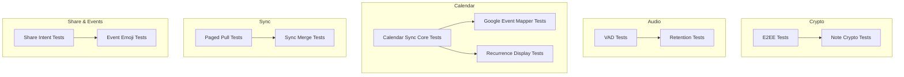

[No sources needed since this diagram shows conceptual grouping, not specific code structure]

## Detailed Component Analysis

### Encryption and Key Management
This component validates cryptographic primitives and workflows: base64 encoding, AES-GCM field encryption, PBKDF2 key derivation, key wrapping, escrow creation/unlocking, password reset via recovery code, and rewrapping with known keys. It also asserts tamper detection and malformed token rejection.

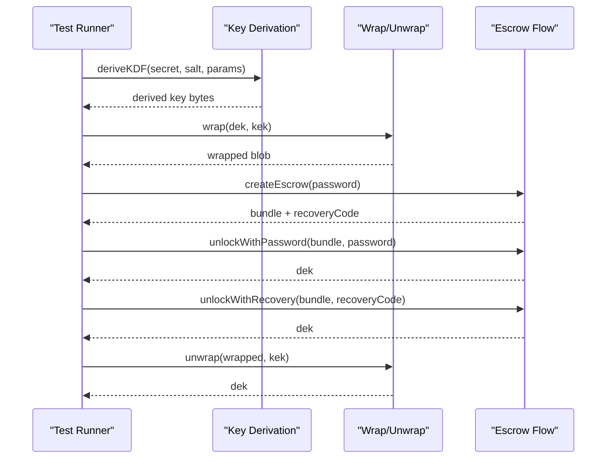

**Diagram sources**
- [e2ee.test.ts:27-144](file://src/crypto/e2ee.test.ts#L27-L144)

**Section sources**
- [e2ee.test.ts:1-155](file://src/crypto/e2ee.test.ts#L1-L155)

### Note Field Encryption
Tests ensure only sensitive fields are encrypted, non-sensitive fields remain readable, idempotent re-encryption does not double-wrap, partial payloads stamp enc_version correctly, and corrupted ciphertext falls back to placeholders without crashing.

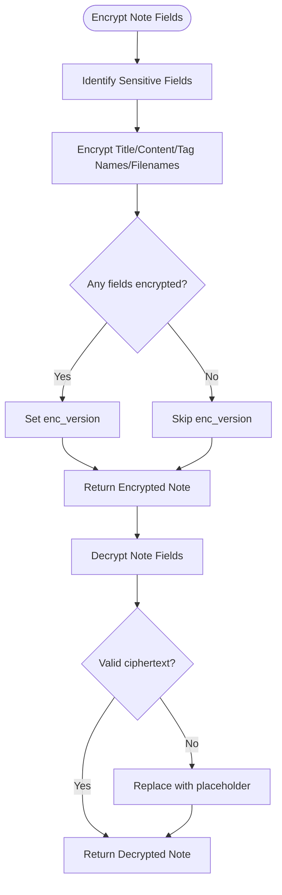

**Diagram sources**
- [noteCryptoCore.test.ts:29-129](file://src/crypto/noteCryptoCore.test.ts#L29-L129)

**Section sources**
- [noteCryptoCore.test.ts:1-198](file://src/crypto/noteCryptoCore.test.ts#L1-L198)

### Voice Activity Detection (Silence-Pause VAD)
Tests model the VAD state machine: listening, paused, probing. They assert thresholds for silence duration, probe intervals, hysteresis for resume, and robustness to undefined/NaN metering.

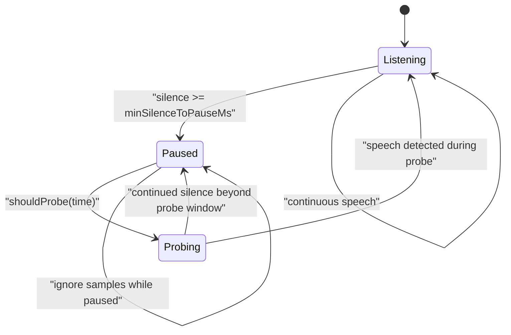

**Diagram sources**
- [vad.test.ts:25-106](file://src/audio/vad.test.ts#L25-L106)

**Section sources**
- [vad.test.ts:1-154](file://src/audio/vad.test.ts#L1-L154)

### Audio Retention Policy
Tests verify default retention periods, conversation-specific TTLs, expiration queries, and formatting utilities. They ensure correct behavior for indefinite, immediate, and conversation modes.

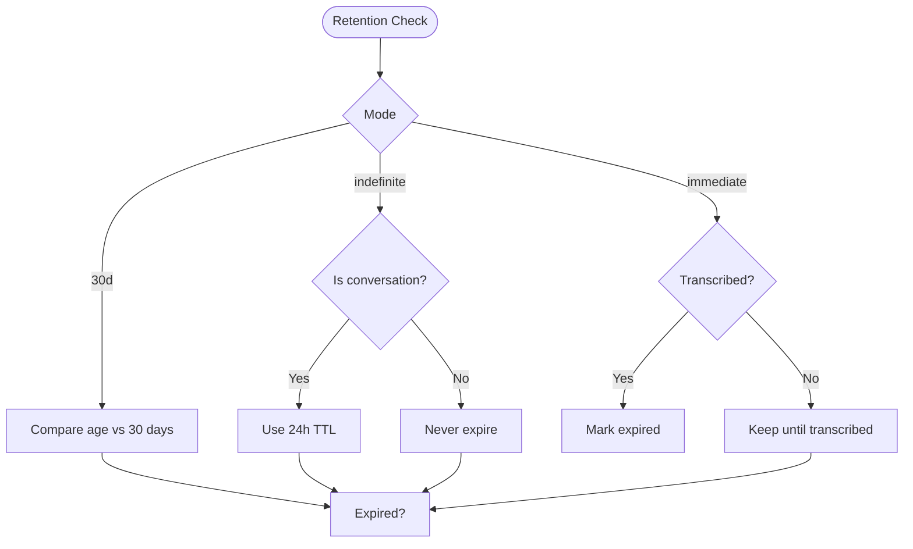

**Diagram sources**
- [retention.test.ts:31-67](file://src/audio/retention.test.ts#L31-L67)

**Section sources**
- [retention.test.ts:1-86](file://src/audio/retention.test.ts#L1-L86)

### Calendar Synchronization Logic
Tests cover decision-making for syncing device events to Nueco: detecting unchanged selections, planning create/update/delete actions, hashing device events, and ensuring all-day date extraction is timezone-safe.

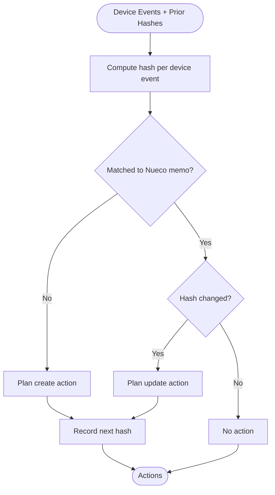

**Diagram sources**
- [calendarSyncCore.test.ts:27-96](file://src/calendarSyncCore.test.ts#L27-L96)

**Section sources**
- [calendarSyncCore.test.ts:1-165](file://src/calendarSyncCore.test.ts#L1-L165)

### Google Calendar Mapping
Tests validate conversion between internal event models and Google Calendar resources, including recurrence RRULE generation and parsing, reminders, attendees, and all-day handling. Degradation paths for unsupported RRULE features are covered.

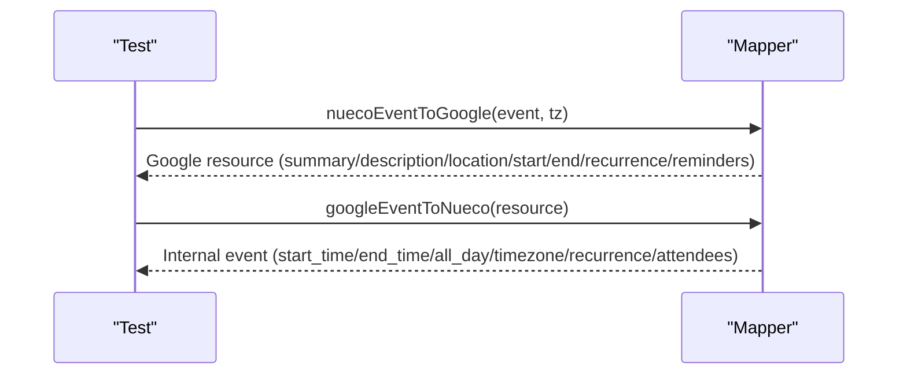

**Diagram sources**
- [eventMapper.test.ts:75-136](file://src/google/eventMapper.test.ts#L75-L136)

**Section sources**
- [eventMapper.test.ts:1-149](file://src/google/eventMapper.test.ts#L1-L149)

### Recurrence Display Helpers
Tests assert day-granularity behavior for next occurrence calculation, occurrence checks, and formatted summaries. Timezone safety for all-day events is validated under positive UTC offsets.

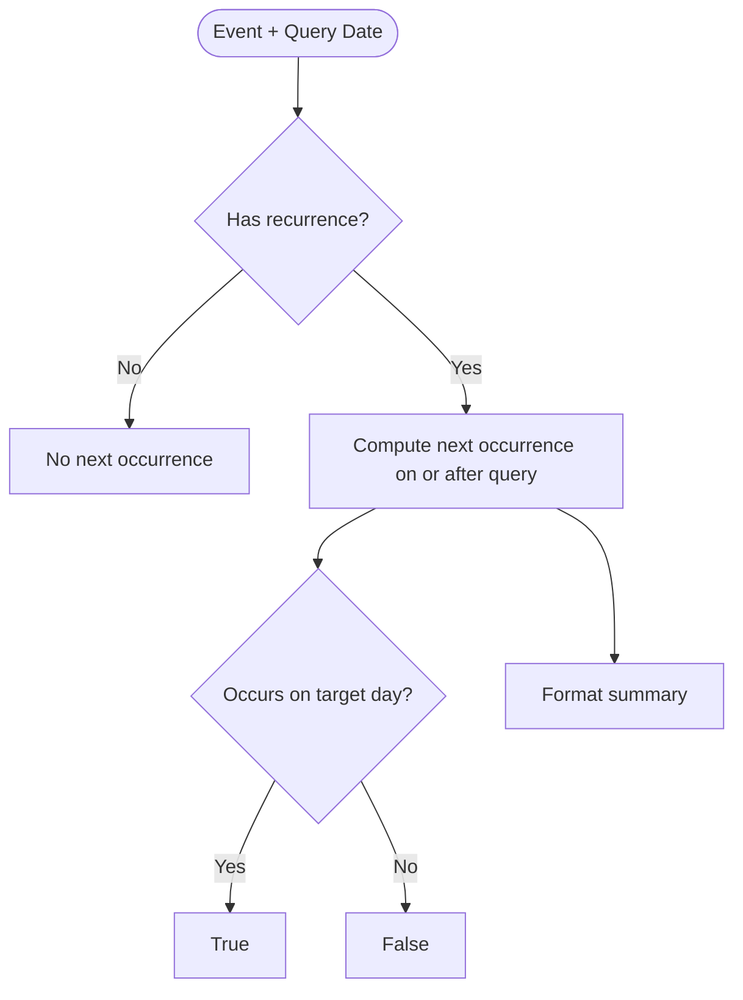

**Diagram sources**
- [recurrence.test.ts:44-142](file://src/recurrence.test.ts#L44-L142)

**Section sources**
- [recurrence.test.ts:1-231](file://src/recurrence.test.ts#L1-L231)

### Paged Pull Safety
Tests ensure complete collection reads, guard against incomplete pulls, handle failures gracefully, and cap runaway servers. They protect against treating absence as deletion when the pull is not complete.

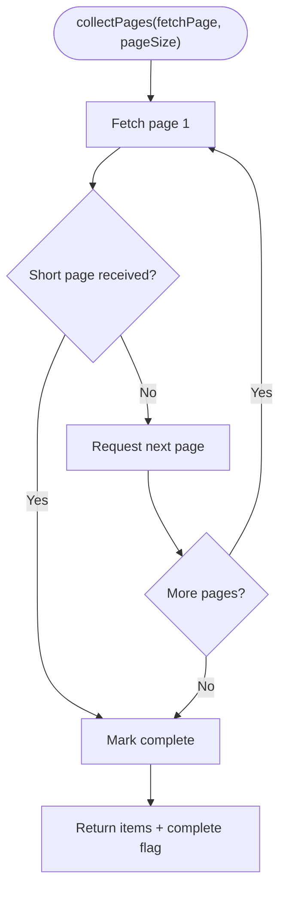

**Diagram sources**
- [pagedPullCore.test.ts:30-70](file://src/pagedPullCore.test.ts#L30-L70)

**Section sources**
- [pagedPullCore.test.ts:1-132](file://src/pagedPullCore.test.ts#L1-L132)

### Sync Merge Rules
Tests validate merging strategies between server and local records, including timestamp comparison, pending deletes, offline-only records, and adoption of device-specific fields. Absence semantics are guarded by pull completeness.

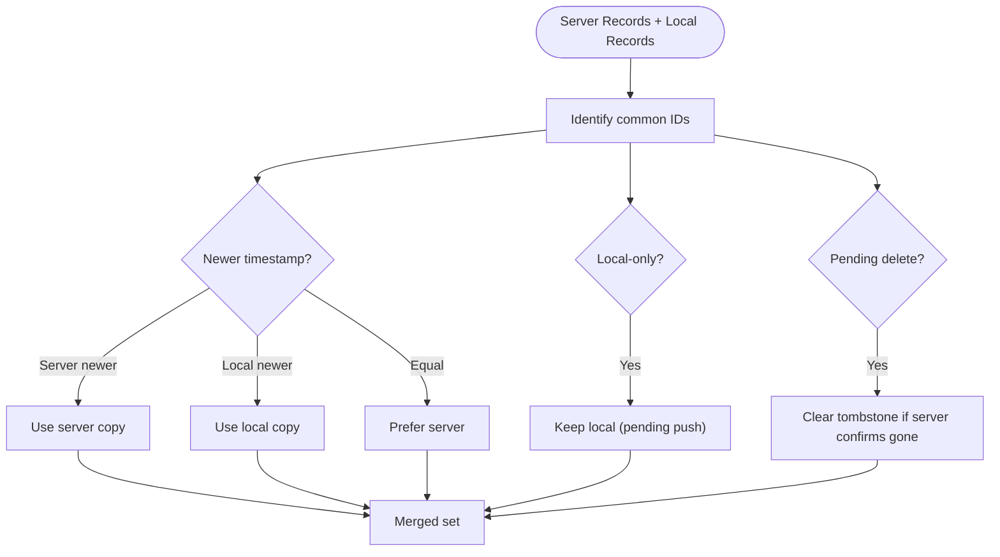

**Diagram sources**
- [syncMergeCore.test.ts:72-221](file://src/syncMergeCore.test.ts#L72-L221)

**Section sources**
- [syncMergeCore.test.ts:1-283](file://src/syncMergeCore.test.ts#L1-L283)

### Share Intent Normalization
Tests cover diverse inputs: URLs, rich metadata, plain text, images, documents, videos, social posts, and multi-file drafts. They assert budget limits for inline images, fallback behaviors, and sanitization.

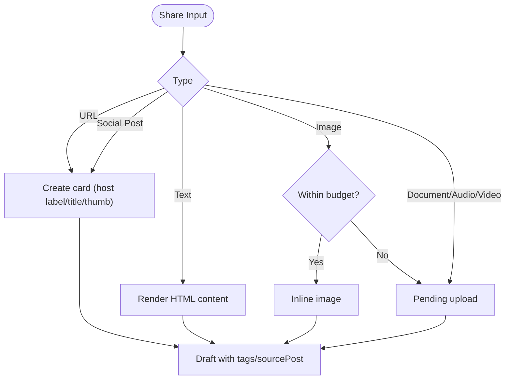

**Diagram sources**
- [normalizeShareIntent.test.ts:22-158](file://src/share/normalizeShareIntent.test.ts#L22-L158)

**Section sources**
- [normalizeShareIntent.test.ts:1-225](file://src/share/normalizeShareIntent.test.ts#L1-L225)

### Event Emoji Selection
Tests ensure deterministic emoji mapping from event titles, prioritizing phrases over single words, whole-word matching, punctuation/case resilience, and safe null returns for unmatched inputs.

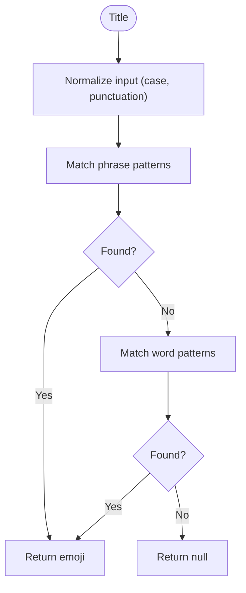

**Diagram sources**
- [eventEmoji.test.ts:20-69](file://src/events/eventEmoji.test.ts#L20-L69)

**Section sources**
- [eventEmoji.test.ts:1-73](file://src/events/eventEmoji.test.ts#L1-L73)

## Dependency Analysis
The tests rely on a minimal runtime and avoid heavy frameworks. A custom module resolver enables running tests that use extensionless relative imports typical in Expo/Metro environments. Scripts in package.json group related tests by domain.

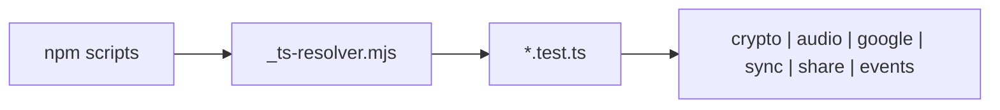

**Diagram sources**
- [package.json:5-19](file://package.json#L5-L19)
- [_ts-resolver.mjs:1-27](file://src/crypto/_ts-resolver.mjs#L1-L27)

**Section sources**
- [package.json:5-19](file://package.json#L5-L19)
- [_ts-resolver.mjs:1-27](file://src/crypto/_ts-resolver.mjs#L1-L27)

## Performance Considerations
- Keep tests fast and deterministic: prefer pure functions and in-memory data structures.
- Use small, focused datasets to exercise edge cases without unnecessary overhead.
- For audio and crypto tests, simulate time and metering values rather than relying on real hardware.
- Cap iteration counts in loops to prevent long-running tests; assert boundaries explicitly.
- Avoid network calls in unit tests; mock or stub any I/O through dependency injection where possible.

[No sources needed since this section provides general guidance]

## Troubleshooting Guide
Common issues and resolutions observed in the test suite:

- Extensionless imports fail in Node: use the provided _ts-resolver.mjs via node --import to resolve .ts files automatically.
- Timezone-related regressions: set process.env.TZ in tests to validate all-day event handling under positive UTC offsets.
- Incomplete pulls causing deletions: ensure collectPages reports incomplete when errors occur mid-pull; absence means deleted only on complete pulls.
- Tampered ciphertext: assert placeholder fallbacks and sibling field preservation to avoid crashes.
- Unknown MIME types: expect warnings and safe defaults; ensure pending uploads still proceed.

**Section sources**
- [_ts-resolver.mjs:1-27](file://src/crypto/_ts-resolver.mjs#L1-L27)
- [calendarSyncCore.test.ts:98-158](file://src/calendarSyncCore.test.ts#L98-L158)
- [pagedPullCore.test.ts:72-125](file://src/pagedPullCore.test.ts#L72-L125)
- [noteCryptoCore.test.ts:107-129](file://src/crypto/noteCryptoCore.test.ts#L107-L129)
- [normalizeShareIntent.test.ts:134-173](file://src/share/normalizeShareIntent.test.ts#L134-L173)

## Conclusion
The current testing strategy emphasizes fast, framework-free unit tests that validate core business logic across encryption, audio processing, calendar synchronization, data sync, sharing, and UI helpers. These tests provide a strong foundation for maintaining correctness and preventing regressions. To evolve toward integration and end-to-end testing, adopt platform-appropriate tools for React Native and web, introduce controlled mocks for native modules and APIs, and add scenario-based tests that exercise user flows across devices and platforms.

[No sources needed since this section summarizes without analyzing specific files]

## Appendices

### Running Tests
- Domain-specific scripts are defined in package.json and execute Node with the custom resolver to run TypeScript tests without a test framework.
- Example commands include separate scripts for crypto, share, sync, vad, and google tests.

**Section sources**
- [package.json:5-19](file://package.json#L5-L19)

### Mocking Strategies
- Inject dependencies via function parameters or objects to isolate external I/O (e.g., readBase64, videoThumbnail).
- Use simple stubs and spies to record calls and return values.
- For calendar and sync tests, construct explicit maps and arrays representing device/server states.

**Section sources**
- [normalizeShareIntent.test.ts:15-21](file://src/share/normalizeShareIntent.test.ts#L15-L21)
- [calendarSyncCore.test.ts:14-25](file://src/calendarSyncCore.test.ts#L14-L25)
- [syncMergeCore.test.ts:23-44](file://src/syncMergeCore.test.ts#L23-L44)

### Test Data Management
- Use factory functions to build consistent test fixtures (e.g., mkDeviceEvent, mkEvent, rec).
- Keep datasets small and representative; include edge cases like empty strings, unicode, large payloads, and boundary timestamps.
- For crypto tests, generate random keys and tokens to ensure uniqueness and randomness assertions.

**Section sources**
- [calendarSyncCore.test.ts:14-25](file://src/calendarSyncCore.test.ts#L14-L25)
- [recurrence.test.ts:20-37](file://src/recurrence.test.ts#L20-L37)
- [syncMergeCore.test.ts:23-44](file://src/syncMergeCore.test.ts#L23-L44)
- [e2ee.test.ts:66-110](file://src/crypto/e2ee.test.ts#L66-L110)

### Mobile-Specific Testing Guidance
- Device simulation: run tests on emulators/simulators for Android/iOS to validate permission flows and native integrations.
- Permission handling: mock or stub permission prompts and assert graceful degradation when denied.
- Native modules: use platform-specific stubs or wrappers to isolate native calls in tests; prefer pure logic tests where possible.
- Background tasks and notifications: test scheduling and lifecycle transitions with deterministic timers and mocked OS hooks.

[No sources needed since this section provides general guidance]

### Continuous Integration Setup
- Add steps to install dependencies and run domain-specific test scripts.
- Cache node_modules to speed up builds.
- Fail the pipeline on non-zero exit codes from tests.
- Optionally collect logs and artifacts for failed runs.

[No sources needed since this section provides general guidance]