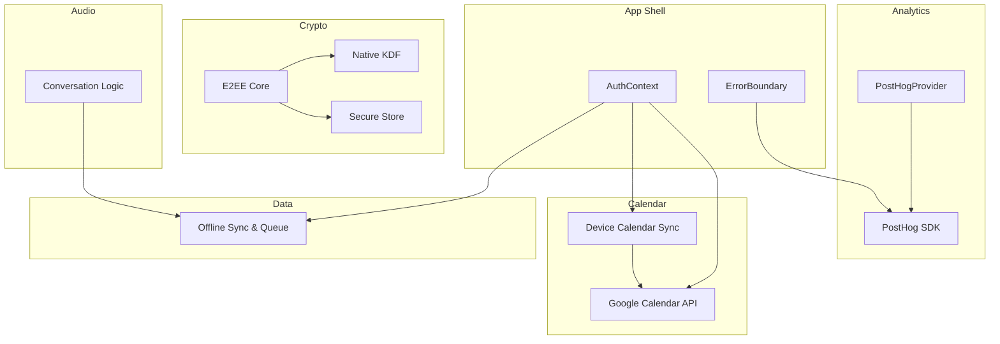
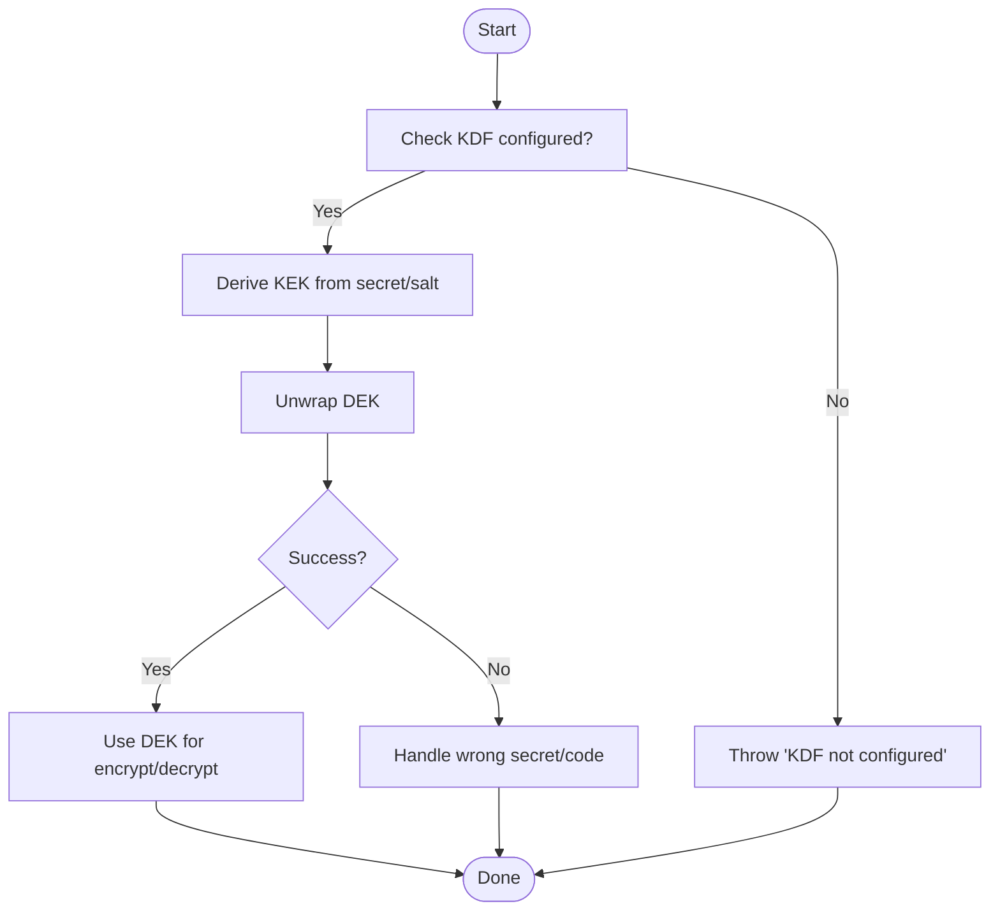
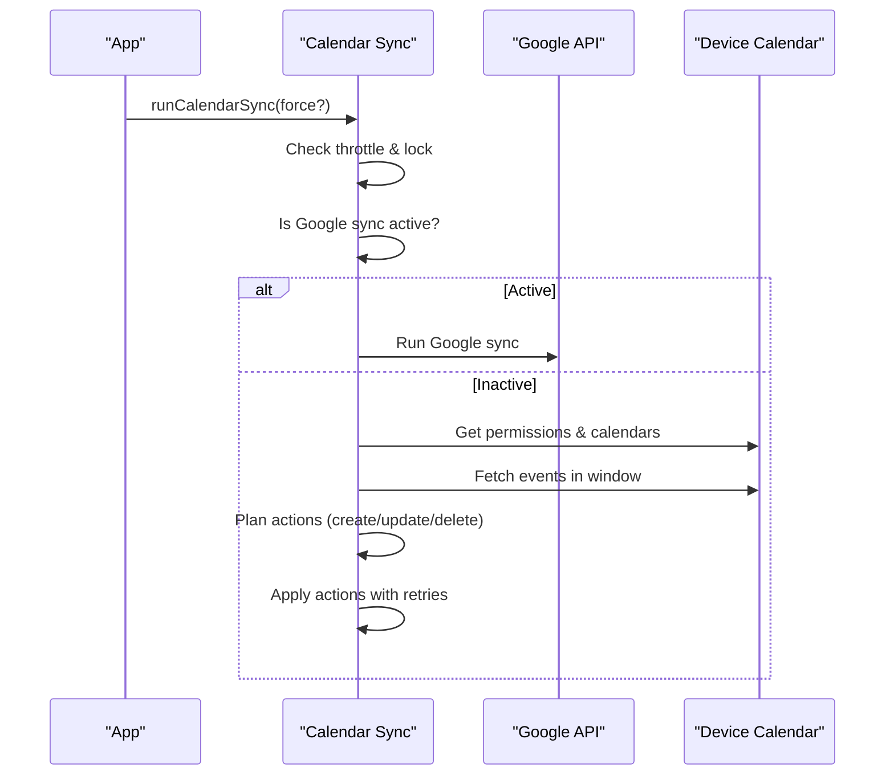
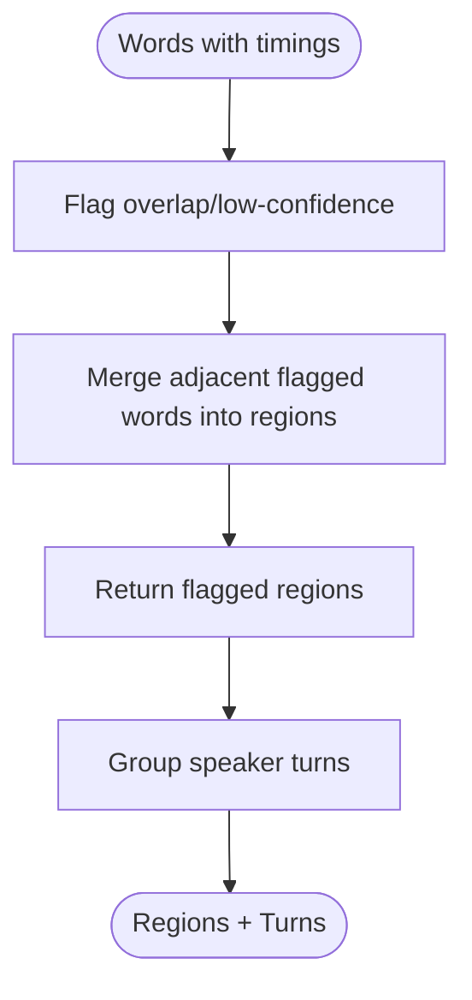
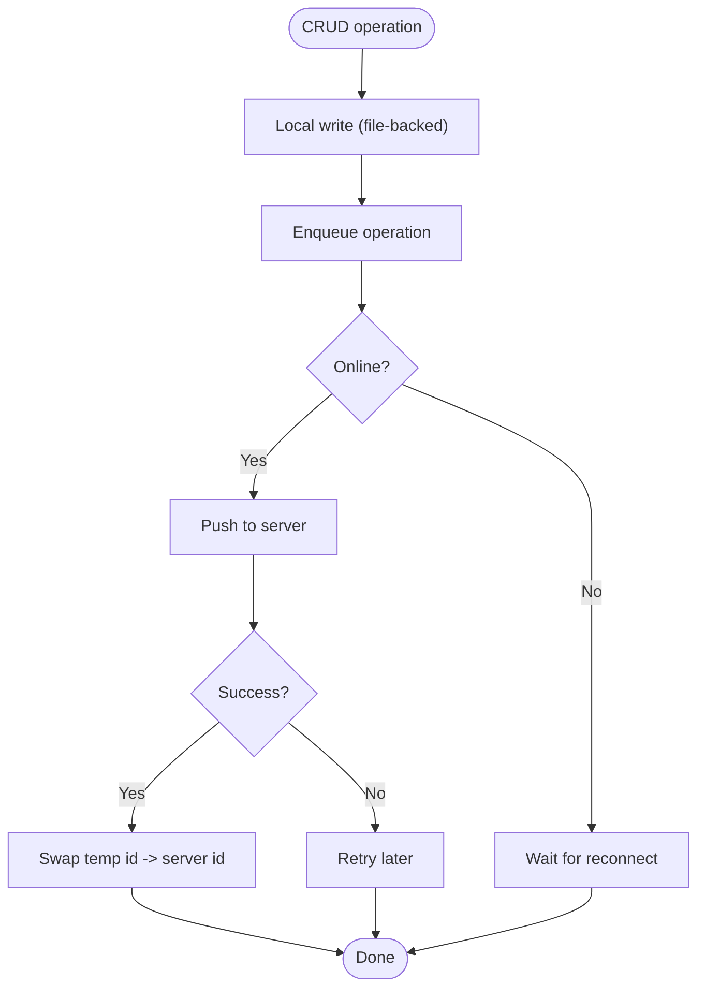
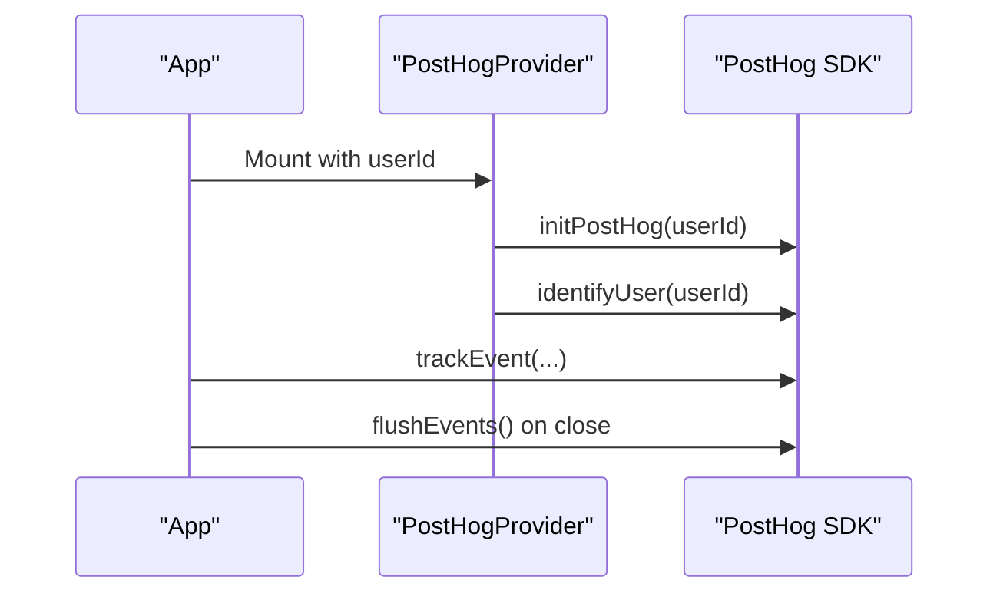
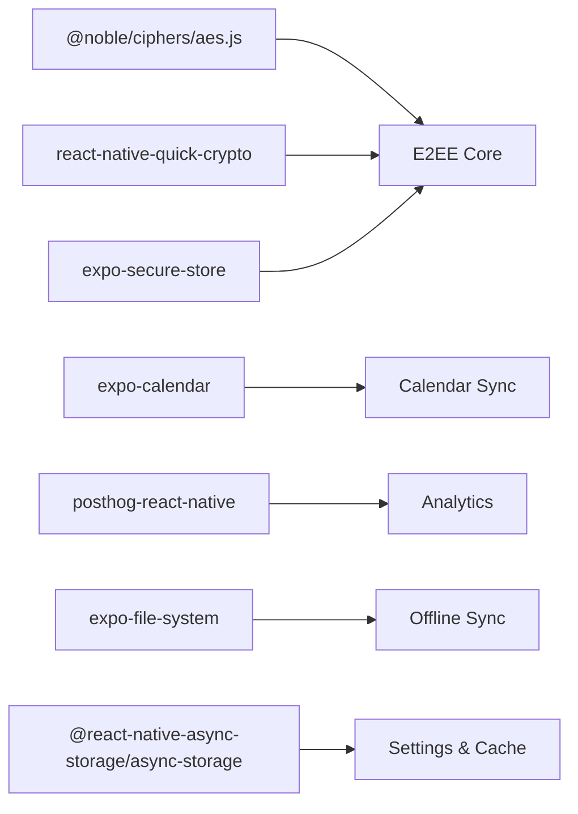

# Troubleshooting Guide

<cite>
**Referenced Files in This Document**
- [ErrorBoundary.tsx](file://src/components/ErrorBoundary.tsx)
- [posthog.ts](file://src/analytics/posthog.ts)
- [PostHogProvider.tsx](file://src/analytics/PostHogProvider.tsx)
- [e2ee.ts](file://src/crypto/e2ee.ts)
- [kdf-native.ts](file://src/crypto/kdf-native.ts)
- [keystore.ts](file://src/crypto/keystore.ts)
- [calendarSync.ts](file://src/calendarSync.ts)
- [calendarApi.ts](file://src/google/calendarApi.ts)
- [conversation.ts](file://src/audio/conversation.ts)
- [offlineSync.ts](file://src/offlineSync.ts)
- [AuthContext.tsx](file://src/auth/context/AuthContext.tsx)
- [package.json](file://package.json)
</cite>

## Table of Contents
1. Introduction
2. Project Structure
3. Core Components
4. Architecture Overview
5. Detailed Component Analysis
6. Dependency Analysis
7. Performance Considerations
8. Troubleshooting Guide
9. Conclusion
10. Appendices

## Introduction
This guide provides practical troubleshooting strategies for development and production issues across encryption, calendar sync, audio processing, and platform-specific areas. It includes debugging techniques, performance profiling tips, logging and monitoring setup using analytics, and step-by-step diagnostics for common user-reported problems.

## Project Structure
The app is a React Native (Expo Router) project with modular features:
- Analytics and error reporting via PostHog
- End-to-end encryption with native KDF wiring and secure storage
- Calendar integration (device calendar and Google Calendar API)
- Audio conversation logic with overlap detection and speaker grouping
- Offline-first data sync with file-backed storage and retry queues
- Authentication context orchestrating login, key bootstrap, and sync readiness



**Diagram sources**
- [AuthContext.tsx:77-177](file://src/auth/context/AuthContext.tsx#L77-L177)
- [ErrorBoundary.tsx:18-88](file://src/components/ErrorBoundary.tsx#L18-L88)
- [PostHogProvider.tsx:20-60](file://src/analytics/PostHogProvider.tsx#L20-L60)
- [e2ee.ts:140-158](file://src/crypto/e2ee.ts#L140-L158)
- [kdf-native.ts:12-21](file://src/crypto/kdf-native.ts#L12-L21)
- [keystore.ts:30-52](file://src/crypto/keystore.ts#L30-L52)
- [calendarSync.ts:102-199](file://src/calendarSync.ts#L102-L199)
- [calendarApi.ts:20-52](file://src/google/calendarApi.ts#L20-L52)
- [conversation.ts:64-106](file://src/audio/conversation.ts#L64-L106)
- [offlineSync.ts:798-800](file://src/offlineSync.ts#L798-L800)

**Section sources**
- [package.json:1-125](file://package.json#L1-L125)

## Core Components
- Error boundary: catches UI errors, shows recovery UI, logs debug info in dev builds.
- Analytics: PostHog initialization, consent gating, event tracking, and user identification/reset.
- Encryption: AES-GCM encryption, PBKDF2 KDF injection, escrow bundle creation/unwrapping, secure DEK storage.
- Calendar sync: device calendar pull and Google Calendar two-way sync with throttling, locking, and conservative deletion.
- Audio conversation: overlap and low-confidence region flagging, speaker turn grouping, session caps.
- Offline sync: file-backed JSON storage, mutexed note writes, queue-based retries, full sync throttling.

**Section sources**
- [ErrorBoundary.tsx:18-88](file://src/components/ErrorBoundary.tsx#L18-L88)
- [posthog.ts:40-78](file://src/analytics/posthog.ts#L40-L78)
- [e2ee.ts:100-158](file://src/crypto/e2ee.ts#L100-L158)
- [calendarSync.ts:102-199](file://src/calendarSync.ts#L102-L199)
- [conversation.ts:64-106](file://src/audio/conversation.ts#L64-L106)
- [offlineSync.ts:217-244](file://src/offlineSync.ts#L217-L244)

## Architecture Overview
End-to-end flow highlights:
- Auth triggers key bootstrap and full sync; calendar permissions requested post-login.
- E2EE uses native PBKDF2 for fast key derivation; DEK stored securely.
- Calendar sync prefers Google API when connected; otherwise reads device calendars with throttling and locks.
- Audio conversation flags unreliable regions to avoid misattribution.
- Offline sync persists changes locally, enqueues operations, and retries on connectivity.

```mermaid
sequenceDiagram
participant User as "User"
participant Auth as "AuthContext"
participant Crypto as "E2EE + Keystore"
participant Cal as "Calendar Sync"
participant Data as "Offline Sync"
participant Analytics as "PostHog"
User->>Auth : Login
Auth->>Crypto : Bootstrap keys / load DEK
Auth->>Data : Full sync (throttled)
Auth->>Cal : Request calendar permission
Note over Auth,Cal : If Google connected, use Google API; else device calendar
Data-->>Analytics : Track events (consent-gated)
Cal-->>Data : Apply create/update/delete actions
User->>Analytics : Consent decision (granted/denied)
```

**Diagram sources**
- [AuthContext.tsx:147-177](file://src/auth/context/AuthContext.tsx#L147-L177)
- [e2ee.ts:140-158](file://src/crypto/e2ee.ts#L140-L158)
- [keystore.ts:36-52](file://src/crypto/keystore.ts#L36-L52)
- [calendarSync.ts:102-199](file://src/calendarSync.ts#L102-L199)
- [offlineSync.ts:798-800](file://src/offlineSync.ts#L798-L800)
- [posthog.ts:40-78](file://src/analytics/posthog.ts#L40-L78)

## Detailed Component Analysis

### Encryption Troubleshooting
Common issues:
- KDF not configured at startup: deriveKek throws if the native KDF is not wired.
- Wrong password or recovery code: unwrapKey throws on auth-tag mismatch.
- Web environment: SecureStore unavailable; DEK loading returns null.

Debugging steps:
- Ensure native KDF wiring is imported early (before any crypto calls).
- Validate escrow bundle fields and salts; confirm enc_version matches expected.
- On web, expect no DEK; plan UX accordingly.



**Diagram sources**
- [e2ee.ts:140-158](file://src/crypto/e2ee.ts#L140-L158)
- [kdf-native.ts:12-21](file://src/crypto/kdf-native.ts#L12-L21)
- [keystore.ts:36-52](file://src/crypto/keystore.ts#L36-L52)

**Section sources**
- [e2ee.ts:100-158](file://src/crypto/e2ee.ts#L100-L158)
- [kdf-native.ts:1-22](file://src/crypto/kdf-native.ts#L1-L22)
- [keystore.ts:1-53](file://src/crypto/keystore.ts#L1-L53)

### Calendar Sync Troubleshooting
Common issues:
- Permissions not granted: device calendar read returns empty.
- Google sync active: double-import risk; handled by skipping device path when Google sync is active.
- Transient failures: network or API errors; retryable status codes handled.

Debugging steps:
- Verify calendar permissions are granted before reading events.
- Confirm last run timestamp and lock TTL to avoid overlapping runs.
- Inspect Google API error details and retryability.



**Diagram sources**
- [calendarSync.ts:102-199](file://src/calendarSync.ts#L102-L199)
- [calendarApi.ts:20-52](file://src/google/calendarApi.ts#L20-L52)

**Section sources**
- [calendarSync.ts:102-199](file://src/calendarSync.ts#L102-L199)
- [calendarApi.ts:20-52](file://src/google/calendarApi.ts#L20-L52)

### Audio Processing Troubleshooting
Common issues:
- Overlapping speech misattributed to single speaker.
- Low-confidence words causing unreliable transcripts.
- Session length exceeding cap.

Debugging steps:
- Use overlap and low-confidence region flagging to mark suspect segments.
- Group speaker turns to visualize speaker changes.
- Enforce session caps to prevent excessive recording duration.



**Diagram sources**
- [conversation.ts:64-106](file://src/audio/conversation.ts#L64-L106)
- [conversation.ts:116-129](file://src/audio/conversation.ts#L116-L129)

**Section sources**
- [conversation.ts:1-130](file://src/audio/conversation.ts#L1-L130)

### Offline Sync Troubleshooting
Common issues:
- Large collections causing AsyncStorage row size limits; mitigated by file-backed JSON.
- Concurrent writes corrupting state; mitigated by mutex for notes.
- Stale note IDs after server id swap; mitigated by alias map and persistence.

Debugging steps:
- Ensure file directory exists and readable/writable.
- Check queue cache and retry counts for stuck operations.
- Repair stale recording links on startup.



**Diagram sources**
- [offlineSync.ts:122-193](file://src/offlineSync.ts#L122-L193)
- [offlineSync.ts:217-244](file://src/offlineSync.ts#L217-L244)
- [offlineSync.ts:449-502](file://src/offlineSync.ts#L449-L502)

**Section sources**
- [offlineSync.ts:122-193](file://src/offlineSync.ts#L122-L193)
- [offlineSync.ts:217-244](file://src/offlineSync.ts#L217-L244)
- [offlineSync.ts:449-502](file://src/offlineSync.ts#L449-L502)

### Analytics and Monitoring Setup
- Initialize PostHog once at app start; identify users on login; reset on logout.
- Respect GDPR consent; capture() no-ops until granted.
- Track key events: note lifecycle, voice recording, sharing, search.



**Diagram sources**
- [PostHogProvider.tsx:20-60](file://src/analytics/PostHogProvider.tsx#L20-L60)
- [posthog.ts:40-78](file://src/analytics/posthog.ts#L40-L78)

**Section sources**
- [posthog.ts:40-78](file://src/analytics/posthog.ts#L40-L78)
- [PostHogProvider.tsx:20-60](file://src/analytics/PostHogProvider.tsx#L20-L60)

## Dependency Analysis
Key runtime dependencies and their roles:
- @noble/ciphers/aes.js: AES-GCM encryption primitives.
- react-native-quick-crypto: Native PBKDF2 for fast key derivation.
- expo-secure-store: Secure DEK storage on native platforms.
- expo-calendar: Device calendar access.
- posthog-react-native: Analytics and event tracking.
- @react-native-async-storage/async-storage: Lightweight settings and small caches.
- expo-file-system: File-backed JSON storage for large datasets.



**Diagram sources**
- [e2ee.ts:21-27](file://src/crypto/e2ee.ts#L21-L27)
- [kdf-native.ts:12-21](file://src/crypto/kdf-native.ts#L12-L21)
- [keystore.ts:9-14](file://src/crypto/keystore.ts#L9-L14)
- [calendarSync.ts:26-29](file://src/calendarSync.ts#L26-L29)
- [posthog.ts:1-5](file://src/analytics/posthog.ts#L1-L5)
- [offlineSync.ts:12-26](file://src/offlineSync.ts#L12-L26)

**Section sources**
- [package.json:21-100](file://package.json#L21-L100)

## Performance Considerations
- Avoid heavy synchronous work on the JS thread: offline sync caches file reads and avoids repeated parses where possible.
- Throttle full syncs to reduce redundant network requests and decryption overhead.
- Use native KDF to keep login times within acceptable bounds.
- File-backed storage prevents AsyncStorage CursorWindow limits for large collections.
- Mutex ensures safe concurrent writes for notes without blocking UI unnecessarily.

[No sources needed since this section provides general guidance]

## Troubleshooting Guide

### Build Failures
- Missing native modules: ensure required Expo modules are installed and compatible with your Expo SDK version.
- Web vs native: some features (e.g., SecureStore, calendar) are native-only; guard platform checks appropriately.
- Environment variables: verify PostHog keys and other env vars are set for build targets.

**Section sources**
- [package.json:1-125](file://package.json#L1-L125)

### Runtime Errors
- UI crashes: wrap critical screens with ErrorBoundary to catch and display recoverable errors; debug info available in dev builds.
- Network errors: calendar API wraps fetch errors with retryable flags; handle transient vs permanent failures.
- Auth token refresh: background refresh may fail; gracefully degrade without clearing user state unless tokens are cleared.

**Section sources**
- [ErrorBoundary.tsx:18-88](file://src/components/ErrorBoundary.tsx#L18-L88)
- [calendarApi.ts:20-52](file://src/google/calendarApi.ts#L20-L52)
- [AuthContext.tsx:86-105](file://src/auth/context/AuthContext.tsx#L86-L105)

### Platform-Specific Issues
- Web: SecureStore returns null; E2EE flows should handle absence of DEK.
- Android/iOS: Calendar permissions must be requested; background tasks require proper configuration.
- Expo Go limitations: certain features like session replay are disabled.

**Section sources**
- [keystore.ts:30-52](file://src/crypto/keystore.ts#L30-L52)
- [calendarSync.ts:26-29](file://src/calendarSync.ts#L26-L29)
- [posthog.ts:50-56](file://src/analytics/posthog.ts#L50-L56)

### Debugging Encryption Problems
- Symptom: unlock fails with malformed ciphertext or wrong key.
- Steps:
  - Confirm KDF configured at startup.
  - Validate escrow bundle structure and salts.
  - Check enc_version compatibility.
  - On web, expect no DEK; adjust UX.

**Section sources**
- [e2ee.ts:100-158](file://src/crypto/e2ee.ts#L100-L158)
- [kdf-native.ts:12-21](file://src/crypto/kdf-native.ts#L12-L21)

### Debugging Sync Conflicts
- Symptom: local edits lost or duplicates appear.
- Steps:
  - Ensure full sync throttling prevents rapid re-syncs.
  - Verify file-backed storage integrity and cache invalidation.
  - Check queue for stuck operations and retry counts.

**Section sources**
- [offlineSync.ts:798-800](file://src/offlineSync.ts#L798-L800)
- [offlineSync.ts:122-193](file://src/offlineSync.ts#L122-L193)

### Debugging Audio Processing Errors
- Symptom: overlapping speech attributed incorrectly; low-confidence segments.
- Steps:
  - Use region flagging to mark overlaps and low-confidence words.
  - Group speaker turns to validate diarization results.
  - Enforce session caps to avoid long recordings.

**Section sources**
- [conversation.ts:64-106](file://src/audio/conversation.ts#L64-L106)
- [conversation.ts:116-129](file://src/audio/conversation.ts#L116-L129)

### Debugging Calendar Integration Issues
- Symptom: events not syncing or deleted unexpectedly.
- Steps:
  - Confirm calendar permissions granted.
  - Check throttle and lock to avoid overlapping runs.
  - Inspect Google API error details and retryability.
  - Ensure selection unchanged before destructive actions.

**Section sources**
- [calendarSync.ts:102-199](file://src/calendarSync.ts#L102-L199)
- [calendarApi.ts:20-52](file://src/google/calendarApi.ts#L20-L52)

### Logging and Monitoring Setup
- Initialize PostHog with consent gating; identify users on login; reset on logout.
- Track key events for product insights and error correlation.
- Flush events on app close to ensure delivery.

**Section sources**
- [posthog.ts:40-78](file://src/analytics/posthog.ts#L40-L78)
- [PostHogProvider.tsx:20-60](file://src/analytics/PostHogProvider.tsx#L20-L60)

### Step-by-Step Diagnostics for Common User Issues
- Notes disappear after adding images:
  - Verify mutexed note writes and file-backed storage.
  - Check alias map for temp-to-server id swaps.
- Voice recordings not linked to notes:
  - Run startup repair to migrate orphaned links.
- Calendar events duplicated:
  - Ensure Google sync active path skips device calendar reads.
  - Validate throttling and lock mechanisms.

**Section sources**
- [offlineSync.ts:217-244](file://src/offlineSync.ts#L217-L244)
- [offlineSync.ts:298-327](file://src/offlineSync.ts#L298-L327)
- [calendarSync.ts:102-199](file://src/calendarSync.ts#L102-L199)

### Development Environment Setup Problems
- Missing native modules: install required Expo packages and ensure SDK compatibility.
- Env variables: set PostHog keys and other required variables per target.
- Platform guards: handle web vs native differences for features like SecureStore and calendar.

**Section sources**
- [package.json:1-125](file://package.json#L1-L125)

### Tools and Techniques for Effective Debugging
- Use ErrorBoundary to capture UI errors and show debug info in dev builds.
- Leverage PostHog events to correlate user actions with errors.
- Inspect offline sync queue and file-backed storage for data integrity.
- Validate calendar permissions and Google API responses for sync issues.

**Section sources**
- [ErrorBoundary.tsx:18-88](file://src/components/ErrorBoundary.tsx#L18-L88)
- [posthog.ts:40-78](file://src/analytics/posthog.ts#L40-L78)
- [offlineSync.ts:122-193](file://src/offlineSync.ts#L122-L193)
- [calendarSync.ts:102-199](file://src/calendarSync.ts#L102-L199)

## Conclusion
This guide consolidates troubleshooting strategies for encryption, calendar sync, audio processing, and platform-specific concerns. By leveraging built-in error boundaries, analytics, robust offline sync, and careful platform guards, you can diagnose and resolve common issues efficiently. Use the provided diagrams and section references to navigate the codebase and apply targeted fixes.

## Appendices
- Quick reference to key files for each domain:
  - Encryption: e2ee.ts, kdf-native.ts, keystore.ts
  - Calendar: calendarSync.ts, calendarApi.ts
  - Audio: conversation.ts
  - Offline sync: offlineSync.ts
  - Analytics: posthog.ts, PostHogProvider.tsx
  - Auth: AuthContext.tsx
  - Error handling: ErrorBoundary.tsx

[No sources needed since this section summarizes without analyzing specific files]